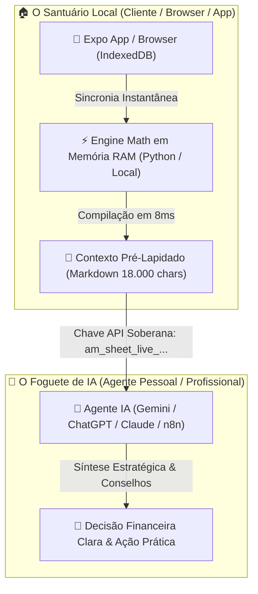

# 🚀 O Foguete e as Penas: O Manifesto da Garagem que Mudou Tudo
### *Uma jornada filosófica, didática e prática sobre a criação do Assistente Moeda*

> *"Se você amarrar um motor de foguete de 100 mil cavalos de potência a um saco de um milhão de penas soltas, você não terá um voo orbital. Você terá apenas um furacão de penas caindo em caos. Mas quando você organiza cada pena em uma asa aerodinâmica de precisão, o mesmo foguete rasga a atmosfera e toca as estrelas."*

---

## 📖 CAPÍTULO 1: A SEMENTE NA GARAGEM
### *Uma pergunta simples de sobrevivência*

Tudo começou longe das salas de reunião corporativas com luzes de LED neon e apresentações em PowerPoint reluzentes. Tudo começou em uma mesa de garagem com uma xícara de café frio e uma pergunta incrivelmente honesta:

> **"Os projetos em que estou gastando minha vida estão cobrindo os seus próprios custos? Eles permanecem viáveis?"**

Não era uma pergunta sobre métricas de vaidade. Não era sobre "curtidas", "ARR inflado" ou gráficos de valuation para investidores de risco. Era sobre a **matéria-prima mais escassa do universo: o tempo de vida de um ser humano**.

Para responder a essa pergunta, o mundo tradicional nos oferece duas alternativas ruins:
1. **Planilhas estáticas e pesadas:** Onde você passa 80% do seu tempo digitando números manual e repetitivamente em células frias e 20% tentando entender o que eles significam.
2. **SaaS corporativos intrusivos:** Que exigem que você entregue todo o seu histórico financeiro, seus nomes, suas intimidades e os segredos do seu trabalho para servidores em nuvem de terceiros que cobram assinaturas mensais abusivas.

Nenhum dos dois caminhos servia. Faltava uma terceira via. Uma via onde a inteligência fosse **nossa**, os dados fossem **soberanos** e a tecnologia trabalhasse para o homem — e não o contrário.

---

## 🌌 CAPÍTULO 2: A PARÁBOLA DO FOGUETE E DAS PENAS
### *O grande erro da indústria de Inteligência Artificial*

Nos últimos dois anos, o mundo assistiu à explosão dos Grandes Modelos de Linguagem (LLMs). Assistimos a "foguetes" extraordinários surgirem — redes neurais treinadas em petabytes de conhecimento humano, capables de raciocinar sobre física quântica, compor poesia e sintetizar diagnósticos complexos em milissegundos.

Mas a indústria cometeu um erro ingênuo de arquitetura.

A indústria olhou para o foguete da IA e disse:  
*"Vamos pedir para a IA ler 50.000 linhas de CSV bruto, extrair datas, converter strings em floats, ordenar listas, somar médias diárias, calcular o desvio padrão de cada categoria, lembrar das regras do regime de competência e depois me dar um conselho."*

Isso é o equivalente a pedir para um motor de foguete girar o moinho de vento para moer o trigo!  
É fazer a IA **soprar e tentar mover um milhão de penas soltas no ar ao mesmo tempo**.

### ⚠️ O Gargalo da Memória e do Contexto
Quando você força uma IA a fazer trabalho matemático bruto de baixo nível sobre dados desorganizados:
1. **Alucinação:** A IA se perde na contagem das "penas" (linhas do arquivo) e inventa totais que não existem.
2. **Custo e Latência:** Você gasta milhões de tokens de contexto apenas carregando poeira e ruído.
3. **Cegueira Estratégica:** Exausta por tentar lembrar e organizar os números brutos, a IA perde a capacidade de fornecer conselhos profundos e humanos.

---

## ⚡ CAPÍTULO 3: A REVOLUÇÃO LOCAL-FIRST & A API TURBINADA
### *Colocando cada pena no seu lugar exato*

A grande virada de chave do **Assistente Moeda** nasceu quando decidimos inverter o jogo:

> **"A IA não deve ser o banco de dados. A IA não deve ser a calculadora. A IA deve ser o Estrategista. E o nosso código local deve ser a Asa Perfeita."**

Construímos uma arquitetura em dois mundos perfeitos que se abraçam:

### 🧠 Como Funciona o Nosso Motor de Alta Otimização:
1. **Trabalho Bruto no Lugar Certo (Zero Gargalos):**
   - O nosso motor em Python (`coin_metrics_engine.py` + `public_api_router.py`) faz a matemática pesada em menos de **10 milissegundos**.
   - Ele calcula regime de competência, mediana, desvio padrão, médias diárias/semanais, balanço de metas estritas e rendimento de juros compostos a 0,8%/mês no CDI.
2. **A Entrega do Diamante Bruto:**
   - A rota da API pública (`GET /api/v1/public/analysis-context`) compila tudo em um relatório Markdown impecável de **18.000 caracteres**.
   - Todas as "penas" já estão agrupadas, limpas, auditadas e ordenadas.
3. **O Foguete Decola sem Peso:**
   - Quando a IA recebe esse payload via API, ela não precisa gastar 1 segundo calculando quanto é `160,00 + 30,00`.
   - Toda a sua capacidade computacional é liberada para o que ela faz de melhor: **analisar comportamento financeiro, projetar cenários futuros de 6 meses e alertar sobre vazamentos invisíveis.**

---

## 🛡️ CAPÍTULO 4: A SOBERANIA DO AMBIENTE LOCAL
### *Por que a privacidade não é um recurso, é a alma do projeto*

Na era da vigilância de dados, o Assistente Moeda toma um posicionamento radical: **Os seus dados pertencem a você e vivem no seu ambiente local.**

- **Sem Banco de Dados Centralizado Bisbilhotando:** As suas transações não ficam salvas em servidores remotos de terceiros. A nossa API opera de forma *stateless* e em memória RAM.
- **Isolamento Estrito por `tableId`:** Cada planilha gera sua própria Chave API viva (`am_sheet_live_...`). Alternar de planilha no aplicativo alterna reativamente a chave no ambiente, garantindo **zero contaminação de dados** entre vidas pessoais e profissionais.
- **Agentes Pessoais e Profissionais Conectados:** Seu agente de IA pessoal pode conversar com a sua planilha de gastos da família, enquanto seu agente profissional conversa com a planilha da sua empresa — ambos consumindo a mesma API limpa, soberana e ultra-rápida.

---

## 💎 CAPÍTULO 5: LIÇÕES DE UM PROJETO DE GARAGEM
### *Inspirado no Sales Coach & LinkedIn Content Creator*

Se tivéssemos que resumir as lições deste projeto em forma de princípios práticos para a vida e para o desenvolvimento de software:

### 🎯 1. Pare de vender a ferramenta. Venda a clareza.
Ninguém quer "mais um aplicativo de finanças". As pessoas querem saber se vão poder viajar no final do ano, se o projeto que estão criando vai pagar as contas no mês que vem, e se elas podem dormir em paz à noite. **Tecnologia boa é aquela que remove a ansiedade e entrega clareza.**

### 🎯 2. Respeite os limites da ferramenta.
- Não use uma IA para fazer soma de colunas.
- Não use um banco de dados relacional para guardar rascunhos voláteis.
- Use a ferramenta certa no ponto exato da engrenagem. O resultado é velocidade instantânea e custo próximo de zero.

### 🎯 3. O divertido é construir o que é de verdade.
Este projeto de garagem é a maior diversão das nossas vidas porque ele nasceu de uma necessidade real de vida. Ele não foi feito para impressionar um comitê; foi feito para resolver a nossa própria vida e a vida dos nossos usuários.

---

## 🔮 CAPÍTULO 6: O FUTURO QUE APENAS COMEÇOU

Estamos apenas no início desta jornada. 

O que começou como um controle simples de viabilidade financeira se transformou na fundação de um novo ecossistema: **a união dos Agentes de IA com Bancos de Dados Locais e APIs Otimizadas de Alta Velocidade.**

À medida que os agentes locais evoluem, a nossa API continuará entregando a eles o mapa perfeito, sem poeira, sem ruído, sem gargalos.

O foguete agora tem asas. E todas as penas estão exatamente onde deveriam estar.

---
*Escrito com paixão, código limpo e café fresco por Sherlock & Augusto — 2026.*  
*Projeto Assistente Moeda — Local-First, AI-Native, Privacy-First.*
