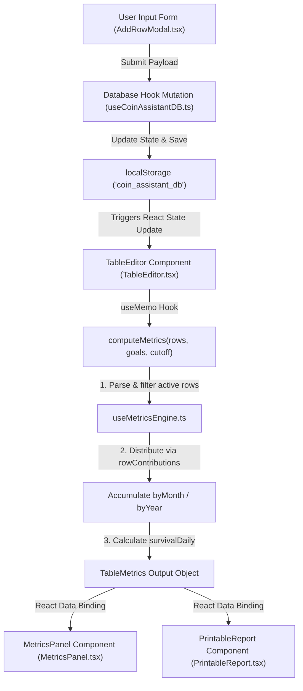

# Masterclass Modulo 1: O Motor de Competência Diária (Regime de Competência Diária)
*Technical Specification, Architectural Blueprint & Lecture Manual*

This document serves as the official textbook-grade Technical Specification and Lecture Manual for **Module 1: The Daily Accrual Engine (Regime de Competência Diária)** of the Assistente-Moeda ecosystem. It details the mathematical foundations, source code implementation, database state architecture, and pedagogical blueprints required to instruct software engineers on building resilient, time-aware financial software.

---

## 📑 CHAPTER 1: The Core Accrual Paradigm & Mathematical Model

### 1.1 The Conceptual War: Cash Basis vs. Daily Accrual
In financial software engineering, the default implementation for recording transactions is the **Cash Basis (Regime de Caixa)**. Under a cash-basis system, financial events are logged and visualized strictly on the calendar date when cash physically enters or exits the account. While simple to implement, Cash Basis introduces a devastating distortion known in corporate finance as the **"illusion of cash flow."**

Consider a professional driver or small business owner who pays an annual vehicle insurance policy ($R\$ 8.217,00$) in January, or takes on a 60-month financing contract ($R\$ 85.000,00$) with a substantial downpayment. Under Cash Basis:
* **January** shows a catastrophic negative cash flow spike, falsely indicating that the business is highly unprofitable and unsustainable.
* **February through December** show inflated net profitability because the active capital asset (the covered vehicle) generates daily revenue while its supporting cost is registered as $R\$ 0,00$.

This representation is psychologically and operationally destructive. It prevents the operator from understanding their true daily break-even threshold ($survivalDaily$) and leads to premature capital distribution or business liquidation due to panic over artificial red months.

To neutralize this distortion, Assistente-Moeda implements a **Daily Accrual Engine (Regime de Competência Diária)**. Instead of assigning a lump-sum liability or asset to a single point in time, the accrual engine dilutes and distributes the financial weight across the exact chronological day span of the asset's active life. An annual insurance policy of $R\$ 8.217,00$ is mapped as an expense spanning 365 days, contributing a flat, predictable daily cost of:

$$\text{Daily Accrual Cost} = \frac{R\$ 8.217,00}{365} \approx R\$ 22,51\text{ per day}$$

By spreading all fixed costs, taxes (like IPVA), and long-term contracts evenly across their calendar lifespans, the system generates a flat, stabilized cost-to-run line. This allows the driver to wake up every morning knowing exactly what minimum revenue they must generate today just to cover their amortized cost structure.

---

### 1.2 Mathematical Modeling of the Flat Accrual Curve
The accrual engine models time as a continuous sequence of calendar days. To compute the daily contribution of any transaction (revenue, expense, or deposit) to a given target reporting period (such as a calendar month or year), the system uses the following algebraic representations:

#### 1. Let $T$ be a transaction with:
* $V_T$: Total nominal value of the transaction.
* $D_{\text{start}}$: The start date of the transaction's financial lifespan (represented as an ISO "YYYY-MM-DD" string).
* $D_{\text{end}}$: The end date of the transaction's financial lifespan (represented as an ISO "YYYY-MM-DD" string).

#### 2. Let $totalLifespanDays$ ($L_T$) be the total inclusive calendar days between the boundaries:
$$L_T = \text{daysBetween}(D_{\text{start}}, D_{\text{end}}) = \text{DateToUnix}(D_{\text{end}}) - \text{DateToUnix}(D_{\text{start}}) + 1\text{ day}$$

#### 3. Let $dailyRate$ ($R_T$) be the flat daily value contribution of transaction $T$:
$$R_T = \frac{V_T}{L_T}$$

#### 4. Let $[M_{\text{start}}, M_{\text{end}}]$ be the active calendar boundaries of the target month or year in view. The engine determines the intersection of the transaction lifespan with the target month lifespan. Let $overlapStart$ and $overlapEnd$ be defined as:
$$\text{overlapStart} = \max(D_{\text{start}}, M_{\text{start}})$$
$$\text{overlapEnd} = \min(D_{\text{end}}, M_{\text{end}})$$

#### 5. If $\text{overlapStart} \le \text{overlapEnd}$, the transaction has active days in the month. Let $activeDaysInMonth$ ($A_{T,M}$) be:
$$A_{T,M} = \text{daysBetween}(\text{overlapStart}, \text{overlapEnd})$$

#### 6. The $monthlyContribution$ ($C_{T,M}$) of the transaction $T$ to the month $M$ is computed as:
$$C_{T,M} = R_T \times A_{T,M} = \left(\frac{V_T}{L_T}\right) \times A_{T,M}$$

Through this model, if an expense starts mid-month, the system calculates the exact number of active days it remained in effect during that initial month and allocates only that portion, leaving the remainder for subsequent months.

---

### 1.3 Handling Calendar Anomalies: Leap Years, Month Boundaries, and DST Shifts
Date calculations in JavaScript are notoriously prone to bugs caused by timezone offsets and Daylight Saving Time (DST) transitions. If a system calculates days by dividing local milliseconds differences by $86,400,000$, a DST transition day (which is 23 or 25 hours long) will return fractional days (e.g., $0.96$ or $1.04$). In a long span, this results in accumulated rounding errors that corrupt financial balances.

Assistente-Moeda addresses these anomalies through three design patterns:

#### 1. Timezone-Neutral Noon Anchoring
Whenever the system parses date strings, it appends a strict noon timestamp (`T12:00:00`) before creating a JavaScript `Date` object or extracting UNIX timestamps. This forces the date boundaries away from midnight, ensuring that DST hour shifts (which occur at midnight or 2 AM) never cause the date to jump backward or forward.
```typescript
const msA = new Date(a + 'T12:00:00').getTime();
const msB = new Date(b + 'T12:00:00').getTime();
```

#### 2. Leap Year & Variable Month Boundaries
Instead of hardcoding month lengths as 30 days, the engine resolves the exact day counts dynamically. To find the total days in any given month of any year, the engine utilizes a standard JavaScript calendar trick: instantiating a `Date` object targeting day `0` of the *next* month. Because day `0` is out of bounds, the browser's date engine automatically rolls back to the final day of the preceding month, naturally returning 29 for February in leap years (e.g., 2024) and 28 in standard years (e.g., 2025).
```typescript
function daysInMonth(year: number, month: number): number {
  // month is 1-indexed (e.g. 2 = February). Day 0 of March (3) returns the last day of February.
  return new Date(year, month, 0).getDate();
}
```

#### 3. Mid-Month Clamping
If a multi-period expense starts on `2026-06-15` and ends on `2026-08-10`, it intersects three months: June, July, and August. The overlap clamp automatically scales the active days:
* **June**: Overlaps from `2026-06-15` to `2026-06-30` ($activeDaysInMonth = 16$).
* **July**: Overlaps from `2026-07-01` to `2026-07-31` ($activeDaysInMonth = 31$).
* **August**: Overlaps from `2026-08-01` to `2026-08-10` ($activeDaysInMonth = 10$).

---

## 💻 CHAPTER 2: Source Code Anatomy (useMetricsEngine.ts)

### 2.1 File Ingestion & Architecture
The heart of the metrics system is located in [useMetricsEngine.ts](file:///c:/Users/Usuario/Desktop/AHeiss_GoogleDrive/02-Programacao/projetos-IA/LogicDefense/src/tools/CoinAssistant/hooks/useMetricsEngine.ts). This file operates as a pure-mathematical utility engine. It takes the raw list of transactions (`TableRow[]`) and active goals (`TableGoals`) as inputs and returns an object containing aggregated totals, time-banks, averages, and year/month breakdowns.

---

### 2.2 Reconstructing and Process Mapping Transaction Types
The engine processes transactions under two operational models:
1. **Pontuais (Point-in-Time)**: One-off daily entries where the expense or income occurs strictly on one calendar date.
2. **Rateados/Contratuais (Prorated/Multi-period)**: Overlap-based entries spanning multiple days.

Let's break down the core contribution mapper, `rowContributions`, which converts any `TableRow` into a clean array of daily contributions:

```typescript
export function rowContributions(row: TableRow): Array<{ date: string; value: number }> {
  // Check if period boundaries are present and distinct
  if (row.periodStart && row.periodEnd && row.periodStart !== row.periodEnd) {
    const msPerDay = 86_400_000;
    // Noon anchoring prevents timezone/DST shifts
    const startMs  = new Date(row.periodStart + 'T12:00:00').getTime();
    const endMs    = new Date(row.periodEnd   + 'T12:00:00').getTime();
    
    // Safety guard against negative lifespans
    if (endMs < startMs) return [{ date: row.date, value: row.value }]; 

    // Calculate inclusive day span
    const periodDays = Math.max(1, Math.round((endMs - startMs) / msPerDay) + 1);
    const dailyValue = row.value / periodDays;
    const contributions: Array<{ date: string; value: number }> = [];

    // Loop through each calendar day in the lifespan
    for (let ms = startMs; ms <= endMs; ms += msPerDay) {
      // Slice ISO string to retrieve YYYY-MM-DD key in local time
      contributions.push({ date: new Date(ms).toISOString().slice(0, 10), value: dailyValue });
    }
    return contributions;
  }
  
  // Pontuais (Point-in-Time) fallback: returns full value on a single day
  return [{ date: row.date, value: row.value }];
}
```

#### Line-by-Line Logic Walkthrough:
* **Line 3**: The engine inspects whether `periodStart` and `periodEnd` exist and are different. If they are equal or undefined, the transaction is marked as *Pontual*, skipping the loop and directly returning the nominal value on the transaction date (Line 24).
* **Lines 5–7**: It extracts the absolute millisecond values. Appending `'T12:00:00'` acts as a firewall against timezone-induced day leakage.
* **Line 10**: If a user enters an invalid date configuration (e.g., `periodEnd` before `periodStart`), the engine executes a defensive rollback, treating the item as *Pontual* to prevent negative infinite arrays.
* **Line 13**: Calculates `periodDays` using rounding and adds `1` to make the range inclusive. The `Math.max(1, ...)` function acts as a defensive guard to guarantee that the denominator is never less than 1.
* **Lines 14–19**: Generates the daily contribution records. It divides `row.value` by `periodDays` to obtain `dailyValue`. It loops day-by-day from `startMs` to `endMs`, pushing a contribution object containing the date (formatted to the standard ISO `YYYY-MM-DD` representation via `.slice(0, 10)`) and the daily rate.

---

### 2.3 The Overlap Math & Defensive Division-by-Zero Guards
Calculating annual expenses requires a year-scoped boundary clamp. The `computeYearExpenses` function implements this logic:

```typescript
function computeYearExpenses(expenseRows: TableRow[], year: number): number {
  const yearStart = `${year}-01-01`;
  const yearEnd   = `${year}-12-31`;
  let total = 0;

  for (const row of expenseRows) {
    if (row.value <= 0) continue;
    const start = row.periodStart || row.date;
    const end   = row.periodEnd   || row.date;

    // Fast-discard: no overlap with the year in view
    if (start > yearEnd || end < yearStart) continue;

    if (start === end) {
      // Point-in-time expense falls in this year — allocate full value
      total += row.value;
    } else {
      // Multi-period: prorate strictly by overlap days with this specific year
      const totalDays   = Math.max(1, calendarDaySpan(start, end));
      const overlapStart = start < yearStart ? yearStart : start;
      const overlapEnd   = end   > yearEnd   ? yearEnd   : end;
      const overlapDays  = Math.max(1, calendarDaySpan(overlapStart, overlapEnd));
      
      // Allocate the daily rate multiplied by the days active inside the year
      total += (row.value / totalDays) * overlapDays;
    }
  }
  return round2(total);
}
```

#### Defensive Engineering Analysis:
* **The Div-by-Zero Firewall**: If a user enters a custom asset with the same start and end date under a prorated type, or if date manipulation returns undefined values, division by zero is mathematically blocked. In `totalDays`, `Math.max(1, calendarDaySpan(start, end))` is used. Because `calendarDaySpan` returns at least `1` for identical inputs (via the `+ 1` suffix inside the helper), `totalDays` will always be $\ge 1$.
* **Boundary Clamping**:
  ```typescript
  const overlapStart = start < yearStart ? yearStart : start;
  const overlapEnd   = end   > yearEnd   ? yearEnd   : end;
  ```
  This logic isolates only the portion of the expense that occurred within the target year. If an expense runs from November 2025 to February 2026, when calculating the expenses for 2026, `overlapStart` clamps to `2026-01-01` and `overlapEnd` to `2026-02-28`. The system only bills the 59 days active in 2026, discarding the 2025 days.

---

## 📊 CHAPTER 3: Data Structures & State Architecture

### 3.1 TypeScript Types and Interface Dissection
The data structures in [types.ts](file:///c:/Users/Usuario/Desktop/AHeiss_GoogleDrive/02-Programacao/projetos-IA/LogicDefense/src/tools/CoinAssistant/types.ts) enforce strict type-safety across the application. The primary data structure is the `TableRow`, representing a single transaction in the database:

```typescript
export interface TableRow {
  id: string;              // Mandatory unique identifier (UUIDv4)
  date: string;            // Mandatory date anchor "YYYY-MM-DD"
  value: number;           // Mandatory cash flow value (BRL decimal)
  description?: string;    // Optional note (normalized to uppercase)
  
  /**
   * Entry type determines calculation routing:
   *   'revenue'    -> Operational income. Flows into grossTotal and timeBank.
   *   'deposit'    -> Principal investment. Flows into CDI interest timeline.
   *   'waiver'     -> Excused week/day. Offsets elapsed weeks debt.
   *   'expense'    -> Operational costs. Distributed over date ranges.
   *   'partner_in' -> Partnership credit. Netting isolation.
   *   'partner_out'-> Partnership debit. Netting isolation.
   */
  entryType?: 'revenue' | 'deposit' | 'waiver' | 'expense' | 'partner_in' | 'partner_out';
  
  // Proration fields:
  periodStart?: string;    // Optional: Start date "YYYY-MM-DD" for accrued items
  periodEnd?: string;      // Optional: End date "YYYY-MM-DD" for accrued items
  
  // Expense-specific fields (used to reconstruct values during calculations):
  monthlyValue?: number;   // Monthly instalment value in BRL
  monthCount?: number;     // Contract span in months
  
  // Metadata / Prediction fields:
  generatedBy?: 'predicted' | 'cloned';
  clonedFrom?: string;
}
```

#### Accrual Schema Integrity:
* **The Proration Signal**: A transaction is structurally tagged as **prorated** if `periodStart` and `periodEnd` are defined, valid, and distinct. If either is missing, the engine falls back to standard point-in-time calculation.
* **Variable vs. Fixed Classification**:
  * An entry with `entryType: 'expense'` and no period strings acts as a variable expense (e.g., a one-off tool purchase).
  * An entry with `entryType: 'expense'` alongside defined period bounds is treated as a fixed contract (e.g., insurance).

---

### 3.2 State Flow and Recalculation Lifecycle
The diagram below details the data flow pipeline, showing how user inputs trigger state updates and reactive recalculations:



#### Step-by-Step Data Flow Analysis:
1. **Input Collection**: The user adds a transaction in the modal. If they check "Ratear Custo" (Prorate Cost), the modal collects `periodStart` and `periodEnd`.
2. **State Mutator**: The `addRow` callback in `useCoinAssistantDB.ts` applies `crypto.randomUUID()` to the payload and pushes it into the `table.rows` array. It writes the updated database to browser `localStorage` as a serialized JSON string.
3. **Reactive Re-Evaluation**: The update to `db.tables` triggers a re-render in `TableEditor.tsx`. The `metrics` `useMemo` block detects the change:
   ```typescript
   const metrics = useMemo(
     () => computeMetrics(filteredRows, table.goals, cutoffDate || undefined),
     [filteredRows, table.goals, cutoffDate],
   );
   ```
4. **Accrual Aggregation**: `computeMetrics` loops through all rows. For prorated items, it calls `rowContributions`, spreading the values across the timeline. It calculates `survivalDaily` by dividing total expenses by the calendar span between the earliest and latest expenses.
5. **UI Rendering**: The returning `TableMetrics` object updates state. `MetricsPanel.tsx` reads `metrics.survivalDaily` to display the "Metas de Sobrevivência" cards, while `PrintableReport.tsx` formats it for PDF export.

---

## 🎓 CHAPTER 4: Pedagogical Script & Lecture Blueprint

### 4.1 60-Minute Lesson Plan: The Accrual Engine in React

#### Lecture Target
Guide intermediate-to-advanced software engineers through transition architectures: moving from cash-basis databases to high-fidelity daily accrual engines in React.

#### Agenda

| Time | Duration | Topic | Pedagogical Goal |
| :--- | :--- | :--- | :--- |
| **10:00 - 10:15** | 15 Mins | The Illusion of Cash Flow | Demonstrate how annual costs distort standard cash flow charts. Introduce the concept of Regime de Competência. |
| **10:15 - 10:30** | 15 Mins | Date Processing Math & Timezones | Deep dive into noon-UTC boundaries, calendar month lengths, and preventing day leakage. |
| **10:30 - 10:50** | 20 Mins | Code Walk-Through: `useMetricsEngine` | Line-by-line review of `rowContributions` and the year-scoped overlap engine `computeYearExpenses`. |
| **10:50 - 11:00** | 10 Mins | Interactive Code Audit & Exercise | Guide students through manual calculation audits for complex contracts. |

---

### 4.2 Slide Deck Layout & Content Specifications

#### Slide 1: Title & Core Problem
* **Slide Title**: The Illusion of Cash Flow in Financial Apps
* **Visual Elements**:
  * **Left Column**: Visual representation of a cash-basis chart showing a single $R\$ 8.217,00$ debit spike in January, leaving the rest of the year looking artificially highly profitable.
  * **Right Column**: Accrued daily curve showing a flat $R\$ 22,51/\text{day}$ cost line distributed over 365 days.
* **Key Bullet Points**:
  * Cash Basis registers transactions strictly on payment dates, creating massive visual spikes.
  * Multi-month and annual liabilities (insurance, taxes) distort net income metrics.
  * Accrual (Competência) spreads values across the entire lifespan of the asset or liability.

#### Slide 2: Mathematical Modeling of Time
* **Slide Title**: Accrual Mathematics: Overlap & Lifespan
* **Code / Mathematical Formulas**:
  $$\text{Daily Rate } (R_T) = \frac{\text{Total Value } (V_T)}{\text{Lifespan Days } (L_T)}$$
  $$\text{Active Days } (A_{T,M}) = \text{daysBetween}(\max(D_{\text{start}}, M_{\text{start}}), \min(D_{\text{end}}, M_{\text{end}}))$$
  $$\text{Accrued Monthly Value } (C_{T,M}) = R_T \times A_{T,M}$$
* **Pedagogical Note**: Emphasize that $A_{T,M}$ dynamically handles mid-month transaction entries and exits.

#### Slide 3: Timezone Safety & Calendar Anomalies
* **Slide Title**: The JavaScript Date Trap: Timezone Leaks & DST Shifts
* **Code Snippet**:
  ```typescript
  // Noon-UTC anchoring prevents DST shifts from altering day counts
  const msStart = new Date(startStr + 'T12:00:00').getTime();
  const msEnd   = new Date(endStr   + 'T12:00:00').getTime();
  
  // Leap-year safe month length resolver
  function daysInMonth(year: number, month: number): number {
    return new Date(year, month, 0).getDate();
  }
  ```
* **Key Message**: Never divide pure millisecond differences by $86,400,000$ without rounding and noon-anchoring.

#### Slide 4: Overlap Architecture (The Clamping Algorithm)
* **Slide Title**: Clamping Expenses to Yearly and Monthly Views
* **Visual Elements**:
  * Timeline diagram showing an expense running from `2025-11-01` to `2026-02-28`.
  * Highlight how the overlapping algorithm extracts only the portion active inside the `2026-01-01` to `2026-12-31` range (exactly 59 days).
* **Code Block**: Show the `computeYearExpenses` inner clamp loop:
  ```typescript
  const overlapStart = start < yearStart ? yearStart : start;
  const overlapEnd   = end > yearEnd ? yearEnd : end;
  ```

#### Slide 5: The Daily Survival Target ($survivalDaily$)
* **Slide Title**: Driving Product Design with Accrued Costs
* **Key Metric Highlights**:
  * **Survival Target**: Total accumulated expenses divided by the global calendar span of those expenses.
  * **Product Application**: Displaying a live daily survival value on the dashboard, giving operators an actionable target.
  * **Code Reference**:
    ```typescript
    const globalExpenseDaySpan = Math.max(1, calendarDaySpan(earliest, latest));
    const survivalDaily = totalExpenses / globalExpenseDaySpan;
    ```

---

### 4.3 Live Code Auditing Exercise (Student Handout)

#### Workshop Objective
Verify the mathematical correctness of a 5-year financing contract ($R\$ 85.000,00$) that starts mid-month. Confirm that it distributes its weight correctly to a single Monday in the middle of winter.

#### Scenario Configuration
* **Nominal Asset Value**: $R\$ 85.000,00$
* **Lifespan Range**: `2026-06-15` to `2031-06-14` (Exactly 5 years, inclusive of leap year 2028).
* **Target Date to Audit**: Monday, `2026-06-22` (A single winter Monday).

#### Part 1: Manual Mathematical Verification (Pen & Paper)
1. Calculate the total inclusive calendar days between `2026-06-15` and `2031-06-14`.
   * Note: The span includes 2028 (leap year), adding an extra day to the timeline.
   * Total days = $(5 \text{ years} \times 365 \text{ days}) + 1 \text{ leap day (2028)} = 1826 \text{ days}$.
2. Calculate the flat daily rate ($R_T$):
   $$R_T = \frac{R\$ 85.000,00}{1826 \text{ days}} \approx R\$ 46,55\text{ per day}$$
3. Calculate the accrued contribution for the month of June 2026 ($A_{T, \text{June}}$):
   * Overlap start is `2026-06-15` (since it is after `2026-06-01`).
   * Overlap end is `2026-06-30` (the last day of June).
   * Active days in June = $16 \text{ days}$ (inclusive).
   * Contribution to June 2026 = $R\$ 46,55 \times 16 = R\$ 744,80$.

#### Part 2: Code Auditing Procedure (Traced via Debugger)
Instruct the students to write a test case to trace this calculation through the engine:

```typescript
import { rowContributions } from '../utils/dateUtils'; // or hook reference

test('Prorated contract daily contribution audit', () => {
  const financingRow = {
    id: 'test-financing-id',
    date: '2026-06-15',
    value: 85000,
    entryType: 'expense',
    periodStart: '2026-06-15',
    periodEnd: '3031-06-14', // 5-year span
  };

  const contributions = rowContributions(financingRow);
  
  // Find the contribution mapped specifically to winter Monday 2026-06-22
  const targetDayContrib = contributions.find(c => c.date === '2026-06-22');
  
  console.log(`Audited Daily Value: R$ ${targetDayContrib?.value}`);
  
  // Verify that the daily value matches the calculated flat daily rate
  expect(targetDayContrib).toBeDefined();
  expect(Math.round(targetDayContrib.value * 100) / 100).toBe(46.55);
});
```

#### Audit Questions for Students:
1. If the year 2028 were not a leap year, how would the daily rate change? (Answer: The day count would be 1825, increasing the daily rate to $R\$ 46,58/day$).
2. How does the system prevent a division-by-zero crash if a student inputs `periodEnd: '2026-06-15'` (the same date as start)? (Answer: The engine triggers the point-in-time check, returning a single contribution of $R\$ 85.000,00$ on that single day without running the division loop).
