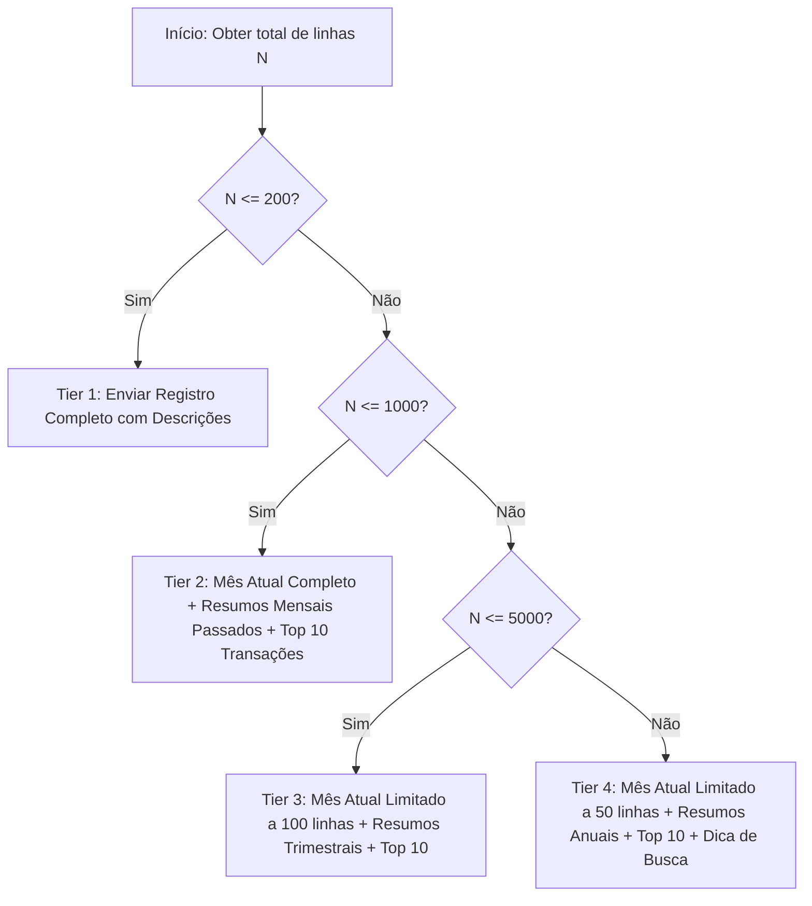

# Masterclass Módulo 5: Inteligência Artificial Conversacional Context-Aware e Design de Produto Cognitivo
*Manual de Aulas, Especificação de RAG Analítico e Engenharia de Prompt no Backend Python*

Este documento serve como o Guia Didático e Manual de Especificação Técnica do **Módulo 5: IA Conversacional e Design de Produto Cognitivo** no ecossistema Assistente-Moeda. Ele apresenta a arquitetura de Ingestão de Contexto no backend Python, as técnicas de compressão em cascata (Tiers) e as estratégias de engenharia de prompt aplicadas a modelos de linguagem para análise financeira avançada.

---

## 📑 CAPÍTULO 1: Arquitetura de RAG Financeiro e Ingestão de Contexto em Python

### 1.1 A Guerra contra o Ruído (Data Ingestion)
No desenvolvimento de aplicações integradas com LLMs (Large Language Models), o padrão comum de desenvolvimento é o despejo direto de tabelas relacionais brutas (JSONs com milhares de linhas de transações) na janela de contexto da API. Embora simples, essa abordagem constitui um erro grave de arquitetura pelos seguintes motivos:

1. **Token Bleed (Vazamento de Orçamento):** Bancos de dados reais contêm chaves internas redundantes, UUIDs de rastreamento, timestamps de criação e sub-chaves de controle que não agregam valor à análise financeira. Enviar esses dados consome a janela de contexto e eleva exponencialmente os custos de API.
2. **Diluição do Prompt (Attention Dilution):** Modelos de linguagem sofrem do fenômeno de *Lost in the Middle* (Perda no Meio). Ao receberem volumes massivos de dados desestruturados, a atenção semântica da IA se dispersa, reduzindo a capacidade do modelo de resgatar instruções operacionais críticas inseridas no System Prompt.
3. **Alucinações Aritméticas (Math Hallucinations):** Modelos autorregressivos (como a família Gemini ou GPT) funcionam estimando probabilidades de strings de texto. Eles **não** são motores de cálculo determinísticos. Forçar o modelo a somar 1.000 parcelas decimais para extrair o saldo líquido global resulta em erros aritméticos graves e alucinações.

---

### 1.2 Hidratação de Contexto Estruturado
Para resolver essas fraquezas, o backend em Python do Assistente-Moeda, implementado em [coin_ai_router.py](file:///c:/Users/Usuario/Desktop/AHeiss_GoogleDrive/02-Programacao/projetos-IA/LogicDefense/backend/routers/coin_ai_router.py), atua como um **hidratador de contexto analítico**. 

O servidor não envia a base de dados bruta para a IA realizar contas. O motor de cálculo determinístico em Python (`compute_metrics` em [coin_metrics_engine.py](file:///c:/Users/Usuario/Desktop/AHeiss_GoogleDrive/02-Programacao/projetos-IA/LogicDefense/backend/services/coin_metrics_engine.py)) processa os números previamente, e o injetor de contexto monta um resumo textual estruturado em Markdown (KPIs, saldos operacionais, médias calendário e vetores de tendências por categoria), deixando para o LLM apenas o papel cognitivo de interpretação estratégica.

A função `build_financial_context` no backend recebe o payload tipado (`AIAnalystPayload`) e o objeto de métricas computadas (`TableMetrics`), mapeando:
- **Metas vigentes:** Meta diária, semanal e custo anual.
- **Totais operacionais (puros):** Receita operacional bruta, despesas operacionais e saldo líquido.
- **Totais com parceria (passthrough):** Créditos e débitos de parceiros.
- **Médias calendário:** Diária, semanal, mensal e anual calculadas sob o tempo transcorrido real.
- **Balanço estrito de metas:** Excedente/déficit financeiro e saldo no Banco de Tempo.
- **Portfólio de investimentos:** Depósitos, rendimento real do CDI simulated a $0.8\%$ ao mês e saldo final.
- **Resumos estatísticos avançados:** Maior, menor, mediana, moda e desvio padrão das receitas.
- **Resumos por categoria:** Faturamento, médias e desvio padrão agrupados por descrição.
- **Cenários projetados:** Meses sintéticos futuros configurados pelo usuário.

Dessa forma, o contexto que chega à IA já é a "comida mastigada", permitindo que ela foque inteiramente na tomada de decisão estratégica e no diagnóstico comportamental do usuário.

---

## 💻 CAPÍTULO 2: Engenharia de Prompt e o System Prompt de Elite

### 2.1 Análise do System Prompt Base
O comportamento da IA analítica é rigidamente delimitado pela constante `SYSTEM_PROMPT` em [coin_ai_router.py](file:///c:/Users/Usuario/Desktop/AHeiss_GoogleDrive/02-Programacao/projetos-IA/LogicDefense/backend/routers/coin_ai_router.py). Ela estabelece a persona do analista financeiro:

```python
SYSTEM_PROMPT = """Você é o **Assistente Moeda** — um analista financeiro pessoal inteligente.

CONTEXTO DO USUÁRIO:
Você está apoiando alguém que gerencia suas finanças pessoais e profissionais
com disciplina e estratégia. Essa pessoa acompanha receitas, despesas e metas
operacionais de forma meticulosa — trate-a como alguém que entende seus números
e busca análises de alto nível, não explicações básicas.

PAPEL:
- Responda SEMPRE em português brasileiro, com tom estratégico e respeitoso.
- Interprete os dados financeiros do contexto para responder à pergunta do usuário.
- Use os números EXATOS do contexto — NUNCA invente valores.
- Formate valores monetários como R$ X.XXX,XX (padrão brasileiro).
- Use Markdown para estruturar a resposta (headers ##, listas, **negrito** para destaques).
- Seja direto e prático — o usuário é um profissional ocupado.
- Entregue análises completas e bem estruturadas, não respostas curtas.

ESPECIALIDADES:
- Análise de tendências de faturamento (diário, semanal, mensal, anual)
- Avaliação do Banco de Tempo (semanas de crédito ou débito)
- Diagnóstico do balanço de metas (excedente vs déficit)
- Recomendações operacionais concretas (quantos dias trabalhar, quando descansar)
- Projeção de cenários simples ("se mantiver esse ritmo...")
- Análise comparativa entre períodos
- Relação receita vs despesas e ponto de equilíbrio
- Análise de portfólio de investimentos (aportes, rendimentos compostos, saldo acumulado)
- Estatísticas avançadas: mediana, moda, desvio padrão, min/max (já calculados — use os valores do contexto)
- Análise de CATEGORIAS financeiras: identificar padrões de gasto/receita, concentração, diversificação

DICAS SOBRE O CONTEXTO:
- O contexto inclui RESUMOS POR CATEGORIA com métricas avançadas (max, min, mediana, DP, média diária/semanal).
- Use esses resumos para identificar tendências, riscos de concentração e oportunidades de otimização.
- As médias diária/semanal por categoria usam o período GLOBAL (primeira→última entrada) para refletir o impacto estrutural real.
- As estatísticas avançadas (mediana, moda, desvio padrão) JÁ FORAM calculadas — use-as diretamente, NÃO recalcule.
- Se o usuário pedir detalhes de transações individuais, sugira que informe o mês ou período desejado.
- You now have access to 'CENÁRIOS PROJETADOS' (Projected Scenarios). These are synthetic future months generated by the user using statistical averages or cloned history. When analyzing, compare their real past performance with these future projections. Advise them if their projected future is financially healthy or if they need to adjust their strategy.

RESTRIÇÕES:
- NUNCA dê conselhos de investimento (ações, cripto, etc.)
- NUNCA invente dados que não estão no contexto
- Se o contexto não tiver informação suficiente, diga explicitamente
- Entradas de parceria (partner_in / partner_out) são estritamente PASSTHROUGH — NÃO representam a capacidade operacional do usuário. Sempre use as métricas OPERACIONAIS puras para análise de desempenho e produtividade.
"""
```

#### Análise das Diretrizes e Restrições Cognitivas:

1. **Rigor Matemático vs. Especulação**: O prompt proíbe expressamente o recalculo de estatísticas descritivas complexas pelo LLM. Informações como a mediana, moda e desvio padrão populacional já chegam prontas na estrutura de contexto, evitando erros comuns de aproximação estatística que ocorrem em modelos generativos.
2. **Entendimento da Realidade Operacional Local (Terminologia Vernacular)**:
   * **`waiver` (Dispensa)**: O LLM compreende que lançamentos do tipo `waiver` representam semanas justificadas (férias, doença, quebra mecânica do veículo), onde o motor contábil perdoa a meta semanal. A IA deve interpretar essas semanas não como ociosidade ou fracasso, mas sim como períodos de interrupção operacional autorizados que geram crédito financeiro proporcional no balanço de metas, preservando a saúde mental do operador.
   * **`partner netting` (Netting de Parcerias)**: Lançamentos de tipo `partner_in` (créditos/reembolsos de parceiros) e `partner_out` (débitos de taxas/insumos cobrados por parceiros) devem ser tratados como fluxos transitórios (*passthrough*). A IA sabe que eles não refletem a verdadeira força de trabalho ou produtividade operacional do autônomo. O LLM é treinado para ignorá-los nas análises operacionais puras de desempenho e para se concentrar no netting dessas contas.
   * **`EH BB`, `AH ITAU`**: Prefixos de namespaces de contas ou categorias bancárias brasileiras. O LLM reconhece que termos iniciados com prefixos de duas letras (como `EH` para empréstimos/encargos e `AH` para amortizações/históricos de amortização, associados a marcas de bancos como Banco do Brasil `BB` ou `ITAU`) representam linhas de custos estruturais, dívidas ou ativos que o motor de proração diária fatia ao longo do tempo. A IA compreende esses namespaces locais sem a necessidade de uma tabela de de-para externa.
3. **Comportamento como Controlador Contábil Frio**: A IA é instruída a atuar como um auditor analítico e não como um terapeuta motivacional. O tom deve ser estratégico, focado em fatos e pautado no cumprimento rígido do Banco de Tempo e do balanço acumulado de metas.

---

### 2.2 Injeção Dinâmica de Variáveis
A construção da prompt final que alimenta a chamada da API do Gemini é realizada pela interpolação da string de contexto analítico com a pergunta específica submetida pelo cliente:

```python
# Trecho de coin_ai_router.py (Rota ai_analyst)
    # ── Step 2: Build rich context ───────────────────────────────────────
    financial_context = build_financial_context(payload, metrics)

    # ── Step 3: Query Gemini ─────────────────────────────────────────────
    user_message = (
        f"{financial_context}\n\n"
        f"── PERGUNTA DO USUÁRIO ──\n"
        f"{payload.user_prompt}"
    )
```

No backend, a requisição é despachada de forma assíncrona para o modelo Gemini (`gemini-2.5-flash` por padrão), utilizando a biblioteca oficial do Google GenAI SDK:

```python
        response = await asyncio.to_thread(
            client.models.generate_content,
            model=MODEL,
            contents=user_message,
            config=types.GenerateContentConfig(
                system_instruction=SYSTEM_PROMPT,
                temperature=0.4,
                max_output_tokens=16384,
                **{"thinking_config": types.ThinkingConfig(
                    thinking_budget=4096,
                )},
            ),
        )
```

*   **Temperatura Baixa ($0.4$):** Reduz o grau de aleatoriedade na amostragem de tokens, forçando a IA a se prender estritamente aos fatos e números injetados no contexto.
*   **Orçamento de Pensamento (Thinking Budget - $4.096$ tokens):** Garante a ativação da janela de raciocínio lógico interno do modelo (Cadeia de Pensamento/Reasoning), permitindo que ele elabore as premissas da análise financeira passo a passo antes de redigir a resposta final, sem estourar o orçamento de tokens.

---

## 📊 CAPÍTULO 3: Economia de Tokens e Estratégias de Compressão de Contexto

### 3.1 O Modelo Matemático de Escalonamento de Contexto
O consumo da janela de contexto de um LLM escala de forma insustentável caso a engenharia de dados do RAG seja negligente. Apresentamos a comparação entre os dois modelos de escalonamento de tokens:

#### 1. Vazamento Linear de Tokens $O(N)$ (Data Dump Bruto)
No cenário onde todas as transações brutas com seus metadados JSON são enviadas à janela de contexto do LLM:

$$T_{\text{bruto}}(N) = N \cdot \alpha + \beta$$

Onde:
- $N$ é o número total de lançamentos (linhas de transação).
- $\alpha$ é o peso médio em tokens de uma única linha crua em formato JSON. Cada linha contém chaves repetitivas (`id`, `date`, `value`, `description`, `entryType`, `monthlyValue`, `monthCount`, `periodStart`, `periodEnd`, `generatedBy`, `clonedFrom`).
- $\beta$ representa o número de tokens fixos consumidos pelo `SYSTEM_PROMPT`.

Para uma base histórica com 5.000 lançamentos ($N = 5.000$), se cada linha JSON consome cerca de 80 tokens ($\alpha = 80$):

$$T_{\text{bruto}}(5000) = 5.000 \cdot 80 + 3.000 = 403.000 \text{ tokens}$$

Isso gera custos financeiros proibitivos e degrada a velocidade de inferência (latência), além de provocar a diluição de atenção do LLM.

#### 2. Compactação Analítica Cascateada $O(1)$ ou $O(K)$ (Modelo Assistente-Moeda)
No Assistente-Moeda, o backend pré-calcula todas as agregações matemáticas e as converte em Markdown analítico compacto. A base histórica detalhada é omitida, restando apenas os sumários por categorias ($K$ categorias) e as assinaturas estatísticas descritivas:

$$T_{\text{otimizado}}(N, K) = K \cdot \gamma + T_{\text{cascade}}(N) + \beta$$

Onde:
- $K$ é o número de categorias financeiras distintas ativas na base de dados (normalmente, $K \le 30$).
- $\gamma$ é o peso médio em tokens da linha Markdown que descreve os dados estatísticos consolidados da categoria (ex: soma total, média diária, mediana, desvio padrão).
- $T_{\text{cascade}}(N)$ é a função de custo do diário dinâmico, controlada pelo algoritmo de 4 Tiers.

Como $K \ll N$ (a quantidade de categorias cresce de forma assintoticamente estável em relação ao número total de transações de um usuário), o consumo de tokens torna-se amortizado e o comportamento do payload se aproxima de um perfil constante ou logarítmico estável.

---

### 3.2 Técnicas de Redução de Payload (Algoritmo de Cascata de 4 Níveis)
O backend implementa o método `build_transaction_ledger` em [coin_ai_router.py](file:///c:/Users/Usuario/Desktop/AHeiss_GoogleDrive/02-Programacao/projetos-IA/LogicDefense/backend/routers/coin_ai_router.py) para regular dinamicamente a densidade do diário de lançamentos de acordo com o volume histórico do usuário. A cascata opera da seguinte maneira:



#### Especificação Técnica dos Tiers de Compressão:

1. **Tier 1 (Ledger Completo) — $N \le 200$**:
   A base é compacta. O diário é renderizado na íntegra, ordenado por data crescente. Exemplo de linha enviada:
   ```text
   2026-06-01 | RECEITA  | R$   1.500,00 | Consultoria Técnica Dev
   ```
2. **Tier 2 (Mês Atual + Resumo Mensal + Top 10) — $201 \le N \le 1.000$**:
   *   O diário exibe de forma detalhada apenas os registros do mês de referência atual (`current_ym`).
   *   Os meses passados são agrupados em uma única linha agregada por mês, omitindo as descrições individuais das transações e somando receitas, despesas, aportes, créditos e débitos de parceria.
   *   Adiciona-se a seção `Top 10 Maiores Transações` para que a IA não perca a visibilidade sobre grandes entradas históricas.
3. **Tier 3 (Mês Atual Limitado + Resumo Trimestral + Top 10) — $1.001 \le N \le 5.000$**:
   *   O mês de referência atual é exibido, porém limitado aos primeiros 100 registros para evitar estouro em meses de altíssima atividade.
   *   O histórico passado é compactado em balanços consolidados por trimestre (`YYYY-Qn`), informando o número de transações e o volume financeiro acumulado.
   *   Injeção da lista com as 10 maiores transações de todos os tempos.
4. **Tier 4 (Ledger Crítico + Resumo Anual + Top 10) — $N > 5.000$**:
   *   O diário do mês atual é limitado a 50 transações.
   *   O histórico antigo é resumido por ano civil (`YYYY`).
   *   Injeta-se um aviso cognitivo ao LLM (`search hint`): *"O usuário possui milhares de transações. Para análise de descrições específicas, peça ao usuário para informar o mês ou período desejado."*

Com essa arquitetura de dados, removemos metadados redundantes (como UUIDs e timestamps) e mantemos a integridade da janela de contexto, permitindo que a inteligência artificial opere com precisão mesmo sob séries temporais gigantescas.

---

## 🎓 CAPÍTULO 4: Roteiro Pedagógico e Blueprint de Aula

### 4.1 Lesson Plan: RAG Otimizado e Limitação de Contexto (60 Minutos)

| Tempo | Tópico | Estratégia Pedagógica | Foco do Instrutor |
| :--- | :--- | :--- | :--- |
| **00:00 - 00:15** | A Guerra contra o Ruído e Alucinações | Aula expositiva com análise do erro contábil provocado por alucinações aritméticas em LLMs. | Demonstrar por que modelos de linguagem falham em aritmética básica de ponto flutuante sob payloads massivos. |
| **00:15 - 00:35** | O Algoritmo de Cascata de Tiers | Engenharia reversa do código do backend. Estudo da função `build_transaction_ledger`. | Explicar o funcionamento das quatro camadas de compressão e a lógica de agregação temporal. |
| **00:35 - 00:45** | Engenharia de Prompt e Segurança | Leitura orientada do `SYSTEM_PROMPT`. Discussão sobre firewall contábil e interpretação de namespaces. | Destacar o isolamento de fluxos de parceria e a leitura de termos específicos brasileiros como `EH BB` e `AH ITAU`. |
| **00:45 - 01:00** | Workshop de Auditoria Automatizada | Laboratório prático (Hands-on). Alunos escrevem testes automatizados de payload. | Conduzir a escrita de asserções que medem a taxa de compressão e a conservação de deltas de saldo com `tiktoken`. |

---

### 4.2 Blueprint do Slide Deck

#### Slide 1: O Fenômeno do Token Bleed em Finanças
*   **Título**: O Fim do "Data Dump": Arquitetura RAG Eficiente
*   **Tópicos Chave**:
    *   Janelas de contexto de LLMs são caras e sofrem de degradação de atenção (*Lost in the Middle*).
    *   Bancos de dados relacionais brutos contêm ruídos (UUIDs, timestamps) que diluem o prompt.
    *   Solução: Dividir responsabilidades — cálculo determinístico no backend Python e interpretação semântica no LLM.
*   **Componente Visual**: Diagrama de blocos mostrando o fluxo ineficiente (Tabela Relacional $\rightarrow$ LLM) riscado com um "X" vermelho, contrastado com o fluxo otimizado (Tabela Relacional $\rightarrow$ Motor Contábil $\rightarrow$ Contexto Sintético MD $\rightarrow$ LLM) destacado em verde.

#### Slide 2: Anatomia do System Prompt e Regras Contábeis
*   **Título**: Alinhamento Cognitivo e Proteção Regulatória
*   **Tópicos Chave**:
    *   Persona: Analista e Auditor Financeiro Estrito (tom corporativo).
    *   Definição e proteção contábil: Tratamento de `waiver` e desconsideração de fluxos de parceria operacionais (*passthrough netting*).
    *   Entendimento nativo de namespaces nacionais (`EH BB`, `AH ITAU`).
    *   Firewall regulatório: Proibição de aconselhamento de investimentos especulativos.
*   **Componente Visual**: Tabela de dois lados diferenciando o tom inadequado ("IA conselheira/terapeuta") e o tom exigido ("Auditor financeiro objetivo").

#### Slide 3: O Algoritmo de Cascata em 4 Tiers
*   **Título**: Regulação Dinâmica do Tamanho do Ledger
*   **Tópicos Chave**:
    *   Ajuste automático do payload baseado em $N$ (tamanho do histórico).
    *   Conservação de dados: O mês atual é priorizado; meses passados são sintetizados.
    *   Preservação de anomalias: Lançamentos volumosos históricos são protegidos pelo vetor *Top 10*.
*   **Componente Visual**: Gráfico de degraus ilustrando o tamanho do payload de contexto (em tokens) estabilizado à medida que $N$ cresce de $10$ para $10.000$ registros.

#### Slide 4: Métricas de Eficiência e Validação
*   **Título**: Auditoria e Garantia de Integridade Financeira
*   **Tópicos Chave**:
    *   Como testar pipelines de IA: Testes unitários com simulação volumosa.
    *   Validação de compressão: Comparação de caracteres e tokens (`tiktoken`).
    *   Validação de integridade: Assertivas para garantir que o delta do saldo financeiro final não foi apagado.
*   **Componente Visual**: Exemplo de linha de código `assert tokens_otimizados < tokens_brutos` com indicadores de economia real superiores a $80\%$.

---

### 4.3 Exercício de Auditoria Prática (Mão na Massa)

#### Instruções para o Estudante:
Neste laboratório, você criará um arquivo de testes automatizados utilizando o framework `pytest` e a biblioteca `tiktoken` (utilizada para contagem exata de tokens do codificador de modelos da OpenAI/Gemini). 

O objetivo do exercício é simular uma base de dados realista de um profissional com 1.000 registros de transações ($N = 1000$). Você deve implementar uma versão simplificada do hidratador de contexto e do diário de transações cascateado, e em seguida escrever asserções unitárias rigorosas para verificar a taxa de compressão em tokens obtida pelo Tier 2, assegurando que os deltas dos saldos das transações históricas suprimidas permaneçam perfeitamente representados nos agrupamentos acumulados mensais.

#### Código do Exercício (`test_rag_compression.py`):
Crie e execute o arquivo de teste abaixo. Certifique-se de ter os pacotes instalados (`pip install pytest tiktoken`).

```python
import pytest
import tiktoken
from datetime import datetime, timedelta

# 1. Definição Simplificada das Entidades de Dados
class TableRow:
    def __init__(self, date: str, value: float, entry_type: str, description: str):
        self.date = date
        self.value = value
        self.entry_type = entry_type
        self.description = description

# 2. Implementação do Motor de Ledger em Cascata (Tiered Cascade)
def build_compact_ledger(rows: list[TableRow], current_ym: str) -> str:
    total_rows = len(rows)
    if total_rows == 0:
        return "Nenhum registro encontrado."

    # Tier 1 (Ledger Completo) — Até 200 linhas
    if total_rows <= 200:
        lines = []
        for r in sorted(rows, key=lambda x: x.date):
            lines.append(f"  {r.date} | {r.entry_type.upper():10s} | R$ {r.value:,.2f} | {r.description}")
        return "\n".join(lines)

    # Tier 2 (Cascata) — Entre 201 e 1000 linhas
    # Exibe todo o mês atual + resumos agrupados de meses anteriores + Top 10 maiores transações
    month_rows = [r for r in rows if r.date.startswith(current_ym)]
    history_rows = [r for r in rows if not r.date.startswith(current_ym)]

    lines = []
    
    # Detalhar Mês Atual
    lines.append(f"── Transações Detalhadas do Mês Atual ({current_ym}) ──")
    for r in sorted(month_rows, key=lambda x: x.date):
        lines.append(f"  {r.date} | {r.entry_type.upper():10s} | R$ {r.value:,.2f} | {r.description}")

    # Agrupar Histórico por Mês
    lines.append("\n── Resumos Mensais (Histórico) ──")
    monthly_aggregates = {}
    for r in history_rows:
        ym = r.date[:7]
        if ym not in monthly_aggregates:
            monthly_aggregates[ym] = {"revenue": 0.0, "expense": 0.0}
        
        if r.entry_type == "revenue":
            monthly_aggregates[ym]["revenue"] += r.value
        elif r.entry_type == "expense":
            monthly_aggregates[ym]["expense"] += r.value

    for ym in sorted(monthly_aggregates.keys()):
        rev = monthly_aggregates[ym]["revenue"]
        exp = monthly_aggregates[ym]["expense"]
        lines.append(f"  {ym}: Receitas R$ {rev:,.2f} | Despesas R$ {exp:,.2f}")

    # Seção Top 10 Maiores Transações (Preservar visibilidade dos outliers)
    lines.append("\n── Top 10 Maiores Transações Históricas ──")
    top_ten = sorted(rows, key=lambda r: r.value, reverse=True)[:10]
    for r in top_ten:
        lines.append(f"  {r.date} | {r.entry_type.upper():10s} | R$ {r.value:,.2f} | {r.description}")

    return "\n".join(lines)

# 3. Conjunto de Testes Unitários de Auditoria de Tokens
def test_rag_payload_compression_and_math_integrity():
    # Setup: Simulação de 1000 linhas de dados financeiros
    # Mês Atual: 2026-06 (com 50 transações cotidianas)
    # Histórico: 950 transações distribuídas pelos meses anteriores de 2025/2026
    current_month = "2026-06"
    simulated_rows = []

    # Injetando receitas e despesas no mês corrente
    for day in range(1, 26):
        simulated_rows.append(TableRow(
            date=f"2026-06-{day:02d}",
            value=250.00,
            entry_type="revenue",
            description=f"Faturamento serviço diário #{day}"
        ))
        simulated_rows.append(TableRow(
            date=f"2026-06-{day:02d}",
            value=50.00,
            entry_type="expense",
            description=f"Combustível posto bandeira #{day}"
        ))

    # Injetando 950 registros históricos nos meses passados (de Janeiro de 2025 a Maio de 2026)
    # Totalizando R$ 100,00 de receita por transação
    start_date = datetime(2025, 1, 1)
    for index in range(950):
        target_date = start_date + timedelta(hours=index * 12)
        if target_date.strftime("%Y-%m") == current_month:
            # Forçar data a cair no mês anterior para manter o isolamento no teste
            target_date = target_date - timedelta(days=60)
        
        simulated_rows.append(TableRow(
            date=target_date.strftime("%Y-%m-%d"),
            value=100.00,
            entry_type="revenue",
            description="Lançamento histórico padrão de rotina"
        ))

    # Simulando o Payload Bruto (como seria enviado sem a filtragem de Tiers)
    # Cada linha JSON crua teria aproximadamente 150 caracteres
    raw_payload_str = ""
    for r in simulated_rows:
        raw_payload_str += f'{{"date": "{r.date}", "value": {r.value}, "entryType": "{r.entry_type}", "description": "{r.description}"}},'

    # Executando o algoritmo de compressão para obter o Ledger de Contexto
    compressed_context = build_compact_ledger(simulated_rows, current_ym=current_month)

    # Inicializando o codificador de tokens do tiktoken (padrão cl100k_base do GPT-4/Gemini adaptado)
    encoder = tiktoken.get_encoding("cl100k_base")
    tokens_raw = len(encoder.encode(raw_payload_str))
    tokens_compressed = len(encoder.encode(compressed_context))

    # ASSERÇÕES DE DESEMPENHO E COMPRESSÃO
    
    # 1. Validação da taxa de compressão de tokens
    # O payload comprimido deve ser pelo menos 75% menor que o dump relacional bruto
    compression_ratio = 1 - (tokens_compressed / tokens_raw)
    assert compression_ratio >= 0.75, f"Compressão insuficiente: {compression_ratio * 100:.2f}%"
    
    # 2. Validação da Integridade dos Dados do Mês Atual
    # Nenhuma transação do mês de referência (2026-06) pode ser excluída ou sumarizada
    assert "2026-06-01" in compressed_context
    assert "2026-06-25" in compressed_context
    assert "Faturamento serviço diário #1" in compressed_context

    # 3. Validação da Integridade Matemática Histórica
    # O delta histórico foi sumarizado, mas seu valor financeiro agregado está preservado nas chaves de mês
    # As transações brutas de meses antigos não aparecem de forma crua
    assert "Lançamento histórico padrão de rotina" not in compressed_context
    assert "2025-01-01" not in compressed_context

    # Contudo, os acumuladores de receitas mensais passados devem estar visíveis e com a matemática exata
    # 950 transações de R$ 100,00 geram um total histórico de R$ 95.000,00 distribuídos
    assert "── Resumos Mensais (Histórico) ──" in compressed_context
    assert "2025-01: Receitas R$ " in compressed_context
```
