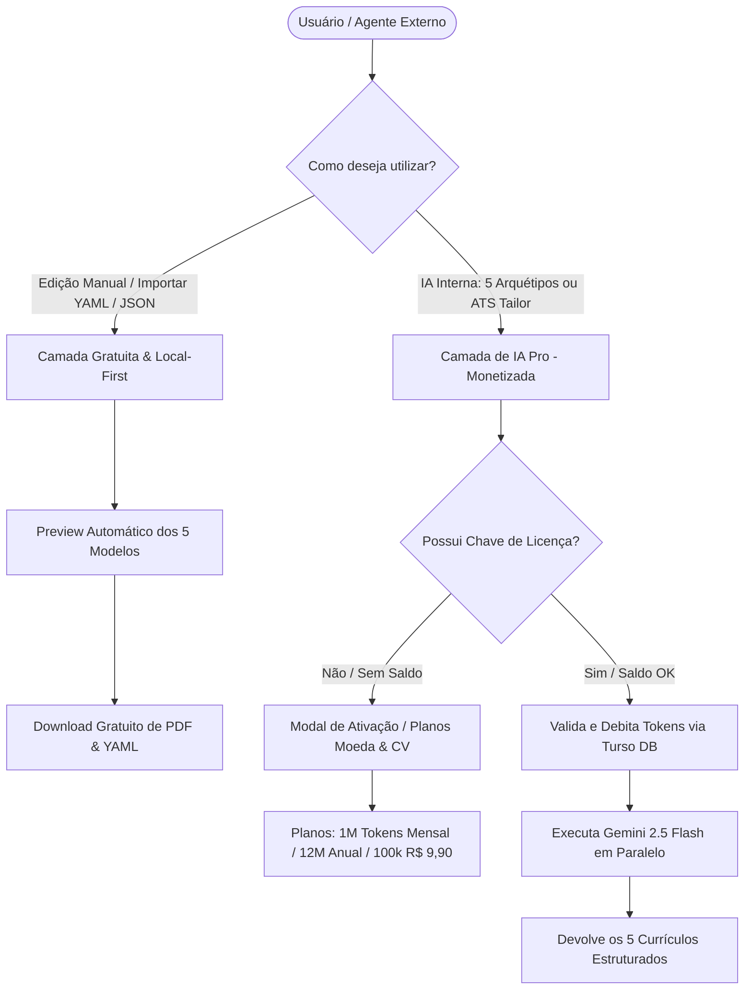

# 🏛️ Master Plan: CV Maker 2.0 — Monetização de IA, Sistema de Licenças & Preview Automático de PDF

> **Data:** 2026-08-28  
> **Status:** 📋 Planejamento & Arquitetura (Aguardando Aprovação / Zero Código Executado)  
> **Especialista:** `agency-master-plan-architect` & `agency-resume-tailor`  
> **Módulo:** `LogicDefense/src/tools/cv-maker` & `LogicDefense/backend`  

---

## 1. 🎓 A Super Aula: Filosofia, Fundamentos & Visão Geral

### 💡 O Problema Real & O Paradoxo do Custo de IA
No desenvolvimento de software moderno, aplicações que realizam geração de conteúdo via Modelos de Linguagem de Grande Escala (LLMs) enfrentam um dilema financeiro crucial:
1. **A Camada de Apresentação & Edição (Client-Side):** Manipular YAML, editar campos no formulário, alternar entre 5 temas visuais e exportar documentos para PDF consome **zero centavos de servidor** se executado na CPU do navegador do usuário.
2. **A Camada de Inferência Inteligente (Server-Side):** Disparar chamadas para modelos como o *Gemini 2.5 Flash* gerando 5 arquétipos simultâneos ou realizando alfaiataria de currículos contra vagas (*ATS Tailoring*) consome tokens pagos de API.

**A Solução Elegante:**
Desacoplar radicalmente a ferramenta em duas camadas:
* **Camada Local / Gratuita (Zero Paywall):** O usuário pode carregar modelos prontos, colar seu próprio YAML ou JSON, alternar entre os 5 temas (Executivo, Criativo, Minimalista, White, Terminal), visualizar o **Preview Automático em PDF/HTML** e fazer o download de todos os modelos **100% de graça**.
* **Camada de IA Interna Pro (Monetizada):** A geração automática de 5 versões de currículos e a alfaiataria ATS inteligente tornam-se serviços Pro, integrados ao **mesmo sistema unificado de licenças e cotas de tokens do Assistente Moeda** (Turso SQLite, Stripe e Webhooks).

---

### 🧱 Padrões Arquiteturais Adotados

1. **Unificação Multilocatária de Licenças (Shared Token Economy):**
   - Não criamos novos bancos ou tabelas isoladas. Reutilizamos a tabela `license_keys` do **Turso SQLite** já operacional no Assistente Moeda.
   - Uma chave de licença Pro adquirida pelo usuário (ex: `am_pro_...`) é **universal**: serve para analisar suas finanças no Assistente Moeda e para gerar seus currículos no CV Maker!
2. **Dual-Engine PDF Preview (Preview Instantâneo Client-Side + Server-Side Endpoint):**
   - **No Navegador:** O componente de visualização renderiza o modelo instantaneamente com as regras de página A4 do CSS (`@page { margin: 8mm 12mm; }`), sem necessidade de requisições de rede para cada caractere digitado.
   - **Na API:** O endpoint `POST /api/v1/cv/render` aceita parâmetros `?format=html`, `?format=yaml` ou `?theme=...` para permitir que agentes externos baixem o arquivo diagramado pronto para impressão.
3. **Idempotência e Segurança com SHA-256:**
   - As chaves de licença são validadas por hash criptográfico SHA-256, com suporte a modo Deus (*God Mode* `Mateus7:12@`) para testes e auditoria interna.

---

## 2. 🔍 Crítica Cirúrgica & Red Teaming (O que pode quebrar?)

| Ponto Vulnerável / Risco | Cenário de Falha | Mitigação Arquitetural Preventiva |
| :--- | :--- | :--- |
| **1. Frustração do Usuário Gratuito** | O usuário achar que precisa pagar para apenas exportar ou ver seu currículo em PDF. | **Mensagens Claras de UI:** Deixar explícito que a importação, edição manual, alternância de temas e download de PDF são **100% gratuitos para sempre**. Apenas os botões de IA ("Gerar 5 Versões" e "Otimizar para Vaga") exigem chave Pro. |
| **2. Débito Incorreto de Tokens** | A chamada de IA falhar no meio do caminho e os tokens serem debitados indevidamente. | O débito (`deduct_license_tokens`) só é disparado **após** a resposta bem-sucedida do Gemini com o número exato de tokens reportados em `usage_metadata.total_token_count`. |
| **3. Concorrência no Débito de Tokens (Race Condition)** | Múltiplas requisições paralelas consumirem o saldo antes do commit no Turso. | A verificação prévia adiciona um buffer de segurança de 15% (`est_prompt_tokens = int((len(text)/4) * 1.15) + 500`) antes de aceitar o processamento. |
| **4. Inchaço de Escopo (Scope Creep)** | Tentar embutir um motor pesado de renderização de PDF nativo em Rust/C++ no servidor Render de baixa memória. | Manter a saída do `/render` como **HTML Standalone com Estilos Embutidos e Botão A4 de Impressão Nativa**, garantindo zero consumo de RAM no servidor Render e fidelidade tipográfica máxima no cliente. |

---

## 3. 🗺️ Esqueleto do Implementation Plan (Mapeamento de Arquivos)

### ⚙️ Backend (`LogicDefense/backend`)

#### `[MODIFY]` [`backend/routers/cv_router.py`](file:///c:/Users/Usuario/Desktop/AHeiss_GoogleDrive/02-Programacao/projetos-IA/LogicDefense/backend/routers/cv_router.py)
* **Objetivo:** Adicionar verificação de licença e débito de tokens nas rotas `/api/v1/cv/generate` e `/api/v1/cv/tailor`.
* **Alterações:**
  - Importar `get_license_by_raw_key`, `deduct_license_tokens` de `db.license_db`.
  - Aceitar `X-License-Key` ou `Authorization: Bearer ...` (com fallback para chave temporária de dev).
  - Verificar saldo de tokens antes da execução e debitar a quantidade exata de tokens consumidos pelo Gemini 2.5 Flash após a geração.

#### `[MODIFY]` [`backend/routers/license_router.py`](file:///c:/Users/Usuario/Desktop/AHeiss_GoogleDrive/02-Programacao/projetos-IA/LogicDefense/backend/routers/license_router.py)
* **Objetivo:** Garantir que o endpoint `/api/license/validate` e `/api/license/recover` sejam consumidos de forma idêntica tanto pelo Assistente Moeda quanto pelo CV Maker.

---

### 💻 Frontend (`LogicDefense/src/tools/cv-maker`)

#### `[NEW]` [`src/tools/cv-maker/components/StoreModal/CVStoreModal.tsx`](file:///c:/Users/Usuario/Desktop/AHeiss_GoogleDrive/02-Programacao/projetos-IA/LogicDefense/src/tools/cv-maker/components/StoreModal/CVStoreModal.tsx)
* **Objetivo:** Modal de ativação de chave Pro, consulta de saldo de tokens e exibição dos planos de compra idênticos ao Assistente Moeda:
  - 🌟 **Plano Mensal:** 1.000.000 tokens/mês.
  - 👑 **Plano Anual:** 12.000.000 tokens/ano (Melhor Custo-Benefício).
  - ⚡ **Recarga Avulsa:** 100.000 tokens por R$ 9,90.
  - 🔑 **Campo de Ativação:** Validação instantânea com Turso SQLite e salvamento em `localStorage` (`ld_pro_license_key`).

#### `[MODIFY]` [`src/tools/cv-maker/components/Toolbar/CVToolbar.tsx`](file:///c:/Users/Usuario/Desktop/AHeiss_GoogleDrive/02-Programacao/projetos-IA/LogicDefense/src/tools/cv-maker/components/Toolbar/CVToolbar.tsx)
* **Objetivo:** 
  - Adicionar botão **"💎 Ativar IA Pro / Saldo de Tokens"** com badge visual de status (Pro ativo / Free).
  - Adicionar atalho de **"👁️ Preview dos Modelos"** permitindo alternar instantaneamente entre os 5 templates para qualquer currículo importado.

#### `[MODIFY]` [`src/tools/cv-maker/CVMakerApp.tsx`](file:///c:/Users/Usuario/Desktop/AHeiss_GoogleDrive/02-Programacao/projetos-IA/LogicDefense/src/tools/cv-maker/CVMakerApp.tsx)
* **Objetivo:**
  - Interceptar cliques em "Gerar com IA" ou "Alfaiataria ATS": se o usuário não possuir licença ativa, abre automaticamente o `CVStoreModal`.
  - Se possuir chave, envia o cabeçalho `X-License-Key` para o backend e atualiza o saldo de tokens restante na interface.

#### `[MODIFY]` [`src/tools/cv-maker/services/cvService.ts`](file:///c:/Users/Usuario/Desktop/AHeiss_GoogleDrive/02-Programacao/projetos-IA/LogicDefense/src/tools/cv-maker/services/cvService.ts)
* **Objetivo:** Incluir o envio automático de `X-License-Key` (lida do `localStorage.getItem('ld_pro_license_key')`) nas chamadas de IA.

---

## 4. 🧪 Protocolo de Validação & Evidências de Verdade

1. **Teste 1 — Usuário Gratuito (Zero Bloqueio):**
   - Abrir o CV Maker sem nenhuma chave inserida.
   - Colar um YAML ou JSON arbitrário.
   - Alternar entre os 5 temas (Executivo, Criativo, Minimalista, White, Terminal).
   - Clicar em "Imprimir / Salvar PDF" e "Baixar YAML".
   - **Resultado Esperado:** Operação 100% gratuita, sem pop-up impeditivo e sem requisições pagas.
2. **Teste 2 — Acionamento da IA Interna sem Licença:**
   - Clicar em "Gerar 5 Versões com IA".
   - **Resultado Esperado:** O `CVStoreModal` deve abrir elegantemente explicando os planos e oferecendo o campo de inserção de chave.
3. **Teste 3 — Ativação de Chave Pro & Consumo de Tokens:**
   - Ativar uma chave Pro válida (ou God Mode `Mateus7:12@`).
   - Disparar a geração de IA de 5 arquétipos.
   - **Resultado Esperado:** Geração paralela concluída com sucesso, e o saldo de tokens no Turso debitado exatamente conforme a contagem de tokens do Gemini.
4. **Teste 4 — Preview Automático dos Modelos:**
   - Verificar a alternância suave de temas com renderização fiel em padrão A4.

---

## 5. 🚦 Perguntas Abertas & Decisões Críticas

1. **Compartilhamento de Chave:** Você prefere que o CV Maker use o mesmo nome de chave no localStorage do Assistente Moeda (`am_license_key` / `ld_pro_license_key`) para que o usuário que já comprou o Assistente Moeda no mesmo navegador já entre com a IA Pro ativada automaticamente no CV Maker? *(Recomendado: Sim! Experiência unificada e encantadora).*
2. **Links de Pagamento do Stripe/MercadoPago:** Usaremos as mesmas URLs de checkout já integradas no Assistente Moeda para os planos de 1M, 12M e recarga de 100k? *(Recomendado: Sim, unificação total de faturamento).*
