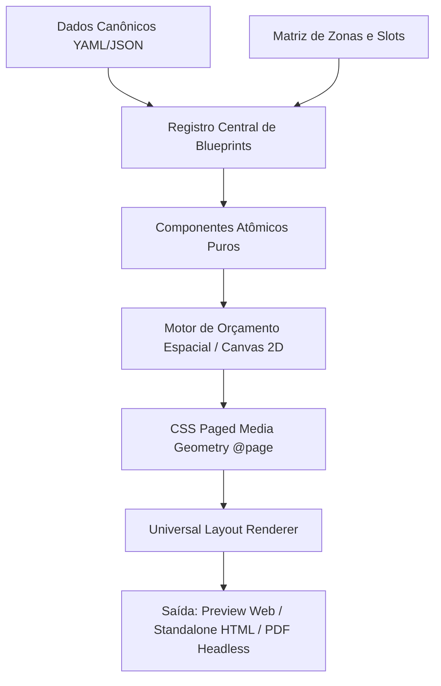

# 🏛️ Master Plan & Manual de Engenharia: Motor de Layouts Declarativos e Compilação Determinística para PDF (Slot-and-Blueprint Engine)

> *"A tela web é infinita e complacente; a folha de papel é imutável, cartesiana e impiedosa. Criar documentos perfeitos não é desenhar CSS arbitrário: é governar o espaço físico através de restrições matemáticas e arquitetura desacoplada."*

---

# 1. 🎓 A Super Aula: Filosofia, Fundamentos & Visão Geral

## 📌 O Problema Real
No desenvolvimento web tradicional, componentes são projetados para fluxos de rolagem vertical infinita. No entanto, quando transformamos dados em **documentos impressos físicos (ISO A4: $210\text{ mm} \times 297\text{ mm}$ ou US Letter: $8.5 \times 11\text{ polegadas}$)**, ocorrem 4 falhas graves caso a arquitetura não seja matemática e declarativa:

1. **Acoplamento Monolítico por `if/else`**: Cada novo layout adicionado exige centenas de linhas de código HTML/JSX duplicado, tornando o sistema frágil e insustentável ao passar de 5 para 50 modelos.
2. **Vazamento Horizontal em Sidebars**: Grids rígidas (como `repeat(3, 1fr)`) inseridas dentro de barras laterais estreitas (~220px) estouram a largura da página e invadem o conteúdo principal.
3. **Páginas Fantasma em Branco (*Trailing Blank Pages*)**: O motor de renderização Blink/Chromium cria páginas extras vazias se houver `break-after: page` no último elemento ou margens descalibradas entre o CSS e o script runner.
4. **Falta de Auto-Balanceamento de Altura**: Documentos com muito conteúdo transbordam cegamente para a segunda página sem ajustar proporcionalmente a tipografia e os espaçamentos.

---

## 📐 Os 4 Pilares da Nova Arquitetura



### 1. Desacoplamento Absoluto (Canonical Schema vs. Layout Blueprint)
* **Canonical Content Schema**: Os dados puros (carreira, educação, habilidades, carta de apresentação), estruturados em YAML/JSON sem nenhuma classe visual ou posição de coluna embutida.
* **Layout Blueprint**: Um objeto declarativo simples que define a matriz de grid (`gridTemplate`) e quais blocos pertencem a quais zonas (`header`, `sidebar`, `main`, `footer`).
* **Componentes Atômicos Puros**: Cada seção (`<BlockWork/>`, `<BlockSkills/>`, `<BlockLanguages/>`) é um componente 100% isolado com contenção estrita (`min-width: 0`, `overflow-wrap: break-word`, `width: 100%`).

### 2. A Matemática do Orçamento Espacial (Spatial Height Budgeting)
Uma folha A4 no padrão web a 96 DPI possui proporções cartesianas fixas:
$$W = 210\text{ mm} \approx 793.7\text{ px}, \quad H = 297\text{ mm} \approx 1122.5\text{ px}$$

Para qualquer coluna ou zona $C$, o consumo vertical obedece à inequação:
$$H_{\text{total}}(C) = \sum_{i=1}^{n} h(\text{bloco}_i) + (n - 1) \cdot \text{gap} + 2 \cdot P_{\text{padding}} \le 1122.5\text{ px}$$

### 3. Compressão Dinâmica de Densidade por Busca Binária Logarítmica
Quando o conteúdo ultrapassa o teto físico, o motor não corta textos: ele executa uma busca binária logarítmica via medição fora do DOM (`CanvasRenderingContext2D.measureText`):
$$F_{\text{font}} \in [8.5\text{ px}, 11.5\text{ px}], \quad P_{\text{padding}} \in [4\text{ px}, 12\text{ px}]$$
O número máximo de iterações para convergir é:
$$K = \left\lceil \log_2\left(\frac{11.5 - 8.5}{0.1}\right) \right\rceil \le \mathbf{5\text{ iterações (menos de 5 milissegundos)}}$$

---

# 2. 🏛️ Estrutura de Arquivos e Componentes

```
LogicDefense/src/tools/cv-maker/
├── types/cv.ts                      # Tipagem canônica e interface LayoutBlueprint
├── engine/
│   ├── blueprints.ts                # Registro de todos os Blueprints A4 declarativos
│   └── DynamicDensityCompressor.ts  # Algoritmo matemático de medição em Canvas 2D
├── components/
│   ├── blocks/                      # Componentes Atômicos Puros
│   │   ├── BlockHeader.tsx
│   │   ├── BlockContacts.tsx
│   │   ├── BlockCivilData.tsx
│   │   ├── BlockPhoto.tsx
│   │   ├── BlockSummary.tsx
│   │   ├── BlockWork.tsx
│   │   ├── BlockProjects.tsx
│   │   ├── BlockEducation.tsx
│   │   ├── BlockSkillsTags.tsx
│   │   ├── BlockSkillsBars.tsx
│   │   ├── BlockLanguages.tsx
│   │   ├── BlockCertificates.tsx
│   │   ├── BlockReferences.tsx
│   │   ├── BlockInterests.tsx
│   │   ├── BlockCoverLetter.tsx
│   │   └── AtomicBlockRenderer.tsx  # Despachante polimórfico de blocos
│   └── CVViewer/
│       ├── UniversalLayoutRenderer.tsx # Renderizador universal sem if/else
│       ├── CVViewer.tsx             # Componente topo de exibição
│       └── CVPrintContainer.tsx      # Trava cartesiana A4 210mm x 297mm
├── services/
│   └── standaloneHtmlService.ts     # Gerador de HTML/ZIP offline sincronizado
└── styles/
    ├── cv-viewer.css                # Estilos visuais de tela e contenção
    └── cv-print.css                 # Regras soberanas de @media print e @page
```

---

# 3. 🚀 Integração com a API Backend (`FastAPI / Python`)

No backend (`backend/services/cv_html_renderer.py` e `backend/routers/cv_router.py`):
1. **Endpoint `GET /api/v1/cv/layouts`**: Disponibiliza a lista de blueprints para qualquer cliente (frontend, scripts Python, fluxos n8n).
2. **Despachante Python de Zonas**: O backend usa o mesmo dicionário de zonas dos blueprints para gerar o HTML idêntico ao React.
3. **Exportação PDF Headless**: Rota `/api/v1/cv/pdf` com Playwright aplicando `@page { margin: 0 }` e `preferCSSPageSize: true`.

---

# 4. 🧪 Protocolo de Validação & Homologação

1. **Paridade Visual 100%**: A alternância entre os 8 modelos A4 e os 5 temas ocorre sem atraso e sem nenhuma quebra visual.
2. **Impressão Perfeita**: `Ctrl + P` gera exatamente 1 página para currículo e exatamente 2 páginas para o modo Dossiê/Cover Letter.
3. **Zero Erros de Build**: Compilação TypeScript e Vite validada (`tsc -b && vite build`).
