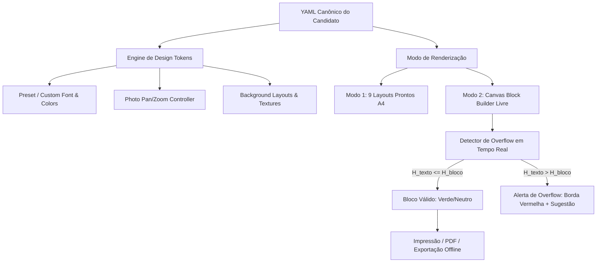

# 🏛️ Master Plan: Token-Driven Design Engine, Foto Pan/Zoom & Canvas Block Builder
**Documento Arquitetural & Guia de Engenharia de Documentos A4**  
*Autores*: PDF Engine Architect & Master Plan Architect  
*Data*: 31 de Agosto de 2026  
*Status*: Proposta Arquitetural & Roteiro de Implementação  

---

## 1. 🎓 A Super Aula: Filosofia, Fundamentos & Visão Geral

### 1.1. O Problema Real
No desenvolvimento web tradicional, a viewport do navegador é infinita e responsiva. No entanto, um documento PDF de alta fidelidade (como um currículo executivo de 1 página ou dossiê de 2 páginas) é regido pelas leis imutáveis da geometria física do papel ISO A4:
$$\text{Largura} = 210\text{ mm} \approx 794\text{ px a 96 DPI}$$
$$\text{Altura} = 297\text{ mm} \approx 1122.5\text{ px a 96 DPI}$$

Ao conceder ao usuário total liberdade para customizar **cores, fontes, tamanhos de letra, espaçamentos e posicionamento de blocos**, o sistema corre o risco de quebrar a geometria do documento caso não haja governança algorítmica.

### 1.2. Os Quatro Pilares da Nova Arquitetura
1. **Token-Driven CSS Variable Engine**: Uma camada de design tokens semânticos (`--cv-font-heading`, `--cv-color-primary`, `--cv-font-scale`) que permite estilização instantânea em $\approx 0\text{ ms}$ no DOM sem recompilar CSS.
2. **Interactive Photo Framing (Pan & Zoom)**: Controle vetorial e matricial de enquadramento facial (`object-position` X/Y e `transform: scale()`) para garantir que qualquer foto (quadrada, retangular ou vertical) centralize perfeitamente no avatar circular ou retangular.
3. **Catálogo de Fundos Gráficos & Prompts de IA**: Texturas sutis, padrões geométricos e gradientes luxuosos que valorizam a estética sem poluir o contraste de leitura ATS.
4. **YAML Block Canvas Builder**: Um modo de composição livre onde uma folha A4 em branco recebe blocos semânticos do YAML, com detecção e cálculo de overflow em tempo real no Canvas 2D offscreen.



---

## 2. 🧩 Módulo 1: Token-Driven CSS Variable Engine

### 2.1. Definição de Variáveis CSS Reativas
Todas as propriedades visuais do currículo passam a ser controladas por variáveis reativas no escopo do documento:

```css
:root, .cv-root, .cv-card {
  /* ── Tipografia & Escala ── */
  --cv-font-heading: 'Plus Jakarta Sans', sans-serif;
  --cv-font-body: 'Inter', sans-serif;
  --cv-font-mono: 'Courier Prime', monospace;
  --cv-font-scale: 1.0;            /* Multiplicador: 0.85x a 1.20x */
  --cv-font-size-base: 0.85rem;     /* Tamanho base */
  --cv-line-height: 1.5;

  /* ── Paleta Cromática ── */
  --cv-color-primary: #0284c7;      /* Destaque principal, títulos e bordas */
  --cv-color-secondary: #0369a1;    /* Cargos, datas e subtítulos */
  --cv-color-text: #0f172a;         /* Texto principal de leitura */
  --cv-color-text-muted: #64748b;   /* Metadados e textos secundários */
  --cv-color-bg: #ffffff;           /* Fundo da folha A4 */
  --cv-color-surface: #f8fafc;      /* Fundo de cards/boxes */
  --cv-color-border: #e2e8f0;       /* Linhas e divisores */
  --cv-color-accent: #f97316;       /* Badges e tags */

  /* ── Background Gráfico / Textura ── */
  --cv-bg-pattern: none;
  --cv-bg-opacity: 1.0;
}
```

### 2.2. Presets de Pareamento Tipográfico Recomendados

| Estilo / Persona | Fonte de Título (`heading`) | Fonte de Corpo (`body`) | Vibe & Aplicação Recomendada |
| :--- | :--- | :--- | :--- |
| **Tech & Modern** | Plus Jakarta Sans (800) | Inter (400/500) | Clean, Startups, ATS-Friendly, Silicon Valley |
| **Executive Editorial** | Cinzel / Merriweather | Inter / Roboto | Tradicional, Jurídico, C-Level, Finanças |
| **Hacker & Engineering**| Courier Prime (Bold) | Courier Prime / Fira Code| Terminal, Engenharia de Sistemas, DevOps, Cyber |
| **Creative & Design** | Poppins (700) | Plus Jakarta Sans (400) | Agências, UX/UI, Produto, Marketing |
| **Humanist & Academic** | Lora (Bold) / Merriweather | Open Sans (400) | Pesquisa, Medicina, Ensino, Literatura |

---

## 3. 🖼️ Módulo 2: Enquadramento Interativo de Foto (Pan & Zoom)

### 3.1. O Desafio do Enquadramento Facial
Ao carregar uma foto, muitas vezes o rosto fica cortado no topo ou descentralizado horizontalmente.
Com a adição de 3 parâmetros simples persistidos no YAML ou no estado da aplicação:
- `imagePosX`: Posição horizontal ($0\% = \text{esquerda}$, $50\% = \text{centro}$, $100\% = \text{direita}$).
- `imagePosY`: Posição vertical ($0\% = \text{topo}$, $50\% = \text{centro}$, $100\% = \text{base}$).
- `imageScale`: Fator de ampliação ($1.0\times$ a $2.5\times$).

```css
.cv-avatar-img {
  width: 100%;
  height: 100%;
  object-fit: cover;
  object-position: var(--cv-avatar-pos-x, 50%) var(--cv-avatar-pos-y, 50%);
  transform: scale(var(--cv-avatar-scale, 1));
  transform-origin: var(--cv-avatar-pos-x, 50%) var(--cv-avatar-pos-y, 50%);
  transition: transform 0.1s ease-out;
}
```

---

## 4. 🎨 Módulo 3: Catálogo de Fundos Gráficos & Prompts de IA

Para elevar o design do currículo ao nível de agências internacionais de branding pessoal, disponibilizamos padrões de fundo em camadas CSS ou imagens vetoriais sutis:

### 4.1. Tipos de Fundos Disponíveis
1. **White Minimalist**: Fundo branco puro para máxima legibilidade ATS.
2. **Subtle Technical Grid**: Malha milimétrica com $2\%$ de opacidade (estilo papel milimetrado de engenharia).
3. **Executive Diagonal Accent**: Faixa chanfrada elegante no canto superior direito.
4. **Soft Studio Gradient**: Suave passagem de cor nos cantos externos da folha.

### 4.2. Prompts Recomendados para Geração de Novos Fundos via IA
Para gerar fundos de altíssima definição no gerador de imagens:

* **Prompt 1 (Corporate Luxury & Minimalist Accent)**:
  > *"Minimalist luxury resume stationery background, ultra-subtle off-white paper texture with elegant thin navy and golden geometric line art strictly on top-right corner, pure solid white center area for reading text, clean corporate, 8k resolution, vector look, zero text, top-right accent only"*

* **Prompt 2 (Cyber Tech Blueprint)**:
  > *"Clean technical engineering resume stationery background, pure crisp white sheet with extremely faint cyan isometric grid and technical micro-dots along left vertical border, executive modern tech aesthetic, 8k, vector style, no text"*

* **Prompt 3 (Modern Editorial Curve)**:
  > *"Abstract corporate A4 background design, flowing subtle emerald green and slate grey curved lines on top and bottom borders, bright white center reading zone, professional studio lighting, 8k resolution, minimalist, no text"*

---

## 5. 🧱 Módulo 4: O "YAML Block Canvas Builder"

### 5.1. A Mecânica do Construtor Livre
No futuro modo **Canvas Livre**:
1. **Menu Lateral Esquerdo**: Exibe a lista de seções preenchidas no YAML:
   - `👤 Identidade & Título`
   - `📷 Foto / Avatar`
   - `✉️ Contatos & Redes`
   - `📝 Resumo Profissional`
   - `💼 Experiência Profissional`
   - `🎓 Formação Acadêmica`
   - `🚀 Projetos em Destaque`
   - `⚡ Competências (Tags ou Barras)`
   - `🌐 Idiomas & Fluência`
   - `🎖️ Certificações`
   - `🎯 Interesses & Hobbies`
2. **Folha A4 em Branco Interativa**: O usuário arrasta os blocos para a folha, organiza em colunas (ex: sidebar de 30% e área principal de 70%, ou cabeçalho horizontal com 3 colunas embaixo).
3. **Customização por Bloco**:
   - Cada bloco pode ter sua própria cor de fundo, borda, tamanho de fonte e alinhamento.
4. **Detector de Overflow em Tempo Real (Mathematical Height Budgeting)**:
   - Utiliza a API Canvas 2D offscreen para calcular se o texto do YAML cabe na área física atribuída ao bloco.
   - Caso $H_{texto} > H_{bloco}$, exibe um alerta visual com cálculo preciso:
     $$\Delta H = H_{necessaria} - H_{disponivel}$$
     > ⚠️ **Texto muito grande para este bloco!**  
     > Altura necessária: $190\text{ px}$ | Altura configurada: $130\text{ px}$ ($\Delta = +60\text{ px}$).  
     > *Ação sugerida: Expanda a altura do bloco ou reduza a escala de fonte para $0.9\times$.*

---

## 6. 🗺️ Esqueleto de Implementação e Mapeamento de Arquivos

### Arquivos Envolvidos:
1. `src/tools/cv-maker/components/Toolbar/PhotoUploader.tsx`:
   - Adição dos controles de Pan X, Pan Y e Zoom de foto.
2. `src/tools/cv-maker/components/Toolbar/DesignCustomizerDrawer.tsx`:
   - Novo drawer/painel de controle para escolha de paletas, tipografia, escala e backgrounds.
3. `src/tools/cv-maker/styles/cv-themes.css` & `cv-print.css`:
   - Vinculação de todas as classes às variáveis de design tokens semânticos.
4. `backend/services/cv_html_renderer.py`:
   - Suporte e injeção das variáveis de design tokens no HTML compilado da API.

---

## 7. 🚦 Perguntas Abertas para Alinhamento

1. **Prioridade Imediata**: Deseja que apliquemos primeiro os controles de **Pan/Zoom de Foto** e o **Painel de Fontes, Cores e Escala** nos 9 modelos existentes?
2. **Modo Canvas Livre**: No Canvas Livre, prefere um sistema de **Grid de 12 Colunas Arrastáveis** (tipo Dashboard/Widget Grid) ou **Posicionamento Absoluto Livre com Snapping** (estilo Figma/Canva)?
