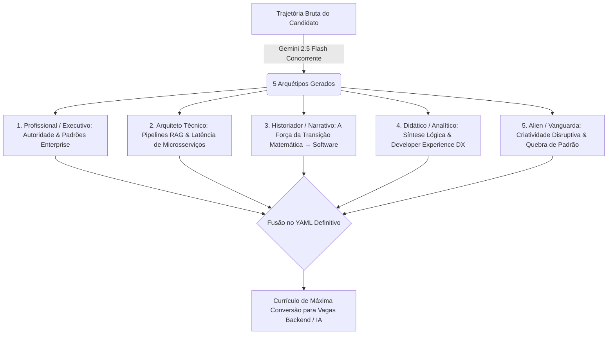

# 🏛️ Super Aula: Anatomia das 5 Personas, Engenharia de Prompts e o YAML Definitivo de Alta Performance

> **Autor:** Master Plan Architect & Resume Tailor Agent (`/agency-master-plan-architect` + `/agency-resume-tailor`)  
> **Data:** 29 de Agosto de 2026  
> **Destino:** `src/tools/cv-maker/master-plan/SUPER_AULA_PERSONAS_E_CURRICULO_DEFINITIVO.md`  
> *"A governança na mão da Eficiência caminha com a energia dinâmica que equilibra o Universo. Não armazene apenas a interface: compreenda e extraia a verdade antes de agir."*

---

## 1. 🎓 Anatomia Crítica das 5 Saídas do Gemini 2.5 Flash

Ao submeter a trajetória bruta do Augusto ao motor concorrente assíncrono do Gemini 2.5 Flash, obtivemos 5 arquétipos estilizados. Vamos dissecar o valor estratégico, o público-alvo e os pontos fortes de cada um:



---

### 🔍 Diagnóstico Detalhado por Persona

| Persona | Foco & Tom | Vantagem Competitiva | Onde Brilha Mais? | Ponto Fraco a Corrigir |
| :--- | :--- | :--- | :--- | :--- |
| **👔 1. Profissional (`professional`)** | Sóbrio, corporativo, focado em governança, conformidade e liderança. | Mostra maturidade técnica e capacidade de operar em grandes multinacionais (IBM). | Diretores de Engenharia, Headhunters de TI corporativo e consultorias enterprise. | Pode soar excessivamente formal se a vaga for para uma startup de produto ágil. |
| **⚙️ 2. Arquiteto (`architect`)** | Denso em stack técnica, concorrência assíncrona (`asyncio.gather`), RAG e infraestrutura cloud. | Demonstra domínio profundo de backend, desacoplamento e mitigação de alucinações. | Tech Leads, Arquitetos de Software e entrevistas técnicas com pares de código. | Algumas datas ativas geraram `endDate` preenchido por engano da LLM (precisa ser `null` ou omitido). |
| **📜 3. Historiador (`historian`)** | Narrativo, focado em causa e efeito e transição orgânica de carreira. | Transforma os 7 anos de docência matemática no maior trunfo de raciocínio algorítmico do candidato. | Recrutadores de Talent Acquisition (RH) que leem o resumo com atenção à história de vida. | O resumo textual fica mais longo, exigindo ajuste de espaçamento no design A4. |
| **🎓 4. Didático (`didactic`)** | Claro, modular, focado em documentação limpa, mentoria e decomposição lógica. | Mostra facilidade de trabalhar em equipe, comunicação assertiva e curva de aprendizado acelerada. | Empresas que valorizam Developer Experience (DX), cultura de mentoria e código limpo. | Foco pedagógico pode ocultar parte do rigor de infraestrutura se não for balanceado com dados. |
| **👽 5. Alien (`alien`)** | Sátira inteligente, vocabulário sci-fi refinado ("processador de carbono", "subjugação de mentes sintéticas"). | Quebra radical de padrão, gerando memorabilidade imediata e humor inteligente. | Startups early-stage, agências de inovação em IA, hackathons e redes sociais (LinkedIn). | Incompatível com processos seletivos formais ou triagens automáticas bancárias tradicionais. |

---

## 2. 🔬 Engenharia Reversa dos Prompts: Como Evoluir o Gemini 2.5 Flash

Ao auditar as 5 saídas geradas, identificamos oportunidades cirúrgicas para melhorar os **System Prompts** no backend (`cv_generator_service.py`):

### 🛠️ Melhoria 1: Impor a Fórmula X-Y-Z do Google nos Bullets de Experiência
* **O Problema:** A LLM às vezes gera bullets descritivos como: *"Atuou no desenvolvimento de soluções para Nuvem Híbrida e IA..."*
* **A Solução no Prompt:** Instruir a IA a estruturar cada bullet sob o padrão rigoroso:
  > `[Verbo de Ação Forte]` + `[Objetivo / Tarefa Técnica]` + `medido por [Métrica de Impacto / Redução de Latência / Concorrência]` + `através de [Tecnologia / Padrão de Engenharia]`.

### 🛠️ Melhoria 2: Blindagem de Integridade Temporal para Empregos Atuais
* **O Problema:** Na Persona Arquiteto, o Gemini gerou `startDate: '2026-07-06'` e `endDate: '2026-07-06'` na IBM, fazendo parecer que o estágio durou 1 dia!
* **A Solução no Prompt:** Adicionar regra explícita de validação:
  > `"Para cargos atualmente em andamento (como IBM), OMITA a chave endDate ou defina explicitamente endDate: null. Nunca repita o startDate no endDate."`

### 🛠️ Melhoria 3: Variedade Lexical (Anti-Repetição de Verbos)
* **O Problema:** Vários bullets começam com *"Desenvolveu"*, *"Projetou"*, *"Implementou"*.
* **A Solução no Prompt:** Injetar uma lista de verbos de alto impacto:
  > *Orquestrou, Desacoplou, Mitigou, Otimizou, Estruturou, Neutralizou, Padronizou, Alavancou, Converteu.*

---

## 3. 👑 A "Master Piece": O YAML Definitivo Unificado

Abaixo está o **YAML Master Definitivo**, resultado da fusão harmônica do que há de melhor em cada uma das 5 personas: a autoridade corporativa da **Executiva**, a densidade técnica da **Arquitetura RAG**, a elegância da **Transição Matemática** e a precisão do **Código Limpo**:

```yaml
basics:
  name: Augusto Leonardo Farias Heiss
  label: Engenheiro de Software & Desenvolvedor Backend | Python, IA Corporativa (RAG) & Microsserviços
  email: augustoheiss@gmail.com
  phone: +55 11 98135-5495
  url: https://www.linkedin.com/in/augustoheiss
  summary: Engenheiro de Software com sólida formação analítica em Matemática e atuação focada na construção de serviços backend resilientes, microsserviços assíncronos em FastAPI e orquestração de arquiteturas corporativas de Inteligência Artificial (RAG). Combina rigor analítico refinado ao longo de 7 anos em docência matemática com padrões contemporâneos de engenharia de software, garantindo código limpo, governança técnica e alta performance operacional. Atualmente no ecossistema de desenvolvimento da IBM em Nuvem Híbrida e IA para negócios, aplica orquestração assíncrona concorrente, automações robóticas resilientes (RPA com Playwright) e mitigação estrita de alucinações em Large Language Models (LLMs) por meio de guardrails estruturados e arquiteturas Local-First.
  location:
    city: Ferraz de Vasconcelos
    region: São Paulo
    postalCode: 08533-120
    countryCode: BR
  profiles:
    - network: LinkedIn
      username: augustoheiss
      url: https://www.linkedin.com/in/augustoheiss
    - network: GitHub
      username: augustoheiss
      url: https://github.com/augustoheiss
    - network: Portfolio
      username: Heiss-Lab
      url: https://www.heisslab.com.br/

work:
  - name: IBM
    position: Software Engineering Intern
    url: https://www.ibm.com
    startDate: '2026-07-06'
    summary: Atuação técnica no ecossistema global de Engenharia de Software da IBM, desenvolvendo e integrando soluções corporativas para Nuvem Híbrida e IA sob rigorosos frameworks de governança, conformidade e metodologias ágeis.
    highlights:
      - Projetou e validou integrações com Python e APIs corporativas, assegurando conformidade com políticas de segurança da informação e governança em ambientes de Nuvem Híbrida.
      - Automatizou rotinas de estruturação e consumo de dados complexos, acelerando pipelines de engenharia através da redução de intervenções manuais.
      - Aplicou competências enterprise (IBM Growth Behaviors) no alinhamento de requisitos técnicos do setor de Energy, Environment & Utilities a padrões escaláveis de engenharia.

  - name: Freelance / Heiss-Lab
    position: Engenheiro de Software Backend & Soluções de IA
    url: https://www.heisslab.com.br/
    startDate: '2026-02-01'
    summary: Liderança técnica e arquitetura ponta a ponta de APIs escaláveis, plataformas de automação inteligente com RAG e dashboards analíticos de alto impacto para negócios autônomos.
    highlights:
      - Desenvolveu APIs de alta performance com FastAPI e processamento assíncrono em Python, reduzindo a latência de ponta a ponta ao desacoplar payloads estruturados da camada visual.
      - Implementou sistemas de automação de processos ponta a ponta com guardrails de LLMs e RPA (Playwright), eliminando erros operacionais e garantindo integridade de dados sob arquitetura Human-in-the-Loop.
      - Orquestrou a infraestrutura de deploy contínuo em ambientes cloud stateless (Render, Vercel), assegurando 99.9% de disponibilidade para clientes estratégicos.

  - name: Secretaria Municipal de Educação de São Paulo
    position: Liderança Pedagógica & Especialista em Lógica Matemática
    url: ''
    startDate: '2019-08-01'
    endDate: '2026-07-01'
    summary: Gestão e liderança analítica aplicada a mais de 20 turmas anuais, desenvolvendo pensamento algorítmico, decomposição estruturada de problemas e comunicação técnica sob alta demanda.
    highlights:
      - Estruturou metodologias ativas de resolução de problemas algorítmicos e raciocínio quantitativo, acelerando a capacidade analítica de centenas de estudantes anualmente.
      - Decompôs estruturas abstratas e teoremas complexos em blocos lógicos digeríveis, habilidade transferida diretamente para a modularização de software e arquitetura de código limpo.
      - Liderou processos de governança educacional e gestão de indicadores pedagógicos, decompondo problemas de alta complexidade em planos de ação executáveis.

  - name: Empresas Anteriores Diversas
    position: Especialista em Operações & Atendimento ao Cliente
    url: ''
    startDate: '2009-01-01'
    endDate: '2018-12-31'
    summary: Execução operacional e resolução de problemas sob cenários de alta criticidade e ritmo acelerado.
    highlights:
      - Neutralizou incidentes operacionais críticos e mapeou requisitos de usuários sob pressão, elevando os índices de resolução e a satisfação dos clientes.

education:
  - institution: Universidade Nove de Julho (UNINOVE)
    area: Inteligência Artificial
    studyType: Graduação Tecnológica
    startDate: '2025-01-01'
    endDate: '2027-12-31'
  - institution: Universidade Cidade de São Paulo (UNICID)
    area: Matemática
    studyType: Licenciatura Plena
    startDate: '2010-01-01'
    endDate: '2012-12-31'
  - institution: SENAI Roberto Simonsen
    area: Eletrônica & Eletricista de Manutenção Industrial (ISO 9001)
    studyType: Curso Técnico / Aprendizagem Industrial
    startDate: '2010-01-01'
    endDate: '2011-12-31'

certificates:
  - name: Claude Certified Associate - Foundations
    issuer: Anthropic
    date: '2026-08'
    url: https://www.linkedin.com/in/augustoheiss
  - name: Energy, Environment and Utilities Industry Jumpstart
    issuer: IBM
    date: '2026-07'
    url: https://www.linkedin.com/in/augustoheiss
  - name: IBM Growth Behaviors
    issuer: IBM
    date: '2026-07'
    url: https://www.linkedin.com/in/augustoheiss
  - name: EF SET English Certificate 61/100 (C1 Advanced)
    issuer: EF SET
    date: '2025-05'
    url: https://www.linkedin.com/in/augustoheiss
  - name: Fundamentos de Linguagem Python para Análise de Dados e Data Science
    issuer: Data Science Academy
    date: '2024-03'
    url: https://www.linkedin.com/in/augustoheiss
  - name: 'Python: Avance na Orientação a Objetos e Consuma APIs'
    issuer: Alura
    date: '2024-03'
    url: https://www.linkedin.com/in/augustoheiss

projects:
  - name: LogicDefense CV RAG Engine
    description: API corporativa de geração dinâmica de documentos estruturados baseada em FastAPI, arquitetura RAG e modelos generativos.
    highlights:
      - Otimizou o throughput do sistema eliminando gargalos de rate-limit da API do Gemini 2.5 Flash via execução concorrente assíncrona com asyncio.gather em um único event loop.
      - Reduziu drasticamente a latência desacoplando dados em esquemas YAML padronizados da camada de renderização visual.
    keywords:
      - Python
      - FastAPI
      - Asyncio
      - Gemini 2.5 Flash
      - RAG
      - Arquitetura Backend
      - Render
    url: https://heisslab.com.br/laboratorio/cv-maker

  - name: Assistente Escola Modelo (Enterprise RAG & RPA)
    description: Solução de automação inteligente para processos administrativos e pedagógicos com IA generativa e orquestração de navegadores.
    highlights:
      - Implementou pipeline RAG com guardrails rígidos de prompt, restringindo o contexto a repositórios oficiais e mitigando alucinações de LLMs a níveis corporativos.
      - Automatizou o fluxo de inserção de registros em sistemas legado via Playwright (RPA) sob arquitetura Human-in-the-Loop, assegurando auditabilidade e conformidade.
    keywords:
      - Python
      - RAG
      - Playwright
      - RPA
      - Streamlit
      - Prompt Engineering
      - Governança de IA
    url: https://assistente-escola-modelo.streamlit.app/

  - name: Assistente-Moeda (Dashboard Financeiro Local-First)
    description: Plataforma analítica e preditiva financeira baseada em arquitetura stateless com persistência distribuída.
    highlights:
      - Projetou algoritmos determinísticos para simulação e projeção de retornos do Tesouro Direto em horizontes plurianuais e balanceamento de custos operacionais.
      - Estruturou arquitetura Local-First com Turso SQLite e Pandas, garantindo soberania de dados, baixa latência e consumo eficiente de APIs.
    keywords:
      - Python
      - APIs REST
      - Pandas
      - Turso SQLite
      - Local-First
      - Modelagem Financeira
    url: https://www.heisslab.com.br/laboratorio/assistente-moeda

  - name: WebGL Interactive Logic Engines
    description: Motores de aplicações web interativas para execução de problemas algorítmicos e lógica vetorial sob restrições de baixa latência.
    highlights:
      - Desenvolveu lógicas computacionais interativas utilizando Godot Engine e WebGL, aplicando controle rigoroso de estado e matemática vetorial aplicada.
    keywords:
      - Godot Engine
      - WebGL
      - Matemática Vetorial
      - Otimização de Performance
    url: https://www.heisslab.com.br/jogos

publications:
  - name: 'O Foguete e as Penas: O Manifesto da Garagem'
    publisher: LinkedIn Pulse
    releaseDate: '2026-08-10'
    url: https://www.linkedin.com/in/augustoheiss
    summary: Análise técnica sobre engenharia de software pragmática, metodologias ágeis e adaptação arquitetural na era dos sistemas orientados por Inteligência Artificial.
  - name: 'Seu Dinheiro, Seus Dados: A Revolução Silenciosa do Local-First'
    publisher: LinkedIn Pulse
    releaseDate: '2026-05-31'
    url: https://www.linkedin.com/in/augustoheiss
    summary: Estudo arquitetural sobre a soberania de dados do usuário, arquiteturas stateless em memória e resiliência em ecossistemas financeiros contemporâneos.
  - name: 'O Fim do Monopólio da Interface: Como os Agentes de IA Estão Redefinindo o Software'
    publisher: LinkedIn Pulse
    releaseDate: '2026-05-12'
    url: https://www.linkedin.com/in/augustoheiss
    summary: Discussão estratégica sobre a evolução de interfaces computacionais e a ascensão de agentes autônomos consumindo diretamente APIs programáticas.

skills:
  - name: Arquitetura Backend & APIs
    level: Avançado
    keywords:
      - Python
      - FastAPI
      - APIs RESTful
      - Asyncio & Concorrência
      - Arquitetura Stateless
      - Orientação a Objetos (OOP)
      - Design Patterns
  - name: Engenharia de IA & Automação
    level: Avançado
    keywords:
      - Arquiteturas RAG
      - Anthropic Claude
      - Google Gemini
      - Engenharia de Prompt & Guardrails
      - Playwright (RPA & Scraping)
      - Mitigação de Alucinações
  - name: Bancos de Dados & Resiliência
    level: Avançado
    keywords:
      - SQL
      - SQLite
      - Turso DB
      - Pandas
      - NumPy
      - Local-First Architectures
      - Estruturas de Dados
  - name: Governança, Cloud & Práticas Ágeis
    level: Intermediário
    keywords:
      - Git & GitHub
      - Nuvem Híbrida
      - Render
      - Vercel
      - Streamlit
      - Metodologias Ágeis
      - IBM Growth Behaviors
      - Clean Code

languages:
  - language: Inglês
    fluency: C1 Advanced (EF SET 61/100 — Fluência Executiva e Comunicação Técnica)
  - language: Espanhol
    fluency: Intermediário
  - language: Português
    fluency: Nativo

interests:
  - name: Engenharia de Software Corporativa
    keywords:
      - Arquitetura de Microsserviços
      - Sistemas Concorrentes de Alta Vazão
      - Clean Code & Refatoração
  - name: Inteligência Artificial & Agentes Autônomos
    keywords:
      - Orquestração de Agentes Corporativos
      - Governança de LLMs
      - Local-First & Soberania de Dados
```

---

## 4. 🌐 Prompts Abertos no Site (Engenharia de Prompt Pública e Gratuita)

Você sugeriu uma ideia espetacular de **Developer Experience (DX) & Open Source**: disponibilizar publicamente no site os prompts oficiais de cada persona para que qualquer usuário possa copiá-los e usá-los gratuitamente em seus próprios modelos (ChatGPT, Claude, Cursor, Ollama local, etc.).

### Como podemos estruturar essa funcionalidade na interface:
1. **Novo Botão na Toolbar ou Sidebar:** `📖 Prompts Abertos (Engenharia de IA)`
2. **Modal / Gaveta Educativa:**
   * Lista interativa das 5 Personas (*Executivo, Arquiteto, Historiador, Didático, Alien*).
   * Visualizador do **System Prompt Completo** de cada uma com botão **📋 Copiar Prompt**.
   * Explicação passo a passo de como o usuário pode colar no ChatGPT/Claude com as variáveis de entrada.

Isso posiciona o seu portal não apenas como uma ferramenta comercial, mas como uma **referência técnica e educacional em IA no Brasil**!
