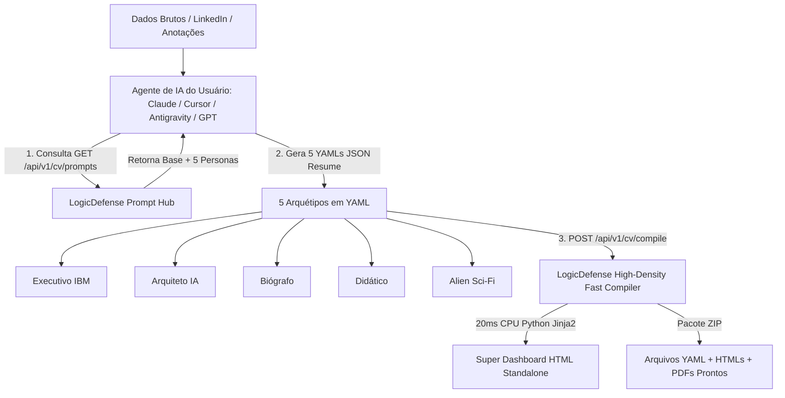

# 🏛️ Master Plan & Super Aula Técnica: CV Maker 2.0 (Agent-Native Architecture)
## Estratégia de Conteúdo e Engenharia para o Artigo do LinkedIn

> **Autor:** Augusto Heiss (Heiss-Lab / LogicDefense)  
> **Frameworks:** `agency-master-plan-architect` & `agency-linkedin-content-creator`  
> **Data:** 30 de Agosto de 2026  
> **Localização:** Ferraz de Vasconcelos — São Paulo, Brasil  

---

# PARTE 1: 🎓 A SUPER AULA ARQUITETURAL DO CV MAKER 2.0

## 1.1. O Problema Fundamental: A Burocracia Arcaica dos Currículos

O mercado de tecnologia e recrutamento corporativo (Big Techs, bancos, multinacionais e startups) sofre de um paradoxo gritante:
1. **O paradoxo do Word/Canva:** Candidatos perdem horas formatando caixas de texto no Canva ou Word, gerando arquivos pesados, com tabelas e colunas invisíveis que **quebram os leitores automáticos (ATS - Applicant Tracking Systems)** como Greenhouse, Workday e Taleo.
2. **O paradoxo das ferramentas pagas predatórias:** Plataformas online de currículo atraem o usuário prometendo um CV gratuito e, no último clique de download, exigem cartão de crédito com assinaturas recorrentes forçadas.
3. **O paradoxo da Alucinação da IA:** IAs generativas genéricas frequentemente inventam métricas absurdas, alteram datas, esquecem o `endDate: null` em empregos ativos e criam textos genéricos sem densidade técnica.
4. **A perda da Soberania de Dados:** O usuário entrega todo o seu histórico profissional para bancos de dados de terceiros sem garantia de privacidade.

### A Tese do CV Maker 2.0:
> *"Currículo é código. Seus dados devem ser armazenados em um formato aberto, estruturado e versionável (YAML / JSON Resume), enquanto o layout é uma função pura e determinística de renderização."*

---

## 1.2. A Fusão das Agency Skills: Como o Motor Funciona

O CV Maker 2.0 não é apenas um formulário: é a cristalização de regras de engenharia de currículos corporativos integradas a partir do ecossistema de **Agency Skills**:



### Os 4 Pilares de Inteligência Embutidos:
1. **Guardrails Anti-Alucinação (`Zero Fabricação`):** Proibição estrita de inventar graduações, datas ou empresas. Apenas amplificação lexical dos fatos reais do candidato.
2. **Fórmula Google / IBM X-Y-Z:**
   $$\text{Conquista} = \text{[Verbo de Ação Forte]} + \text{[Desafio Técnico]} + \text{medido por [Métrica de Impacto]} + \text{através de [Tecnologia/Padrão]}$$
3. **Blindagem Temporal:** Empregos ativos em andamento recebem explicitamente `"endDate": null` para evitar incongruências lógicas e eliminação em triagens de RH.
4. **Arquitetura 100% Agent-Native (Zero Custos de Servidor):**
   - A inteligência generativa pesada roda no próprio ambiente de IA do usuário (Claude Code, Cursor, Antigravity, ChatGPT).
   - O servidor da API Heiss-Lab atua puramente como um **compilador determinístico de alta performance**, convertendo os 5 YAMLs em um Super Dashboard HTML standalone com 5 temas (Executivo, Criativo, Minimalista, White e Terminal), suporte a injeção de avatar e botão nativo de impressão A4.

---

## 1.3. Matriz Comparativa: Vantagens, Desvantagens e Trade-offs

| Dimensão | Geradores Tradicionais (Canva/Zety) | CV Maker 2.0 (Agent-Native) |
| :--- | :--- | :--- |
| **Custo de Renderização** | Pago com cartão de crédito | **100% Gratuito (API de compilação sem tokens)** |
| **Compatibilidade ATS** | Baixa (quebra de tabelas e fontes) | **Máxima (HTML semântico e texto selecionável)** |
| **Versionamento** | Inviável (PDF binário fechado) | **Perfeito (arquivos `.yaml` no Git)** |
| **Flexibilidade** | 1 único currículo estático | **5 Arquétipos simultâneos em 1 clique** |
| **Privacidade** | Dados salvos em servidores de terceiros | **Zero persistência no servidor (Stateless)** |
| **Curva de Entrada** | Arrasta e solta visual | **Exige entender YAML ou usar prompt no Agente** |

### Limitações e Riscos Arquiteturais Atuais:
- **Dependência de Schema Estrito:** Se o Agente ou o usuário enviar um YAML fora da especificação JSON Resume v1.0.0, o compilador precisará aplicar sanitização com valores padrão (fallback gracioso).
- **Sem Banco de Dados Central (Design Stateless):** Como o sistema não salva o currículo do usuário na nuvem por motivos de privacidade, o usuário é responsável por salvar seu arquivo `.yaml` ou `.html`.

---

## 1.4. Roadmap de Upgrades Futuros (Próximas Fases)

1. **Extensão MCP Nativa (`mcp_cv_maker`):** Ferramenta MCP para que agentes como Antigravity e Claude Desktop compilem e abram o PDF localmente em 1 comando.
2. **Score de Match ATS Semântico em Tempo Real:** Leitor de Job Description que calcula o percentual de aderência de palavras-chave antes de compilar.
3. **Mecanismo de QR Code Dinâmico:** Injeção automática de QR Code svg com link seguro para o LinkedIn, portfólio GitHub ou credencial verificada.
4. **Exportação Typst / LaTeX:** Além do HTML e PDF, geração direta de arquivos `.typ` para engenheiros que preferem tipografia acadêmica de precisão.

---

# PARTE 2: 🚀 PLANO DE IMPLEMENTAÇÃO DO ARTIGO NO LINKEDIN

## 2.1. Objetivos Estratégicos & Métricas de Sucesso

- **Público-Alvo:** Desenvolvedores, Engenheiros de Software, Arquitetos de Soluções, Estudantes de Tecnologia, Recrutadores Técnicos e entusiastas de IA.
- **Tese Central do Post:** Por que ferramentas visuais estão matando currículos de tecnologia e como você pode gerar 5 versões profissionais em YAML/JSON Resume em 30 segundos usando seu próprio Agente de IA com a API aberta do Heiss-Lab.
- **Meta de Conversão:** Levar leitores a testar a API gratuita (`/api/v1/cv/compile` e `/prompts`) e explorar as ferramentas no portal `heisslab.com.br/laboratorio`.

---

## 2.2. O Artigo Master para o LinkedIn (Pronto para Publicação)

### 🎣 3 Opções de Ganchos (Scroll-Stoppers):

* **Opção 1 (Contrarian / Quebra de Padrão - Recomendada):**
  > *"Parem de formatar currículo no Canva. O ATS da Big Tech não lê caixas de texto coloridas."*
* **Opção 2 (História de Engenharia):**
  > *"Eu cansei de sites que cobram R$ 40 no final para liberar o download de um PDF simples. Então criei uma API aberta para resolver isso."*
* **Opção 3 (Foco em IA & Agentes):**
  > *"A maioria dos desenvolvedores usa IA para gerar currículo, mas recebe um texto genérico e cheio de alucinações. O segredo está no YAML estruturado."*

---

### 📝 Conteúdo Completo do Post / Artigo Técnico:

```markdown
Parem de formatar currículo no Canva. O ATS da Big Tech não lê caixas de texto coloridas.

Se você é da área de tecnologia, o seu currículo não deveria ser um arquivo binário preso no Word ou um design arrastado no Figma.

Ele deveria ser CÓDIGO: estruturado, versionável no Git e compilável sob demanda.

Nos últimos meses, estudei a fundo os frameworks de recrutamento das Big Techs (Google e IBM) e cheguei a uma conclusão: os melhores currículos seguem 4 regras matemáticas simples:

1. A Fórmula Google/IBM X-Y-Z:
"[Verbo de Ação] + [Desafio Técnico] + medido por [Métrica de Impacto] + através de [Tecnologia]".

2. Blindagem Temporal:
Cargos atuais NUNCA devem ter data final repetida. O schema precisa de "endDate": null para não ser descartado pelos robôs de triagem.

3. Zero Alucinação:
A IA não pode inventar empresas nem métricas. Ela deve apenas elevar o rigor analítico dos seus fatos reais.

4. 5 Arquétipos em vez de 1 único CV:
Você precisa de versões diferentes para momentos diferentes:
• Executivo / Senior Lead (foco em ROI e governança)
• Arquiteto de Soluções (microsserviços, cloud, resiliência)
• Biográfico (narrativa contínua e contexto)
• Didático (learning velocity e mentoria)
• Relatório Alien / Sci-Fi (porque um pouco de criatividade técnica chama atenção)

Para resolver isso de forma definitiva e 100% gratuita, liberei uma API pública e aberta no Heiss-Lab: o CV Maker 2.0.

🚀 Como funciona a Arquitetura 100% Agent-Native:
Você não precisa de cadastro nem de colocar cartão de crédito no Google Cloud. O seu próprio Agente de IA (Cursor, Claude Code, Antigravity, ChatGPT) lê as diretrizes da API, gera os 5 YAMLs e a nossa rota compila tudo em 20ms num Super Dashboard HTML navegável com 5 temas e botão de impressão A4.

Quer testar no seu terminal agora mesmo?

1️⃣ Puxe as diretrizes das 5 personas:
curl -X GET https://ocorrencias-pdf-writer.onrender.com/api/v1/cv/prompts

2️⃣ Cole no seu agente favorito com os dados do seu LinkedIn.

3️⃣ Envie os 5 YAMLs para compilar:
curl -X POST https://ocorrencias-pdf-writer.onrender.com/api/v1/cv/compile \
  -H "Content-Type: application/json" \
  -d '{"professional": "...", "architect": "...", "format": "html"}' \
  -o meu_dashboard_cv.html

Abra o arquivo no navegador e pronto: você tem 5 currículos profissionais perfeitos para PDF.

Também está disponível com interface visual interativa no nosso portal.

🔗 O link da ferramenta visual e a especificação OpenAPI 3.1.0 completa estão no primeiro comentário!

Como você gerencia as versões do seu currículo hoje? Deixe nos comentários.

#softwareengineering #career #python #resume #ai #opensource
```

---

## 2.3. Roteiro do Carrossel em PDF (8 Slides de Alta Retenção)

* **Slide 1 (Capa):**
  - *Título:* Por que seu currículo é descartado pelo ATS (e como resolver com YAML + IA).
  - *Subtítulo:* O guia definitivo de Engenharia de Currículo para Desenvolvedores.
* **Slide 2 (O Problema):**
  - *Texto:* PDFs com tabelas invisíveis, ícones flutuantes e colunas do Canva são ilegíveis para robôs como Workday e Taleo.
* **Slide 3 (A Regra de Ouro: Fórmula X-Y-Z):**
  - *Texto:* *"Desenvolveu APIs"* ❌ vs *"Desacoplou monólito construindo microsserviços em FastAPI, reduzindo latência em 45%"* ✅.
* **Slide 4 (O Padrão JSON Resume):**
  - *Texto:* Dados em YAML puro. Sem dependência de layout. Um único arquivo que gera qualquer tema.
* **Slide 5 (Os 5 Arquétipos):**
  - *Texto:* Por que ter 1 único currículo é um erro. Conheça as personas: Executivo, Arquiteto, Biógrafo, Didático e Alien.
* **Slide 6 (A Arquitetura Agent-Native):**
  - *Texto:* Seu agente gera os dados. A API gratuita compila em 20ms. Zero custo de servidor e soberania total.
* **Slide 7 (Exemplo de Código cURL/Terminal):**
  - *Texto:* Mostra a chamada limpa `GET /api/v1/cv/prompts` e `POST /api/v1/cv/compile`.
* **Slide 8 (Chamada para Ação):**
  - *Texto:* Teste grátis no Heiss-Lab ou via terminal. Link no primeiro comentário! Salve este post para atualizar seu CV no final de semana.

---

## 2.4. Estratégia de Engajamento & Algoritmo (Regra dos 60 Minutos)

1. **Zero Links no Corpo do Post:** Manter links estritamente no **primeiro comentário** para evitar penalização de alcance pelo algoritmo do LinkedIn.
2. **Primeiro Comentário Estruturado:**
   ```text
   🔗 Links diretos:
   • Ferramenta Visual: https://www.heisslab.com.br/laboratorio/cv-maker
   • Documentação OpenAPI & API Gratuita: https://ocorrencias-pdf-writer.onrender.com/docs
   • Repositório & Projetos de IA: https://www.heisslab.com.br/laboratorio
   ```
3. **Janela Dourada de Publicação:**
   - Publicar em uma Terça, Quarta ou Quinta-feira entre **07h30 e 08h30 da manhã** (horário de Brasília).
4. **Ação nos Primeiros 60 minutos:**
   - Responder a **100% dos comentários** com perguntas abertas e aprofundamento técnico.
   - Compartilhar o link do post com grupos de desenvolvedores e engenharia de software para gerar tração orgânica inicial.

---

## 3. 🎨 BANCO DE PROMPTS DE IMAGEM EM INGLÊS (PARA CAPA E CORPO DO ARTIGO)

> **Dica de Renderização:** Estes prompts foram otimizados para ferramentas como **Midjourney v6**, **Flux.1 Pro**, **DALL-E 3** e **Ideogram**. Use a proporção `--ar 16:9` para a capa do artigo e `--ar 1:1` ou `--ar 4:5` para posts de feed/carrossel.

---

### 🖼️ PROMPT 1: Imagem de Capa Master (Hero / Banner 16:9)
* **Objetivo:** Parar o scroll no LinkedIn transmitindo o conceito de "Currículo como Código" e modernidade de engenharia.
* **Prompt em Inglês:**
```text
Cinematic 8k wide shot of a modern software engineer workspace at twilight. A high-end curved OLED ultrawide monitor displaying glowing cyan, electric purple, and amber YAML code on the left half, smoothly transforming into a pristine, high-density executive resume with sleek typography on the right half. Holographic floating badges hovering in the air (Python, Cloud, Architecture, AI, Lead). Deep navy and charcoal ambient aesthetic, soft volumetric cyan backlight, carbon fiber desk, mechanical keyboard with subtle backlight. Clean, minimalist, premium Big Tech aesthetic, photorealistic, Unreal Engine 5 render style, ray tracing reflections, no visual clutter --ar 16:9 --v 6.0
```

---

### 🖼️ PROMPT 2: O Contraste Visual (Canva Caótico vs. YAML Estruturado)
* **Objetivo:** Ilustrar a primeira seção do artigo (O Problema dos Designs Quebrados vs. Código Limpo).
* **Prompt em Inglês:**
```text
Visual split-screen concept art illustrating modern software architecture. On the left side: a messy, chaotic graphic design interface with misaligned colorful text boxes, broken red exclamation marks, and fragmented tables dissolving into digital noise. On the right side: an elegant, perfectly indented code editor glowing with clean, radiant cyan YAML syntax and structured nodes that assemble into a razor-sharp, flawless A4 PDF document with green checkmarks. Dark futuristic studio background, subtle neon accent lighting, highly detailed, 8k, crisp focus --ar 16:9 --v 6.0
```

---

### 🖼️ PROMPT 3: Os 5 Arquétipos em Holograma (Multi-Persona Deck)
* **Objetivo:** Ilustrar a seção que apresenta os 5 modelos (Executivo, Arquiteto, Biógrafo, Didático e Alien).
* **Prompt em Inglês:**
```text
Five distinct holographic translucent glass cards floating in a dynamic semi-circle above a sleek minimalist obsidian desk. Each card represents a unique professional archetype with its own distinct subtle color aura: 1. Deep IBM Navy (Executive), 2. Electric Cyan (AI Solutions Architect), 3. Warm Gold/Parchment (Career Biographer), 4. Emerald Green (Didactic Learning Velocity), 5. Neon Purple/Sci-Fi (Alien Observer). Futuristic floating UI elements, crisp typography, subtle particle effects, depth of field, premium Apple and Vercel design system aesthetic, 8k resolution --ar 16:9 --v 6.0
```

---

### 🖼️ PROMPT 4: O Robô de ATS Escaneando com 100% de Aprovação (Machine Vision)
* **Objetivo:** Ilustrar a seção técnica de compatibilidade com ATS (Applicant Tracking Systems) e palavras-chave.
* **Prompt em Inglês:**
```text
A sleek futuristic robotic optical scanner lens analyzing a perfectly formatted high-density resume document lying on a glass surface. A bright emerald green laser beam sweeps across the lines of text, highlighting key metrics like '+45% Throughput', 'FastAPI', 'Cloud Architecture' and spawning glowing green 100% MATCH holographic data nodes around the page. Cyber-security laboratory atmosphere, dark moody lighting, depth of field, high-tech engineering precision, 8k, photorealistic --ar 16:9 --v 6.0
```

---

### 🖼️ PROMPT 5: A Engine Agent-Native (Terminal + Compilação Ultra-Rápida)
* **Objetivo:** Ilustrar a seção que convida os desenvolvedores a testarem a API gratuita via terminal cURL/Python.
* **Prompt em Inglês:**
```text
Close-up conceptual shot of a glowing command line interface (CLI) terminal executing a high-speed compilation task. Streams of JSON and YAML code converging into a glowing golden compiler core that instantly radiates outward into clean PDF sheets and a standalone interactive HTML dashboard. Dark glassmorphism interface, floating server nodes, subtle data flow lines, cyber-aesthetic, high contrast, cinematic depth of field, 8k resolution --ar 16:9 --v 6.0
```

---

## 4. Conclusão & Próximos Passos

Este documento unifica o rigor da arquitetura de software com a estratégia de posicionamento técnico de autoridade e um kit visual completo para maximizar o alcance e a conversão do artigo. O ecossistema está 100% pronto, testado em produção e preparado para engajar a comunidade técnica.
