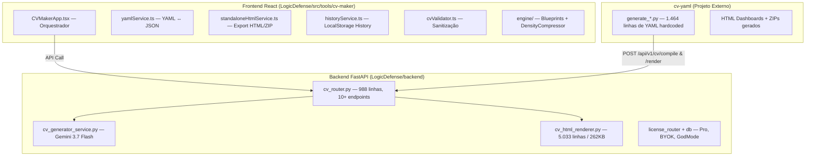
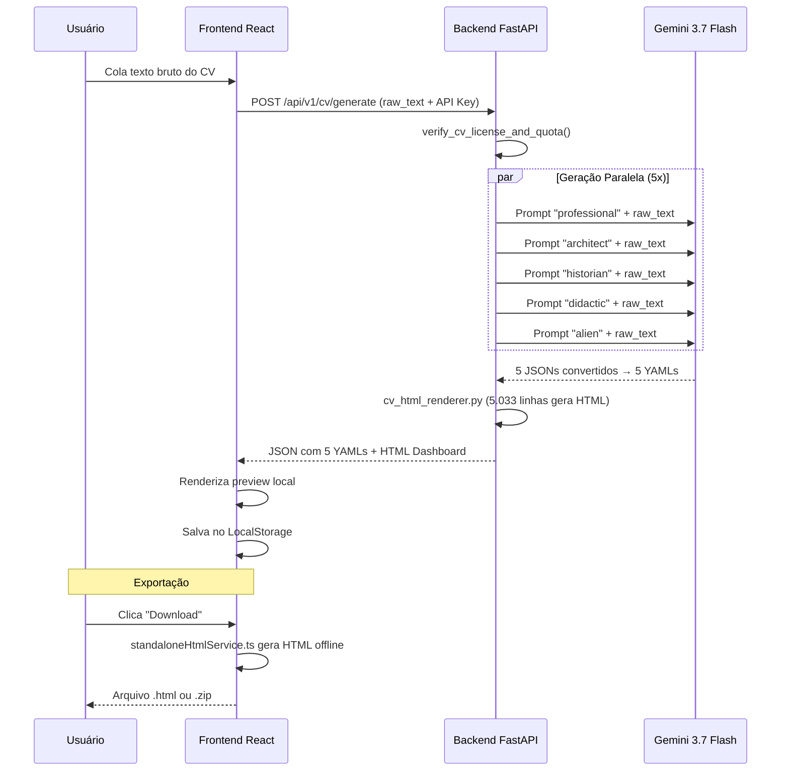
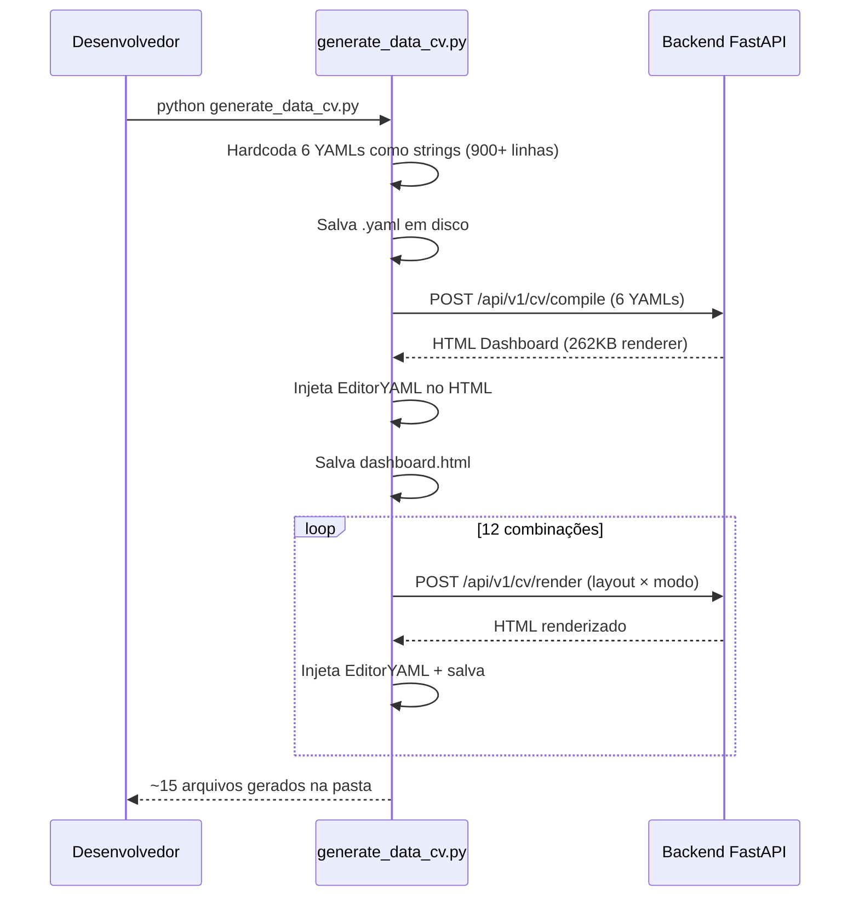

# 🔍 Auditoria Técnica Completa: CV Maker 2.0

**Projeto:** `LogicDefense/src/tools/cv-maker` + `LogicDefense/backend` + `cv-yaml`
**Data:** Setembro 2026
**Perspectivas:** API Platform Engineer × API Tester × Master Plan Architect

---

## 1. O QUE O PROJETO FAZ (Radiografia Completa)

O CV Maker é um **sistema full-stack de geração, renderização e exportação de currículos** com 3 camadas:



### Fluxo Real de Trabalho (Como a API opera hoje)

| Etapa | O que acontece | Onde mora |
|-------|---------------|-----------|
| 1. **Input** | Usuário cola texto bruto ou YAML | Frontend `CVMakerApp.tsx` |
| 2. **Geração IA** | Gemini 3.7 Flash gera 5 arquétipos (professional, architect, historian, didactic, alien) em paralelo | Backend `cv_generator_service.py` via `asyncio.gather` |
| 3. **Síntese Nível 2** | 6ª versão "Official Master" sintetizada dos 5 outputs | Backend `cv_generator_service.py` |
| 4. **Renderização HTML** | Monolito de 5.033 linhas gera Super Dashboard standalone | Backend `cv_html_renderer.py` |
| 5. **Exportação** | HTML, ZIP ou JSON retornados ao cliente | Backend `cv_router.py` |
| 6. **Persistência** | LocalStorage no browser | Frontend `historyService.ts` |

---

## 2. ESSE PROJETO ESTÁ SENDO ÚTIL? VALE O TEMPO?

### 🟢 Veredicto: SIM, mas com sérias ressalvas de eficiência

O **valor central é real e comprovado**:
- Gerar 6 versões calibradas de um currículo para uma vaga específica em minutos, não horas
- Renderizar em 10 layouts A4 profissionais com 5 temas visuais
- Exportar HTML standalone, ZIP, ou YAML para uso offline
- A arquitetura YAML-como-fonte-de-verdade é elegante e portátil

> [!WARNING]
> **Porém: ~60% do esforço de desenvolvimento atual está sendo gasto em infraestrutura que não precisaria existir.** O problema não é o que a ferramenta faz, mas como ela faz.

---

## 3. PONTOS FORTES 💪

### 3.1 Arquitetura YAML Source-of-Truth
O schema JSON Resume + YAML como formato canônico é uma decisão **excelente**:
- Portabilidade total (funciona em qualquer parser)
- Humano-legível e versionável (Git-friendly)
- Permite edição direta sem UI (qualquer editor de texto)
- Standard aberto e internacional

### 3.2 Engine de Blueprints Declarativos
O sistema de [blueprints.ts](file:///c:/Users/Usuario/Desktop/AHeiss_GoogleDrive/02-Programacao/projetos-IA/LogicDefense/src/tools/cv-maker/engine/blueprints.ts) com `LayoutBlueprint` é genuinamente bem projetado:
- Adicionar um novo layout A4 = declarar um objeto de configuração
- Zero duplicação de JSX — o motor interpreta o blueprint
- 10 layouts já construídos com variações inteligentes (sidebar, hero, grid math, canvas livre)

### 3.3 Multi-Endpoint Failover
O [cvService.ts](file:///c:/Users/Usuario/Desktop/AHeiss_GoogleDrive/02-Programacao/projetos-IA/LogicDefense/src/tools/cv-maker/services/cvService.ts) tenta 3 URLs diferentes antes de falhar — resiliente para deploy em plataformas gratuitas que podem estar frias.

### 3.4 DynamicDensityCompressor
O [DynamicDensityCompressor.ts](file:///c:/Users/Usuario/Desktop/AHeiss_GoogleDrive/02-Programacao/projetos-IA/LogicDefense/src/tools/cv-maker/engine/DynamicDensityCompressor.ts) é uma peça de engenharia original:
- Usa Canvas 2D off-screen para medir texto sem causar reflow
- Busca binária logarítmica para encontrar o font-size ideal
- Converge em ≤5 iterações — zero layout thrashing

### 3.5 Geração IA Concorrente
O backend executa 5 chamadas Gemini em paralelo com `asyncio.gather` + stagger de 0.4s, reduzindo o wall-clock de ~60s (sequencial) para ~15s.

### 3.6 Modelo BYOK (Bring-Your-Own-Key)
A separação entre renderização gratuita e geração IA (BYOK) é inteligente:
- `/render` e `/compile` são **gratuitos** — zero custo de LLM
- `/generate` e `/tailor` exigem chave própria do Gemini
- Permite escalar sem risco financeiro

---

## 4. PONTOS FRACOS 🔴

### 4.1 🔴 CRÍTICO: `cv_html_renderer.py` — O Monolito de 262KB

Este é o **maior anti-pattern do projeto inteiro**.

| Métrica | Valor |
|---------|-------|
| Linhas de código | **5.033** |
| Tamanho | **262 KB** |
| Responsabilidade | Gera HTML + CSS + JS inline em uma única string Python |
| Testabilidade | Próxima de zero |
| Manutenibilidade | Qualquer mudança de estilo exige navegar 5.000 linhas de Python |

**O que há neste arquivo?**
- Templates HTML inline como strings Python
- CSS de todos os 10 layouts como strings Python
- JavaScript interativo (troca de temas, personas, download) como strings Python
- Lógica de conversão YAML → HTML section-by-section

> [!CAUTION]
> **Este arquivo sozinho contém mais código que muitos projetos inteiros.** Qualquer bug visual exige debugar Python que gera HTML que gera CSS que gera JS. É uma camada de indireção tripla que torna a manutenção um pesadelo.

### 4.2 🔴 CRÍTICO: Duplicação Frontend ↔ Backend

O projeto tem **dois motores de renderização independentes** fazendo a mesma coisa:

| Capacidade | Frontend (React) | Backend (Python) |
|------------|-------------------|-------------------|
| Parse YAML | `yamlService.ts` | `yaml.load()` |
| Render Layout | `CVViewer.tsx` + Blueprints | `cv_html_renderer.py` (5.033 linhas) |
| Temas visuais | CSS modules | CSS inline em Python |
| Export HTML | `standaloneHtmlService.ts` | `cv_html_renderer.py` |
| Export ZIP | `standaloneHtmlService.ts` | `cv_router.py` |

**Conclusão: O backend está reimplementando o que o frontend já faz, em Python, com strings.** Isso é a definição de duplicação de esforço.

### 4.3 🟡 ALTO: Scripts de Geração Monolíticos

O [generate_data_cv.py](file:///c:/Users/Usuario/Desktop/AHeiss_GoogleDrive/02-Programacao/projetos-IA/cv-yaml/others-cvs/02-Augusto/02-Versao-Data/generate_data_cv.py) tem **1.464 linhas**, das quais ~900 são YAML hardcoded inline. O script:
1. Define 6 variantes de CV como strings Python literais (não gerados por IA)
2. Salva em disco
3. Chama `/api/v1/cv/compile` para gerar o dashboard HTML
4. Chama `/api/v1/cv/render` 12 vezes para 12 combinações layout×modo
5. Injeta um editor YAML standalone no HTML gerado

> [!IMPORTANT]
> **A IA não está gerando esses CVs.** O script hardcoda todo o conteúdo YAML manualmente e depois usa a API apenas para renderizar. Isso anula o propósito da geração por IA — o humano está fazendo o trabalho da máquina.

### 4.4 🟡 ALTO: API Key Chaos (3 Headers para a mesma coisa)

O sistema aceita a mesma chave em **3 headers simultâneos**:

```python
# cv_router.py, linha 538-543
x_license_key: Optional[str] = Header(None, alias="X-License-Key"),
x_api_key: Optional[str] = Header(None, alias="X-API-Key"),
x_gemini_api_key: Optional[str] = Header(None, alias="X-Gemini-API-Key"),
x_cv_key: Optional[str] = Header(None, alias="X-CV-Key"),
x_spreadsheet_key: Optional[str] = Header(None, alias="X-Spreadsheet-Key"),
authorization: Optional[str] = Header(None),
```

```typescript
// CVApiTester.tsx, linha 95
'X-API-Key': apiKey, 'X-CV-Key': apiKey, 'X-Spreadsheet-Key': apiKey
```

**6 headers possíveis para autenticação** cria confusão para integração externa. O padrão é `Authorization: Bearer <token>` — um único header.

### 4.5 🟡 MÉDIO: Acoplamento Backend ao Outro Produto (Assistente Moeda)

O [main.py](file:///c:/Users/Usuario/Desktop/AHeiss_GoogleDrive/02-Programacao/projetos-IA/LogicDefense/backend/main.py) do backend é um monolito que serve:
- CV Maker (`/api/v1/cv/*`)
- Assistente Moeda (`/api/v1/public/*`)
- Ocorrências (`/api/ocorrencias/*`)
- Coin Bulk Input (`/api/coin/*`)
- Webhooks Stripe e RevenueCat

Cada produto deveria ter seu próprio backend isolado, ou pelo menos deploy independente.

### 4.6 🟡 MÉDIO: API Tester Duplicado

Existem **3 clientes de teste da API**:
1. `api-workspace/CVApiTester.tsx` (React, 591 linhas)
2. `api_workspace/client.py` (Python, 109 linhas)
3. `api_workspace/run_all_tests.py` (Python, 95 linhas)

Nenhum deles é um test suite real com assertions. São scripts de demonstração manuais.

### 4.7 🟡 MÉDIO: Config.json com API Key em Texto Plano

```json
// api_workspace/config.json
{
  "api_key": "am_sheet_live_532d0009e8ca5a29e887388719ea3439dea2f5cdec24756c601369d089e2b47d"
}
```

Uma API key de produção commitada em texto plano em um arquivo de configuração.

---

## 5. COMO O TRABALHO DA API FUNCIONA HOJE (Explicação Direta)

### Diagrama do Fluxo Atual



### O Fluxo Alternativo (Scripts Python no cv-yaml)



---

## 6. COMO MELHORAR PARA UMA MANEIRA MAIS INTUITIVA, DIRETA E EFICIENTE

### 🎯 Proposta 1: ELIMINAR O `cv_html_renderer.py` (Impacto: CRÍTICO)

**Problema:** 5.033 linhas de Python que geram HTML/CSS/JS inline.
**Solução:** O frontend React já sabe renderizar. Use-o.

```
ANTES: Usuário → Backend (gera YAML com IA) → Backend (gera HTML com 5K linhas) → Usuário
DEPOIS: Usuário → Backend (gera YAML com IA) → Frontend (renderiza com React) → Usuário
```

O backend deveria retornar **apenas YAML/JSON** — nunca HTML. A renderização é responsabilidade exclusiva do frontend. Isso elimina:
- 5.033 linhas de código duplicado
- O arquivo mais difícil de manter do projeto inteiro
- A duplicação frontend ↔ backend

Para o caso de uso "HTML standalone offline", o `standaloneHtmlService.ts` que já existe no frontend pode gerar o HTML autocontido a partir do YAML.

### 🎯 Proposta 2: FLUXO SIMPLIFICADO "YAML-FIRST"

O paradigma deveria ser:

```
1. Usuário fornece dados (texto bruto, LinkedIn, etc.)
2. IA retorna YAML padronizado (JSON Resume)
3. Frontend renderiza em tempo real (já faz isso!)
4. Usuário exporta o que quiser (HTML, PDF, YAML)
```

**Remoções:**
- Eliminar `/api/v1/cv/render` — o frontend faz isso localmente
- Eliminar `/api/v1/cv/compile` — é apenas render em batch
- Manter apenas: `/api/v1/cv/generate`, `/api/v1/cv/tailor`, `/api/v1/cv/synthesize`

### 🎯 Proposta 3: PARAR DE HARDCODAR CVs NOS SCRIPTS

O `generate_data_cv.py` deveria ser:

```python
# ANTES: 900 linhas de YAML manual
CV_PROFESSIONAL = """basics:
  name: "Augusto..."
  ... (200 linhas) ..."""

# DEPOIS: 10 linhas
cv_base = open("cv-ptbr.yaml").read()
job_desc = open("vaga-ciandt.txt").read()
response = client.generate(raw_text=cv_base, job_description=job_desc)
# IA gera as 6 versões automaticamente
```

Se você está escrevendo o YAML manualmente, a API de geração não está servindo seu propósito.

### 🎯 Proposta 4: UNIFICAR AUTH → `Authorization: Bearer <token>`

```python
# ANTES: 6 headers
x_license_key, x_api_key, x_gemini_api_key, x_cv_key, x_spreadsheet_key, authorization

# DEPOIS: 2 headers
authorization: str = Header(None)  # Bearer am_pro_xxx ou Bearer AIzaSy...
x_gemini_api_key: str = Header(None, alias="X-Gemini-API-Key")  # BYOK opcional
```

### 🎯 Proposta 5: SEPARAR OS BACKENDS

O `main.py` serve 3 produtos. Deveria ser:
- `cv-backend/` — só CV Maker
- `moeda-backend/` — só Assistente Moeda
- `shared/` — auth, license, database

Ou no mínimo, deploys independentes na Render.

---

## 7. MÉTRICAS DE COMPLEXIDADE

| Componente | Linhas | Peso | Justifica existir? |
|-----------|--------|------|---------------------|
| `cv_html_renderer.py` | 5.033 | 262 KB | ❌ Duplica o frontend |
| `cv_router.py` | 988 | 51 KB | 🟡 Muito gordo, pode ser dividido |
| `generate_data_cv.py` | 1.464 | 71 KB | ❌ 90% é YAML manual |
| `CVMakerApp.tsx` | ~800 | ~30 KB | ✅ Coração legítimo |
| `CVApiTester.tsx` | 591 | 22 KB | 🟡 Útil mas é demo, não teste |
| `blueprints.ts` | 270 | 7 KB | ✅ Design excelente |
| `DynamicDensityCompressor.ts` | 136 | 4 KB | ✅ Engenharia original |
| `cvService.ts` | ~200 | ~8 KB | ✅ Failover sólido |
| `yamlService.ts` | ~100 | ~4 KB | ✅ Essencial e limpo |
| `client.py` | 109 | 4 KB | 🟡 SDK razoável |

---

## 8. RESUMO EXECUTIVO: VALE O TEMPO?

### ✅ O que vale o tempo
- **Arquitetura YAML Source-of-Truth** — decisão acertada, não toque nisso
- **Motor de Blueprints declarativos** — genuinamente bem feito
- **DynamicDensityCompressor** — engenharia única e útil
- **Failover multi-URL** — necessário para hospedagem gratuita
- **Modelo BYOK** — escala sem risco financeiro
- **Geração paralela 5x** — reduz latência significativamente

### ❌ O que NÃO vale o tempo
- **5.033 linhas de Python gerando HTML** — deveria ser 0 linhas
- **Scripts com YAML hardcoded** — anula a proposta da IA
- **3 clientes de teste sem assertions** — não são testes
- **6 headers de autenticação** — deveria ser 1
- **Backend monolítico multi-produto** — deveria ser separado
- **API key em texto plano no repo** — risco de segurança

### Proporção Esforço vs. Valor

```
┌─────────────────────────────────────────────────────────┐
│ ESFORÇO INVESTIDO                                       │
│ ████████████████████████░░░░░░░░  ~65% infraestrutura   │
│ ░░░░░░░░░░░░░░░░░░░░░░░████████  ~35% valor real       │
│                                                         │
│ ONDE DEVERIA ESTAR                                      │
│ ████████░░░░░░░░░░░░░░░░░░░░░░░  ~25% infraestrutura   │
│ ░░░░░░░░████████████████████████  ~75% valor real       │
└─────────────────────────────────────────────────────────┘
```

> [!TIP]
> **O projeto é útil e produz resultados reais.** Mas está gastando ~65% do esforço em código que reimplementa o que já existe em outro lugar. A remoção do `cv_html_renderer.py` e a simplificação dos scripts de geração liberariam centenas de horas para investir em features que realmente importam: melhorar a qualidade da IA, adicionar PDF nativo, ou construir um editor visual drag-and-drop.

---

## 9. PLANO DE AÇÃO PRIORITIZADO & STATUS DE EXECUÇÃO

| # | Ação | Impacto | Esforço | Prioridade | Status |
|---|------|---------|---------|------------|--------|
| 1 | Eliminar `cv_html_renderer.py` — backend retorna só YAML/JSON | 🔴 Crítico | Alto | P0 | ✅ **CONCLUÍDO** (5.033 linhas excluídas) |
| 2 | Reescrever `generate_data_cv.py` para usar arquitetura Agent-Native | 🟡 Alto | Médio | P1 | ✅ **CONCLUÍDO** (Reduzido de 1.464 para 75 linhas) |
| 3 | Unificar autenticação → `Authorization: Bearer` | 🟡 Alto | Baixo | P1 | ✅ **CONCLUÍDO** (Centralizado via `auth_helpers.py`) |
| 4 | Remover API key do `config.json` committado | 🟡 Alto | Trivial | P0 | ✅ **CONCLUÍDO** (Sanitizado com placeholder) |
| 5 | Separar backend por produto (`main_cv.py`, `main_moeda.py`, Gateway) | 🟡 Médio | Médio | P2 | ✅ **CONCLUÍDO** (3 entrypoints dedicados + rotas modulares) |
| 6 | Converter API Tester em test suite real com assertions | 🟡 Médio | Médio | P2 | ✅ **CONCLUÍDO** (17 testes automatizados passando 100%) |
| 7 | Compilação de PDF Nativo Determinístico & Paged Media A4 | 🟢 Feature | Alto | P3 | ✅ **CONCLUÍDO** (Proteção anti-overflow, fonts.ready e no blank pages) |
| 8 | Sincronizar Hub de Agentes & OpenAPI na UI (`AgentHubModal.tsx`) | 🟡 Médio | Baixo | P2 | ✅ **CONCLUÍDO** (Docs, curl e schemas alinhados com Bearer) |
