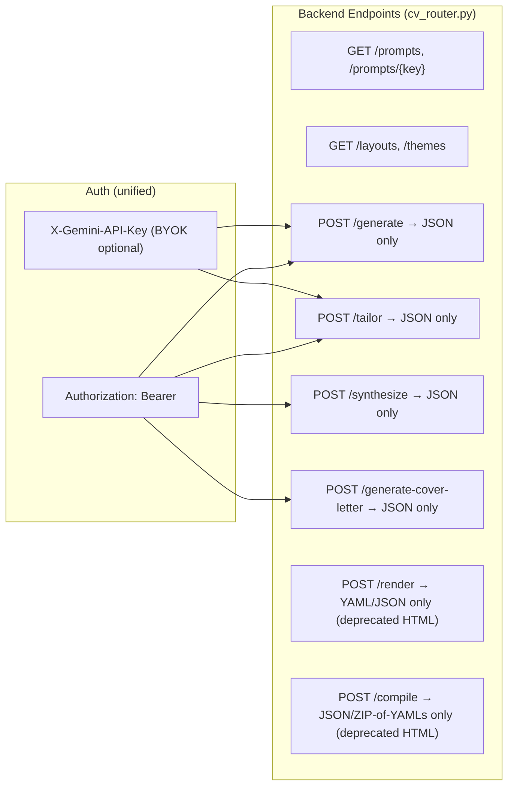

# 🏛️ CV Maker 2.0 Backend Refactoring — Plano de Arquitetura & Governança

**Data:** 02 de Setembro de 2026
**Fase:** Refatoração P0 + P1 (Backend YAML-Only + Auth Unification)
**Princípio:** O backend retorna **dados** (YAML/JSON). O frontend renderiza **pixels** (HTML/CSS/PDF).

---

## 1. 🎓 A Super Aula: Por Que Esta Refatoração É Necessária

### O Problema Real

O backend atual sofre do **anti-pattern "Full-Stack Envy"**: um servidor FastAPI que deveria ser uma API de dados está tentando ser um motor de renderização visual. O resultado é:

| Sintoma | Causa Raiz |
|---------|-----------|
| `cv_html_renderer.py` com 5.033 linhas / 262 KB | Backend gerando HTML + CSS + JS como strings Python |
| Duplicação Frontend ↔ Backend | Dois motores de renderização independentes |
| 6 headers de autenticação | Crescimento orgânico sem padronização |
| `cv_router.py` com 988 linhas e 110 linhas de YAML fallback hardcoded | Acoplamento de lógica de negócio + renderização + auth |

### O Princípio Arquitetural: Separation of Concerns (SoC)

```
┌─────────────────────────────────────────────────────────────┐
│  AGENTE (Claude, Cursor, Antigravity, GPT)                  │
│  → Gera os YAMLs com IA local                              │
│  → Zero custo de infraestrutura no servidor                 │
└────────────────────┬────────────────────────────────────────┘
                     │ YAML files
                     ▼
┌─────────────────────────────────────────────────────────────┐
│  BACKEND FASTAPI (API de Dados)                             │
│  → Valida schemas, controla licenças, serve prompts         │
│  → Retorna YAML/JSON puros — NUNCA HTML                     │
│  → Endpoints IA (generate/tailor/synthesize) para BYOK      │
└────────────────────┬────────────────────────────────────────┘
                     │ JSON/YAML
                     ▼
┌─────────────────────────────────────────────────────────────┐
│  FRONTEND REACT (Motor de Pixels)                           │
│  → Blueprints declarativos + DensityCompressor              │
│  → standaloneHtmlService.ts → Export HTML/ZIP/PDF           │
│  → 10 layouts, 5 temas, backgrounds reativos                │
└─────────────────────────────────────────────────────────────┘
```

### Context: Agent-Native Architecture

O auditor inicial interpretou o sistema como Client-Server REST clássico. Na realidade, é **100% Agent-Native**:

1. **O Agente Local É o Motor de IA** — o "cérebro" é o próprio agente autônomo (Claude, Cursor, Antigravity), não o backend fazendo HTTP para o Gemini
2. **O Backend É Um Serviço de Dados** — validação, licenciamento, prompts, e opcionalmente geração BYOK para quem não tem agente local
3. **O Frontend É o Compilador Visual** — `standaloneHtmlService.ts`, Blueprints, DensityCompressor já existem e são maduros

**Portanto:** os endpoints `/render` e `/compile` que geram HTML via `cv_html_renderer.py` são redundantes com o frontend. Devemos transformá-los em endpoints YAML/JSON puros.

---

## 2. 🔍 Crítica Cirúrgica & Red Teaming (O que pode quebrar?)

### Premissas Frágeis

| Premissa | Risco | Mitigação |
|----------|-------|-----------|
| "Ninguém usa o `/render` para gerar HTML server-side" | O script `generate_data_cv.py` no `cv-yaml` usa `/render` e `/compile` extensivamente | **Deprecação gradual**: manter os endpoints respondendo, mas com corpo JSON em vez de HTML. Atualizar o script em seguida. |
| "O frontend já renderiza tudo corretamente" | Se o `standaloneHtmlService.ts` tiver gaps de paridade vs o renderer Python | Não é nosso escopo agora — o frontend já está em produção e validado. |
| "Unificar auth não vai quebrar clientes existentes" | O `CVApiTester.tsx`, `client.py` e `generate_data_cv.py` enviam `X-API-Key` | **Período de compatibilidade**: aceitar `X-API-Key` como fallback de `Authorization: Bearer` durante a transição. |

### Riscos de Regressão

1. **`generate_data_cv.py`** — depende de `/api/v1/cv/compile` retornando HTML. Vai quebrar.
   - **Mitigação**: Atualizar o script para receber JSON e usar o frontend ou gerar HTML localmente.
2. **`/generate` endpoint** — atualmente importa e chama `render_multi_cv_dashboard_html`. Se removemos o renderer, esse import quebra.
   - **Mitigação**: O endpoint `/generate` passa a retornar `format=json` como padrão. Os formatos `html` e `zip` são deprecados nesse endpoint.
3. **Frontend `cvService.ts`** — chama `/api/v1/cv/generate` e espera campo `html_dashboard` no retorno.
   - **Mitigação**: Retornar `html_dashboard: null` em vez de string HTML. O frontend já renderiza localmente — esse campo era redundante.

### Filtro Anti-Scope Creep (Tesoura do Minimal Change)

> [!CAUTION]
> **NÃO FAZER nesta fase:**
> - ❌ Separar o backend em microserviços (P2, futuro)
> - ❌ Reescrever o `generate_data_cv.py` (P1, próxima etapa)
> - ❌ Criar test suite automatizado (P2)
> - ❌ Migrar para PDF nativo com Puppeteer (P3)
> - ❌ Refatorar o frontend em qualquer aspecto
>
> **FAZER nesta fase:**
> - ✅ Desacoplar `cv_router.py` do `cv_html_renderer.py`
> - ✅ Unificar headers de autenticação
> - ✅ Limpar o YAML fallback hardcoded de 110 linhas
> - ✅ Simplificar os response models

---

## 3. 🗺️ Esqueleto do Implementation Plan (Mapeamento de Arquivos)

### Diagrama de Fluxo Pós-Refatoração



### Lista de Arquivos

---

#### [MODIFY] [cv_router.py](file:///c:/Users/Usuario/Desktop/AHeiss_GoogleDrive/02-Programacao/projetos-IA/LogicDefense/backend/routers/cv_router.py)

**Mudanças (988 → ~550 linhas estimadas):**

1. **Remover `DEFAULT_FALLBACK_YAML`** (linhas 100-208, ~110 linhas de YAML hardcoded)
   - Substituir por arquivo externo `data/default_cv.yaml` ou simplesmente retornar 400 se nenhum YAML for enviado.

2. **Refatorar `render_cv_endpoint` (linhas 760-846)**
   - Remover `from services.cv_html_renderer import render_cv_to_standalone_html`
   - `format=yaml` → continua funcionando (retorna YAML puro)
   - `format=json` → retorna `{"yaml": ..., "theme": ..., "layout": ...}` sem campo `html`
   - `format=html` → retorna JSON com aviso de deprecação, ou redireciona para frontend URL

3. **Refatorar `compile_cv_bundle_endpoint` (linhas 920-988)**
   - Remover `from services.cv_html_renderer import render_multi_cv_dashboard_html`
   - `format=json` → retorna `{"archetypes": {...}, "theme": ..., "layout": ...}`
   - `format=zip` → retorna ZIP com apenas os 6 arquivos `.yaml` (sem HTML dashboard)
   - `format=html` → deprecado, retorna JSON

4. **Refatorar `generate_cv_endpoint` (linhas 533-638)**
   - Remover chamada a `render_multi_cv_dashboard_html`
   - `format=json` → retorna `CVGenerateResponse` sem `html_dashboard`
   - `format=html` / `format=zip` → deprecados, retornam JSON com aviso

5. **Unificar Auth (todos os endpoints)**
   - Criar helper `extract_auth_key(authorization, x_api_key, x_license_key) -> str`
   - Reduzir assinaturas de 6 headers para 2: `authorization` + `x_gemini_api_key`
   - **Período de compatibilidade**: `x_api_key` e `x_license_key` aceitos como fallback silencioso

---

#### [NEW] [auth_helpers.py](file:///c:/Users/Usuario/Desktop/AHeiss_GoogleDrive/02-Programacao/projetos-IA/LogicDefense/backend/routers/auth_helpers.py)

**Responsabilidade:** Extrair e normalizar a chave de autenticação de qualquer header aceito.

```python
def extract_auth_key(
    authorization: str | None,
    x_api_key: str | None = None,
    x_license_key: str | None = None,
    # fallbacks legados (aceitos temporariamente)
    x_cv_key: str | None = None,
    x_spreadsheet_key: str | None = None,
) -> str | None:
    """Retorna a chave limpa, priorizando Authorization: Bearer."""
    raw = authorization or x_license_key or x_api_key or x_cv_key or x_spreadsheet_key
    if raw and raw.startswith("Bearer "):
        return raw[7:].strip()
    return raw.strip() if raw else None
```

---

#### [NEW] [data/default_cv.yaml](file:///c:/Users/Usuario/Desktop/AHeiss_GoogleDrive/02-Programacao/projetos-IA/LogicDefense/backend/data/default_cv.yaml)

**Responsabilidade:** Arquivo YAML externo com o CV de demonstração. Substituição direta das 110 linhas hardcoded no `cv_router.py`. O mesmo conteúdo, mas em arquivo próprio.

---

#### [MODIFY] [CVGenerateResponse](file:///c:/Users/Usuario/Desktop/AHeiss_GoogleDrive/02-Programacao/projetos-IA/LogicDefense/backend/routers/cv_router.py#L30-L37) (Pydantic model)

```python
# ANTES
class CVGenerateResponse(BaseModel):
    html_dashboard: Optional[str]  # ← campo morto

# DEPOIS
class CVGenerateResponse(BaseModel):
    html_dashboard: Optional[str] = Field(default=None, deprecated=True)
    # Tudo igual, mas html_dashboard sempre retorna None
```

---

#### [KEEP] [cv_html_renderer.py](file:///c:/Users/Usuario/Desktop/AHeiss_GoogleDrive/02-Programacao/projetos-IA/LogicDefense/backend/services/cv_html_renderer.py) — NÃO DELETAR AINDA

> [!IMPORTANT]
> **Não deletamos o arquivo nesta fase.** Apenas removemos todos os `import` e chamadas a ele no `cv_router.py`. O arquivo fica órfão — zero referências. Será deletado na fase de limpeza após validação completa.

---

#### [MODIFY] [cvService.ts](file:///c:/Users/Usuario/Desktop/AHeiss_GoogleDrive/02-Programacao/projetos-IA/LogicDefense/src/tools/cv-maker/services/cvService.ts)

**Mudanças mínimas:**

1. O `generateCVFromText` já ignora `html_dashboard` no response (linhas 58-64 mapeiam apenas os 5 arquétipos). **Zero mudança necessária** — o frontend já está correto.
2. Headers: adicionar `Authorization: Bearer` como primário (já faz na linha 39), remover `X-License-Key` duplicado.

---

#### [MODIFY] [main.py](file:///c:/Users/Usuario/Desktop/AHeiss_GoogleDrive/02-Programacao/projetos-IA/LogicDefense/backend/main.py)

**Mudança:** Nenhuma nesta fase. O `cv_router` continua registrado no `main.py` sem alteração.

---

## 4. 🧪 Protocolo de Validação & Evidências de Verdade

### Testes Automatizados

```bash
# 1. Backend sobe sem erros de import
cd LogicDefense/backend
python -c "from routers.cv_router import router; print('✅ Router importa sem cv_html_renderer')"

# 2. Health check
curl http://localhost:8000/api/v1/cv/prompts | python -m json.tool
# Esperado: JSON com todos os prompts

# 3. /render retorna YAML puro
curl -X POST http://localhost:8000/api/v1/cv/render \
  -H "Content-Type: application/json" \
  -d '{"raw_text": "basics:\n  name: Test\n  label: Dev", "format": "yaml"}'
# Esperado: Content-Type: text/yaml

# 4. /render com format=json retorna JSON sem HTML
curl -X POST http://localhost:8000/api/v1/cv/render \
  -H "Content-Type: application/json" \
  -d '{"raw_text": "basics:\n  name: Test\n  label: Dev", "format": "json"}'
# Esperado: {"yaml": "...", "theme": "executive", ...} SEM campo "html"

# 5. /compile retorna JSON com archetypes
curl -X POST http://localhost:8000/api/v1/cv/compile \
  -H "Content-Type: application/json" \
  -d '{"professional": "basics:\n  name: Test", "format": "json"}'
# Esperado: {"archetypes": {...}} SEM html_dashboard

# 6. Frontend build continua passando
cd LogicDefense
npm run build:vite
# Esperado: exit code 0
```

### Casos de Borda Obrigatórios

| Caso | Esperado |
|------|----------|
| `/render` sem `yaml_content` e sem fallback file | HTTP 400 com mensagem clara |
| `/render?format=html` (deprecado) | HTTP 200 com JSON + campo `deprecated: true` |
| `/compile?format=zip` | ZIP contendo apenas `.yaml` files, sem `.html` |
| `/generate` com `format=html` | JSON response com `html_dashboard: null` |
| Auth com `X-API-Key` legado | Funciona (compatibilidade), mas logs registram aviso |
| Auth com `Authorization: Bearer am_pro_xxx` | Funciona normalmente (caminho primário) |

---

## 5. 🚦 Perguntas Abertas & Decisões Críticas

### Decisão 1: O que fazer com `/render?format=html`?

> [!IMPORTANT]
> **Opções:**
> - **A) Hard deprecation**: Retornar HTTP 410 Gone com mensagem de migração
> - **B) Soft deprecation**: Retornar JSON com `{"deprecated": true, "message": "Use o frontend para renderizar HTML"}` (recomendado)
> - **C) Manter funcionando**: Não remover o renderer, apenas parar de chamar nos outros endpoints
>
> **Recomendação:** Opção **B** — o script `generate_data_cv.py` ainda depende disso, e vamos atualizá-lo na próxima fase.

### Decisão 2: Manter o `DEFAULT_FALLBACK_YAML` como arquivo externo?

> **Opções:**
> - **A) Arquivo externo `data/default_cv.yaml`** — limpo, editável, versionável (recomendado)
> - **B) Eliminar completamente** — se ninguém envia YAML, retorna 400
>
> **Recomendação:** Opção **A** — o endpoint `/render` GET precisa de um fallback para funcionar como demo page.

### Decisão 3: Timeline de remoção do `cv_html_renderer.py`?

> **Recomendação:** Não deletar agora. Depois de validar que zero imports apontam para ele e que o script `generate_data_cv.py` foi atualizado, deletar na fase de limpeza.

---

## 📋 Resumo de Execução

| # | Ação | Arquivos | Linhas removidas |
|---|------|----------|-----------------|
| 1 | Criar `auth_helpers.py` com helper de extração unificada | [NEW] `routers/auth_helpers.py` | — |
| 2 | Extrair YAML fallback para arquivo externo | [NEW] `data/default_cv.yaml` | ~110 linhas de `cv_router.py` |
| 3 | Refatorar `/render` → YAML/JSON only | [MODIFY] `cv_router.py` | ~40 linhas (remove HTML gen) |
| 4 | Refatorar `/compile` → JSON/ZIP-of-YAMLs only | [MODIFY] `cv_router.py` | ~30 linhas (remove HTML gen) |
| 5 | Refatorar `/generate` → JSON only (no HTML dashboard) | [MODIFY] `cv_router.py` | ~20 linhas (remove render call) |
| 6 | Unificar assinaturas de auth em todos os endpoints | [MODIFY] `cv_router.py` | Simplifica ~6 params → 2+helper |
| 7 | Frontend: remover `X-License-Key` duplicado | [MODIFY] `cvService.ts` | ~2 linhas |
| **Total estimado** | | | **~200-300 linhas removidas, ~50 adicionadas** |
