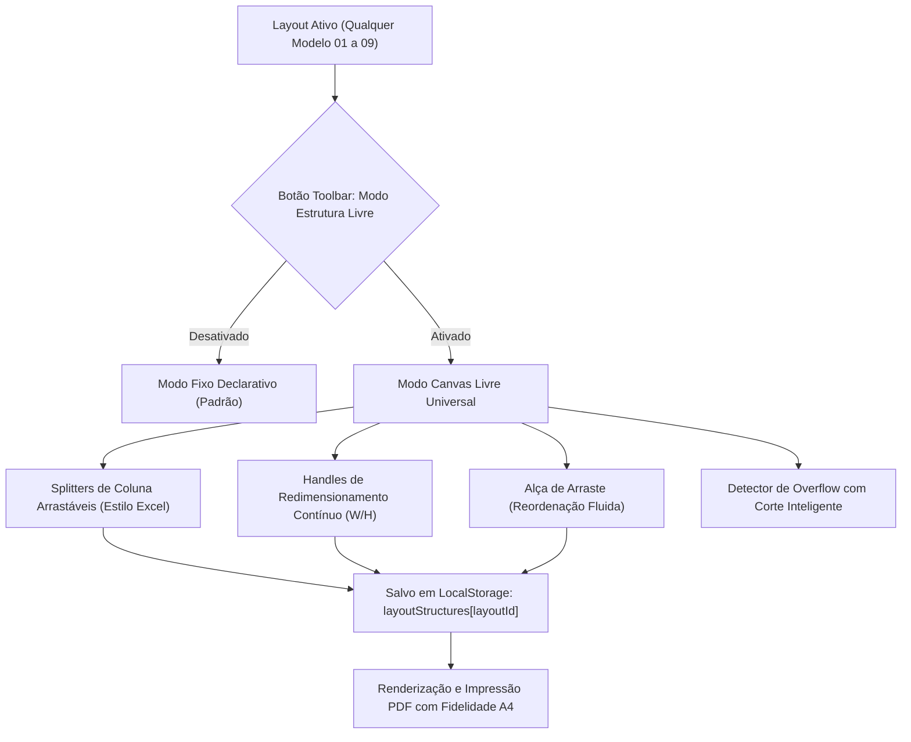

# 🏛️ Arquitetura do Canvas Livre Universal & Manipulação Estrutural A4 — Master Plan

> **Documento de Governança e Especificação Técnica**  
> **Data:** 03 de Setembro de 2026  
> **Especialistas Responsáveis:** `agency-master-plan-architect` & `agency-pdf-engine-architect`  
> **Status:** Proposta Arquitetural (Planejamento Estrito — Zero Execução de Código)  
> **Destino do Módulo:** `LogicDefense/src/tools/cv-maker`

---

## 1. 🎓 A Super Aula: Filosofia, Fundamentos & Visão Geral

### 1.1 O Problema Real: A Falsa Dicotomia "Modelo Rígido vs. Canvas Vazio"
Historicamente, geradores de currículo sofrem de um dilema estrutural insolúvel:
1. **Modelos Prontos (Rígidos):** O design é lindo e matematicamente harmonioso, mas o usuário fica preso a uma "gaiola de ferro". Se ele quiser esticar o bloco de Habilidades um pouco para a direita, encurtar a coluna lateral ou dar mais altura para as Experiências, o sistema não permite.
2. **Editores Livres Tipo Canva (Vazios):** Dão liberdade total (arraste absoluto X/Y), mas começam com uma tela em branco aterrorizante, quebram completamente as regras de impressão A4, exigem alinhamento manual frustrante e geram PDFs com textos desalinhados e quebras de página desastrosas.

No nosso sistema anterior, caímos em uma armadilha similar: criamos o **"Modelo 10 (Canvas Livre)"** como um layout segregado no menu. Ao selecioná-lo, o usuário perdia a identidade visual dos 9 modelos profissionais e caía em uma grade genérica com opções engessadas de colSpan discreto (`100%`, `66%`, `50%`, `33%`, `25%`), incapaz de ajustar alturas e sem conexão com as estruturas que tornam cada modelo especial.

### 1.2 A Solução Arquitetural: O "Canvas Livre Universal" (Universal Structural Canvas)
O Canvas Livre deixa de ser um "modelo isolado" e se transforma em uma **Capacidade de Desbloqueio Estrutural da Folha** (*Structural Unlocking Layer*):

```
┌────────────────────────────────────────────────────────────────────────┐
│ MODELO BASE (Ex: Executive Sidebar, Linear ATS, Editorial Accent, ...) │
├────────────────────────────────────────────────────────────────────────┤
│ [Botão na Toolbar]: 🔓 DESTRAVAR ESTRUTURA (CANVAS LIVRE ATIVADO)       │
│                                                                        │
│ • A estrutura do modelo atual é herdada automaticamente.               │
│ • Cada seção vira um container elástico e reordenável.                 │
│ • Resize Handles contínuos em Largura (Width) e Altura (Height).       │
│ • Drag & Drop fluido por Pointer Events (Mouse + Touchscreen Mobile).  │
│ • Alerta de Overflow Protetivo (se o texto não couber, corta limpo).  │
│ • Se desativar o botão: a estrutura volta a travar no estado ajustado. │
└────────────────────────────────────────────────────────────────────────┘
```

### 1.3 Fundamentos Teóricos Adotados
1. **Pointer Events Unificados (`pointerdown`, `pointermove`, `pointerup`):**
   Substitui a dicotomia `mousedown` vs `touchstart`. Uma única implementação lida com cliques de mouse desktop, canetas stylus e gestos de toque em smartphones e tablets, com `setPointerCapture` para evitar perdas de foco durante arraste rápido.
2. **Box-Sizing Elástico com Bounding Box A4 Matemática:**
   Ao redimensionar uma coluna ou bloco, a largura é expressa em unidades relativas e a altura em pixels calculados. O limite físico da folha ($210\text{ mm} \times 297\text{ mm} \approx 794\text{px} \times 1123\text{px}$ a 96 DPI) é soberano.
3. **Mecanismo de Overflow Graceful & Clip Protetivo:**
   Quando a caixa é encolhida manualmente pelo usuário abaixo do volume do texto:
   - Um badge não-imprimível avisa: `⚠️ Conteúdo excede as dimensões definidas`.
   - O container oculta o excesso de texto com elegância (`overflow: hidden` com gradiente sutil de atenuação) para **impedir categoricamente que o texto estoure a folha A4 e crie páginas extras na impressão**.

---

## 2. 🔍 Crítica Cirúrgica & Red Teaming (O que pode dar errado?)

### ⚠️ Risco 1: Quebra da Geometria de Impressão (`window.print()`)
- **O Risco:** Um usuário no celular ou desktop arrasta uma caixa para 500px de altura e 1200px de largura, estourando a margem da página A4 e gerando 3 páginas deformadas no PDF.
- **Mitigação `agency-pdf-engine-architect`:**
  - Todo bloco terá um *Bounding Box Controller* com limites estritos:
    - Largura mínima: `120px` (ou 15% da folha); Largura máxima: `100%` da largura útil A4.
    - Altura mínima: `36px`; Altura máxima: espaço restante até a borda inferior de 297mm.
  - No CSS de impressão (`@media print`), as dimensões calculadas são travadas rigorosamente dentro da folha com `box-sizing: border-box`.

### ⚠️ Risco 2: Conflito Entre Estrutura de Colunas Fixas e Arraste Livre
- **O Risco:** Modelos como o *Modelo 03 (Sidebar)* possuem duas colunas mestres (Lateral 230px + Conteúdo 1fr). Se o usuário puder mover qualquer coisa para qualquer lugar sem hierarquia, a identidade do layout pode se desintegrar.
- **Mitigação:**
  - A divisão da estrutura adota o conceito de **Splitters e Caixas de Seção**:
    - **Nível 1 (Divisores de Zona/Colunas):** O usuário pode arrastar a divisória entre a Sidebar e a Área Principal (exatamente como mudar a largura da coluna no Excel ou no chat do Antigravity).
    - **Nível 2 (Caixas de Seção Internas):** Dentro de cada zona, o usuário pode alterar livremente a largura (1 a 100%), a altura mínima e a ordem dos blocos.

### ⚠️ Risco 3: Perda das Configurações ao Alternar Entre Modelos
- **O Risco:** O usuário personaliza a estrutura no Modelo 01, troca para o Modelo 02 e tem suas alterações sobrescritas ou quebradas.
- **Mitigação:**
  - As customizações estruturais são armazenadas sob a chave `layoutStructures[layoutId]`. Cada modelo guarda a sua própria memória de proporções e posições destravadas.
  - Haverá sempre um botão explícito: `🔄 Restaurar Estrutura Padrão deste Modelo`.

### ⚠️ Risco 4: Performance e Engasgos no Touchscreen de Celulares
- **O Risco:** Eventos `pointermove` disparando dezenas de `setState` por segundo causam *layout thrashing* e travamento visual.
- **Mitigação:**
  - O arraste visual opera diretamente no estilo do nó DOM via `transform` e `requestAnimationFrame` durante o movimento; o estado do React só é commitado no `pointerup` (ao soltar o mouse/dedo).

---

## 3. 🗺️ Esqueleto do Implementation Plan (Mapeamento de Arquivos)

### Diagrama de Estados do Novo Fluxo



---

### Mapeamento Detalhado de Arquivos

#### 1. Tipos e Contratos de Estrutura
- `[MODIFY]` [`LogicDefense/src/tools/cv-maker/types/cv.ts`](file:///c:/Users/Usuario/Desktop/AHeiss_GoogleDrive/02-Programacao/projetos-IA/LogicDefense/src/tools/cv-maker/types/cv.ts):
  - Remover `canvas_livre` da lista de layouts (`LayoutVariant`). Ficam apenas os 9 modelos profissionais puros.
  - Adicionar o modelo de dados `LayoutStructureConfig`:
    ```typescript
    export interface SectionBoxDimensions {
      widthPercent?: number       // Largura contínua de 10% a 100%
      minHeightPx?: number        // Altura mínima em pixels
      maxHeightPx?: number        // Altura máxima com corte protetivo
      overflowAction?: 'clip' | 'warn' | 'expand'
    }
    
    export interface LayoutStructureConfig {
      isFreeCanvasActive: boolean
      columnSplitRatio?: number   // Proporção de colunas (ex: 28% sidebar / 72% main)
      sectionDimensions: Record<string, SectionBoxDimensions>
      sectionOrder?: Record<string, string[]> // Ordem customizada por zona
    }
    ```

#### 2. Componente de Redimensionamento e Arraste (Pointer Engine)
- `[NEW]` [`LogicDefense/src/tools/cv-maker/components/CanvasBuilder/StructuralBoxWrapper.tsx`](file:///c:/Users/Usuario/Desktop/AHeiss_GoogleDrive/02-Programacao/projetos-IA/LogicDefense/src/tools/cv-maker/components/CanvasBuilder/StructuralBoxWrapper.tsx):
  - Envolve qualquer seção atômica quando o Canvas Livre estiver ativo.
  - Provê alça de arraste superior e cantos/bordas de redimensionamento contínuo compatíveis com Mouse e Touch (`pointerdown`, `pointermove`, `pointerup`).
  - Implementa o cálculo em tempo real e o alerta visual de overflow com corte suave.
- `[NEW]` [`LogicDefense/src/tools/cv-maker/components/CanvasBuilder/ColumnSplitterHandle.tsx`](file:///c:/Users/Usuario/Desktop/AHeiss_GoogleDrive/02-Programacao/projetos-IA/LogicDefense/src/tools/cv-maker/components/CanvasBuilder/ColumnSplitterHandle.tsx):
  - Barra divisória móvel entre colunas (ex: Sidebar ↔ Main, Duas Colunas do Split Duo), permitindo arrastar a largura de colunas exatamente como no Excel ou no chat do Antigravity.

#### 3. Roteador Universal de Layouts
- `[MODIFY]` [`LogicDefense/src/tools/cv-maker/components/CVViewer/UniversalLayoutRenderer.tsx`](file:///c:/Users/Usuario/Desktop/AHeiss_GoogleDrive/02-Programacao/projetos-IA/LogicDefense/src/tools/cv-maker/components/CVViewer/UniversalLayoutRenderer.tsx):
  - Integrar a propriedade `structureConfig?: LayoutStructureConfig`.
  - Quando `isFreeCanvasActive` for `true`, as seções de qualquer modelo renderizam dentro do `StructuralBoxWrapper` com os splitters interativos.
  - Quando for `false`, renderiza o modelo fixo original perfeitamente estável.

#### 4. Barra de Ferramentas & Modais
- `[MODIFY]` [`LogicDefense/src/tools/cv-maker/components/Toolbar/CVToolbar.tsx`](file:///c:/Users/Usuario/Desktop/AHeiss_GoogleDrive/02-Programacao/projetos-IA/LogicDefense/src/tools/cv-maker/components/Toolbar/CVToolbar.tsx):
  - Substituir o menu engessado de "Modo" por um botão proeminente: **"🎨 Modo Estrutura Livre (Canvas)"** com estado toggle (`on` / `off`).
  - No menu de "Modelo A4", remover o "Modelo 10 (Canvas Livre)", deixando apenas os 9 modelos profissionais declarativos.
- `[MODIFY]` [`LogicDefense/src/tools/cv-maker/CVMakerApp.tsx`](file:///c:/Users/Usuario/Desktop/AHeiss_GoogleDrive/02-Programacao/projetos-IA/LogicDefense/src/tools/cv-maker/CVMakerApp.tsx):
  - Gerenciar o estado `structureConfig` e sincronizar com o `UniversalLayoutRenderer`.
  - Descontinuar a troca abrupta de tela para `CanvasBuilderWorkspace`, unificando a visualização no próprio `CVViewer`.

#### 5. Estilos e Impressão
- `[MODIFY]` [`LogicDefense/src/tools/cv-maker/styles/cv-canvas-builder.css`](file:///c:/Users/Usuario/Desktop/AHeiss_GoogleDrive/02-Programacao/projetos-IA/LogicDefense/src/tools/cv-maker/styles/cv-canvas-builder.css):
  - Adicionar classes para os handles de redimensionamento (`.cv-resize-handle-x`, `.cv-resize-handle-y`, `.cv-resize-handle-corner`).
  - Adicionar estilos para o divisor de colunas (`.cv-column-splitter`).
  - Adicionar classes para o estado de overflow suave (`.cv-box-overflow-clipped`).
- `[MODIFY]` [`LogicDefense/src/tools/cv-maker/styles/cv-print.css`](file:///c:/Users/Usuario/Desktop/AHeiss_GoogleDrive/02-Programacao/projetos-IA/LogicDefense/src/tools/cv-maker/styles/cv-print.css):
  - Garantir que todos os handles, badges e splitters interativos recebam `display: none !important;` na impressão.
  - Garantir que as proporções customizadas sejam preservadas com nitidez A4 na saída vetorial.

---

## 4. 🧪 Protocolo de Validação & Evidências de Verdade

Antes de qualquer aprovação da implementação, os seguintes testes serão estritamente executados:

1. **Teste de Redimensionamento Contínuo (Mouse e Touch):**
   - Arrastar a borda direita de uma caixa de seção de 30% a 100% de largura de forma suave, sem saltos fixos.
   - Arrastar a borda inferior para aumentar ou diminuir a altura mínima.
   - Testar no modo responsivo mobile (Touch Simulation do DevTools) para garantir que `touch-action: none` e os `PointerEvents` funcionem perfeitamente.
2. **Teste de Redimensionamento de Colunas (Splitter Estilo Excel):**
   - No *Modelo 03 (Sidebar)*, arrastar o divisor entre a Sidebar e a área principal, variando a proporção de 20%/80% até 45%/55%.
3. **Teste do Alerta e Corte de Overflow:**
   - Reduzir uma caixa de experiência profissional para 60px de altura.
   - Verificar se o badge `⚠️ Conteúdo excede as dimensões` aparece e se o texto é contido sem empurrar a folha para além dos 297mm da página A4.
4. **Teste de Impressão e PDF (`window.print()`):**
   - Emitir a impressão em modo Canvas Livre ativo.
   - Confirmar visualmente que nenhum handle ou badge vaza para o papel e que a folha mantém rigorosamente 1 página A4.
5. **Compilação Monorepo Sem Erros:**
   - Executar `npm run build` e confirmar 0 erros de tipagem TypeScript.

---

## 5. 🚦 Perguntas Abertas & Decisões Críticas (Trade-offs)

Para que o plano seja executado com exatidão cirúrgica, alinhamos as seguintes definições:

1. **Comportamento do Texto que Não Cabe (Overflow):**
   - *Opção Recomendada:* O container aplica `overflow: hidden` com um sutil gradiente transparente no rodapé da caixa e exibe o badge de aviso na tela. Na impressão, o texto excedente não vaza para fora do bloco.
2. **Persistência das Customizações:**
   - As proporções e alturas ajustadas pelo usuário serão salvas no `localStorage` por modelo. Assim, se o usuário customizar a estrutura do Modelo 03 e depois for para o Modelo 01, ao voltar para o Modelo 03 sua diagramação estará intacta.
3. **Botão de Reset Estrutural:**
   - Haverá um botão rápido na toolbar: *"Restaurar Proporções Padrão"* para o caso de o usuário deformar a folha além do desejado.

---

> [!IMPORTANT]
> **COMPROMISSO DE GOVERNANÇA:** Conforme a regra sagrada do `agency-master-plan-architect`, **NENHUM CÓDIGO DE PRODUÇÃO FOI ALTERADO NESTA RESPOSTA**. O plano acima e o arquivo espelho criado em `master-plan` estão submetidos à sua revisão e aprovação antes de qualquer linha de código ser implementada.
