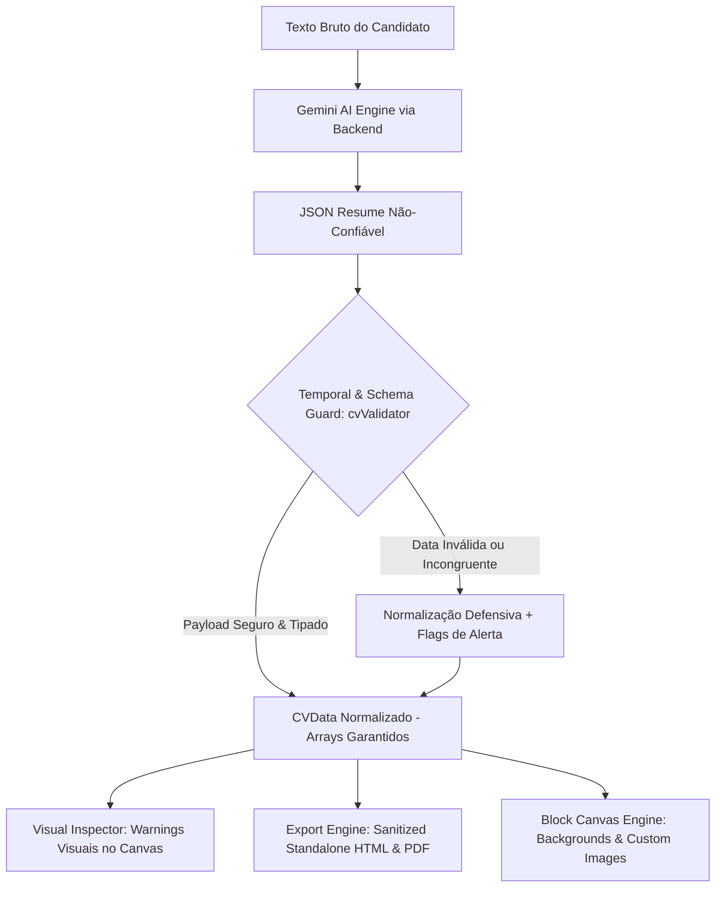

# 🏛️ CV Maker 2.0 — Plano de Arquitetura, Governança & Blindagem Comercial

> *"A governança na mão da Eficiência caminha com a energia dinâmica que equilibra o Universo. Não armazene apenas a interface: compreenda e extraia a verdade antes de agir."*  
> — **Master Plan Architect & Technical Educator**

---

## 1. 🎓 A Super Aula: Filosofia, Fundamentos & Visão Geral

### 1.1 O Problema Real
O **CV Maker** é uma ferramenta Local-First e Agent-Native de criação de currículos de alto impacto. No entanto, ela enfrenta três dores fundamentais para se tornar um produto comercialmente blindado e de padrão de excelência internacional:
1. **A Fragilidade da Ilusão da IA (Alucinação Temporal):** LLMs (como o Gemini) sofrem de horror ao vácuo (*horror vacui*). Quando o texto bruto do candidato omite uma data (ex: *"Fui tech lead na startup X"*), o modelo deduz datas aleatórias como `"2020-01-01"` a `"2022-05-01"`. Se o usuário não perceber, exporta uma mentira curricular com graves consequências jurídicas e de reputação profissional.
2. **Vetores de Injeção em Exportação Standalone (CSS/XSS):** O arquivo HTML autocontido interpola propriedades como `backgroundPattern` diretamente em `url('...')` dentro de blocos CSS. Sem sanitização rígida, inputs maliciosos podem desfigurar o documento ou executar vetores de CSS Injection / XSS.
3. **Limitação Estética & Potencial Comercial Não Realizado:** O mercado atual exige flexibilidade visual (backgrounds contextuais por seção, badges, logos de empresas/universidades, screenshots de projetos e QR Codes), sem cair no caos estético ("efeito carnaval") e sem quebrar o limite de 5MB a 10MB do `localStorage`.

### 1.2 Fundamentos Teóricos & Padrões Arquiteturais
Para resolver essas dores com **dignidade técnica e eficiência harmônica**, adotamos quatro padrões centrais:



- **Zero Trust nos Outputs da IA:** Trate qualquer retorno de LLM como input de usuário não sanitizado. A camada de validação (`cvValidator.ts`) deve ser uma fronteira dura com tipagem discriminada e asserções semânticas.
- **Princípio da Transparência & Governança no Usuário:** A IA nunca deve fingir certeza. Se uma data é ausente ou inferida, o sistema deve registrar a incerteza (`inferred: true` / `[ESTIMADO]`) e sinalizá-la visualmente no canvas para que a responsabilidade e a decisão final estejam nas mãos do usuário.
- **Sanitização Canônica por Allowlist:** Para cores e backgrounds, nunca permitir strings arbitrárias em contextos de renderização CSS raw. Utilizar validação estrita (Hex regex `#([A-Fa-f0-9]{3,8})`, gradientes permitidos pré-compilados, e URLs checadas).
- **Orçamento Espacial e de Memória (Storage Budgeting):** Imagens do usuário adicionadas a seções ou blocos livres devem passar por um pipeline de compressão client-side via `HTMLCanvasElement` (WebP/JPEG, max 1600x1200, limite de ~150KB por ativo), evitando o crash silencioso de estouro de cota do `localStorage`.

### 1.3 Estudo Comparativo de Mercado
| Solução | Abordagem de IA | Customização de Imagens/Fundos | Fragilidade Observada |
| :--- | :--- | :--- | :--- |
| **Reactive Resume** | Não foca em geração do zero; foca em edição de campos | Suporte a fotos simples, sem imagens de projetos | Sem assistência semântica ativa |
| **Novoresume** | Sugestões pontuais de texto pré-formatadas | Templates fechados, zero backgrounds por seção | Rigidez extrema; sem liberdade 2D |
| **Canva** | Livre movimentação e design | Totalmente livre | Zero aderência ATS; formatação quebra parsing de RH |
| **CV Maker 2.0 (Nossa Visão)** | **Agent-Native + Resume Tailor Skill + Auditoria Temporal** | **Caixas modulares com backgrounds harmônicos + Imagens ricas + Modo Livre** | **Equilíbrio perfeito: visual premium + ATS estruturado + dados auditados** |

---

## 2. 🔍 Crítica Cirúrgica & Red Teaming (O que pode quebrar?)

### 2.1 Premissas Frágeis
- **Premissa:** *"O prompt é suficiente para impedir que a IA invente datas."*  
  **Realidade (Red Teaming):** Falsa. Modelos de linguagem priorizam completar o padrão sintático de um JSON schema sobre obedecer a instruções negativas ("não invente"). A defesa deve residir obrigatoriamente no código determinístico do cliente/validador.
- **Premissa:** *"Podemos permitir que o usuário cole qualquer URL de imagem externa para logos e projetos."*  
  **Realidade (Red Teaming):** Se a imagem for remota, o modo Standalone HTML Offline e a exportação em PDF quebram por bloqueio CORS ou falta de internet. Toda imagem precisa ser embutida como Data URI base64 otimizada.

### 2.2 Riscos de Regressão
- **Regressão em Layouts Antigos (Modelos 01 a 09):** A introdução de `custom_image` ou novos atributos visuais em `SectionBoxDimensions` não pode quebrar os templates clássicos que esperam um array fixo de campos em `CVWork` ou `CVEducation`.
- **Incompatibilidade de Parsing no Standalone HTML:** Se o `standaloneHtmlService.ts` não implementar a renderização segura de imagens customizadas e fundos por seção, haverá divergência crítica entre o que o usuário vê na tela e o arquivo que ele baixa.

### 2.3 Filtro Anti-Scope Creep (A Tesoura do Minimal Change)
- ❌ **NÃO faremos nesta fase:** Um editor gráfico vetorial completo (estilo Figma/Canva com rotação 3D e camadas livres infinitas).
- ❌ **NÃO faremos nesta fase:** Um servidor de banco de dados relacional remoto para salvar CVs. O modelo Local-First com exportação YAML/ZIP/HTML é o ponto forte da ferramenta e deve ser preservado.
- 🎯 **O que FAREMOS:** Extensão cirúrgica de tipos, sanitização de CSS, validação temporal de datas, avisos visuais de incerteza, galeria visual com miniaturas estáticas/vetoriais, e componente de imagem customizada comprimida.

---

## 3. 🗺️ Esqueleto do Implementation Plan (Mapeamento de Arquivos)

O plano é dividido em **4 Fases Sequenciais**:

```
FASE 0: Blindagem Crítica (P0) — Segurança & Integridade Temporal
  ├── D-1 & D-2: Validador de Datas & Plausibilidade
  ├── D-3: Prompt Anti-Fabricação
  └── S-4: Sanitização de BackgroundPattern & Cores
FASE 1: Experiência Comercial & Ecosistema (P1)
  ├── 6.1: Conexão Oficial com Resume Tailor Skill
  ├── D-4: Alertas Visuais de Datas Inferidas no Canvas
  ├── 5.2: Galeria Visual de Templates A4
  └── A-5 & A-6: Tipagem Rígida e Normalização de Arrays
FASE 2: Poder Criativo — Backgrounds & Imagens Customizadas (P2)
  ├── 5.1: Sistema de Fundos Granulares por Seção
  └── 5.3: Bloco e Entidade de Imagens Customizadas (com compressão)
FASE 3: Refatoração Estrutural dos God Components (P3)
  └── A-1: Modularização do AgentHubModal
```

### Arquivos Impactados:

#### [MODIFY] [types/cv.ts](file:///c:/Users/Usuario/Desktop/AHeiss_GoogleDrive/02-Programacao/projetos-IA/LogicDefense/src/tools/cv-maker/types/cv.ts)
- **Motivo:** 
  - Adicionar interfaces `CVCustomImage` e estender `CVWork`, `CVEducation`, `CVProject` com campos opcionais de logo/mídia (`companyLogo?`, `institutionLogo?`, `mediaUrl?`).
  - Expandir `SectionStyleOverride` para suportar `bgType`, `bgGradient`, `bgPattern`, `bgOpacity`, `borderRadius`.
  - Criar união discriminada para itens de `AtomicItemRenderer`.
  - Incluir metadados de validação temporal (`temporalWarnings?: Record<string, string[]>`).

#### [MODIFY] [services/cvValidator.ts](file:///c:/Users/Usuario/Desktop/AHeiss_GoogleDrive/02-Programacao/projetos-IA/LogicDefense/src/tools/cv-maker/services/cvValidator.ts)
- **Motivo:**
  - Implementar validador determinístico de datas (`validateDateFormat`, `validateDatePlausibility`).
  - Normalizar arrays vazios: retornar `[]` em vez de `undefined` para evitar erros de renderização.
  - Detectar datas no futuro ou datas invertidas (`startDate > endDate`), gerando warnings estruturados sem quebrar a carga do documento.

#### [MODIFY] [services/standaloneHtmlService.ts](file:///c:/Users/Usuario/Desktop/AHeiss_GoogleDrive/02-Programacao/projetos-IA/LogicDefense/src/tools/cv-maker/services/standaloneHtmlService.ts)
- **Motivo:**
  - Sanitizar `designConfig.backgroundPattern` e variáveis de cores com validação rigorosa (eliminar vulnerabilidade S-4 / CWE-79).
  - Incluir suporte seguro aos novos estilos de caixas de seção e imagens customizadas.

#### [MODIFY] [components/Modals/AgentHubModal.tsx](file:///c:/Users/Usuario/Desktop/AHeiss_GoogleDrive/02-Programacao/projetos-IA/LogicDefense/src/tools/cv-maker/components/Modals/AgentHubModal.tsx)
- **Motivo:**
  - Reforçar o prompt de sistema anti-fabricação temporal (Regra de Ouro: *"Se não há data explícita, declare 'YYYY' ou omita; nunca invente dias/meses"*).
  - Adicionar card de destaque e link direto para a skill open source `agency-resume-tailor` no GitHub da Agency.

#### [MODIFY] [components/blocks/AtomicItemRenderer.tsx](file:///c:/Users/Usuario/Desktop/AHeiss_GoogleDrive/02-Programacao/projetos-IA/LogicDefense/src/tools/cv-maker/components/blocks/AtomicItemRenderer.tsx)
- **Motivo:**
  - Substituir `item: any` por união tipada.
  - Renderizar badges/tooltips de alerta visual caso haja inconsistência temporal no item.
  - Suportar a exibição opcional de logo da empresa/instituição quando presente.

#### [NEW] [components/Modals/TemplateGalleryModal.tsx](file:///c:/Users/Usuario/Desktop/AHeiss_GoogleDrive/02-Programacao/projetos-IA/LogicDefense/src/tools/cv-maker/components/Modals/TemplateGalleryModal.tsx)
- **Motivo:**
  - Nova interface comercial: visualização em grid com cartões de templates, badges de estilo (ATS, Criativo, Executivo, Canvas) e aplicação em um clique com preview instantâneo.

#### [NEW] [utils/imageCompressor.ts](file:///c:/Users/Usuario/Desktop/AHeiss_GoogleDrive/02-Programacao/projetos-IA/LogicDefense/src/tools/cv-maker/utils/imageCompressor.ts)
- **Motivo:**
  - Função utilitária pura para receber arquivos de imagem (PNG/JPG/WebP), redimensionar em canvas offscreen (max 800px para logos, 1200px para banners) e converter em base64 compactado (< 150KB), prevenindo saturação de armazenamento.

---

## 4. 🧪 Protocolo de Validação & Evidências de Verdade

1. **Teste de Blindagem de Datas (Anti-Alucinação):**
   - **Caso de Teste 1:** Fornecer texto sem nenhuma data: *"Trabalhei como analista na Ambev e fiz faculdade na USP"*.
   - **Critério de Sucesso:** A IA não gera datas fictícias (`startDate` vazio ou ano aproximado com tag `[ESTIMADO]`). O `cvValidator` não aceita formatos espúrios e exibe aviso amarelo no preview.
   - **Caso de Teste 2:** Fornecer data futura: `startDate: "2030-01"`. O validador marca como flag de plausibilidade e alerta o operador.
2. **Teste de Sanitização CSS / XSS:**
   - Injetar no `backgroundPattern`: `javascript:alert(1)` ou `'); } </style><script>alert(1)</script>`.
   - **Critério de Sucesso:** O parser neutraliza a injeção e renderiza string segura ou `none`.
3. **Teste de Compressão de Imagens:**
   - Fazer upload de foto/logo de 10MB em alta resolução.
   - **Critério de Sucesso:** A imagem é comprimida client-side para menos de 180KB antes de ser persistida no estado/localStorage.
4. **Verificação Visual e de Compilação:**
   - Executar validação de tipos TypeScript (`tsc --noEmit`).
   - Testar exportação Standalone HTML e verificar integridade offline no navegador.

---

## 5. 🚦 Perguntas Abertas & Decisões Críticas (Trade-offs)

1. **Comportamento das Datas Não Informadas:**
   - Opção A: Campo nulo/vazio estrito.
   - Opção B: Inferência com flag explícita `[ESTIMADO]` + destaque visual de auditoria no canvas.
2. **Design dos Fundos por Seção:**
   - Paleta de presets harmônicos curados vs seletor de cores totalmente livre.
3. **Prioridade de Início:**
   - Iniciar imediatamente pela Fase 0 (Blindagem Crítica P0).
