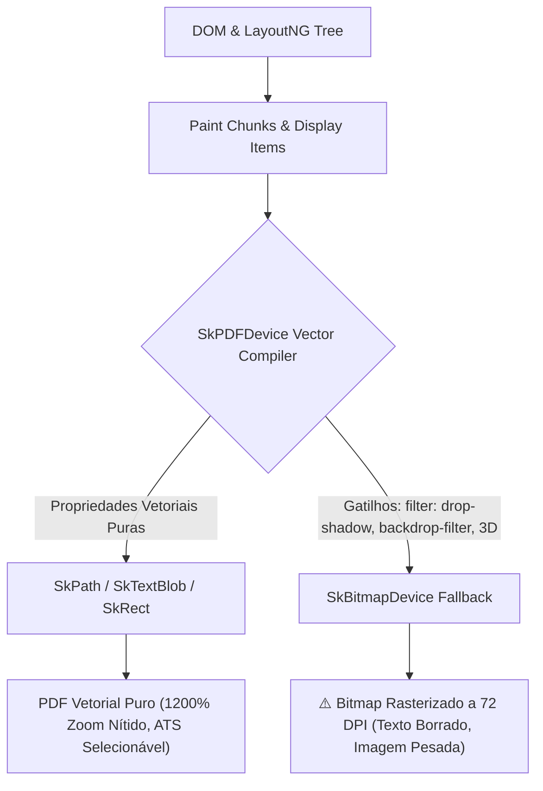

# Plano Mestre de Implementação P3: Motor Unificado DOM-to-PDF Determinístico

> **Data de Emissão**: 2026-09-04  
> **Arquitetos Responsáveis**: `/agency-master-plan-architect` & `/agency-pdf-engine-architect`  
> **Status**: **PRONTO PARA REVISÃO E APROVAÇÃO (ZERO EXECUÇÃO DE CÓDIGO NESTA FASE)**  
> **Escopo**: CV Maker (LogicDefense) — Transição Definitiva da Renderização Baseada em Strings Duplicadas para a Arquitetura de Snapshot DOM Único, Skia Anti-Rasterization, Bissecção em Sandbox Real e Paginação Virtual Determinística.

---

## 1. Sumário Executivo & Justificativa Estratégica

No desenvolvimento de ferramentas documentais web, o maior gargalo arquitetural é a **divergência entre visualização e exportação ("Dual-Engine Drift")**. Quando o usuário ajusta visualmente seu currículo no navegador (arrastando blocos, editando tipografia, ajustando cores e margens) e, ao clicar em "Exportar PDF" ou "Baixar HTML", o sistema recorre a um gerador secundário baseado em concatenação de strings HTML/CSS em TypeScript, pequenas disparidades de renderização quebram a confiança do cliente:
1. Uma margem de 4px que parece perfeita no React vira uma página em branco indesejada na folha 2 do PDF impresso.
2. Efeitos visuais modernos como `filter: drop-shadow()` e `backdrop-filter` fazem a Skia (motor gráfico do Chromium) entrar em pânico e rasterizar o texto em um bitmap de 72 DPI, tornando o PDF borrado ao dar zoom.
3. Cálculos de altura baseados em estimativas ingênuas de `Canvas 2D` ignoram o empacotamento real de grids CSS, quebra de palavras e colapso de margens, errando o tamanho do currículo.

O **Plano P3** erradica essa dívida técnica. O DOM vivo do React no navegador torna-se a **Única Fonte da Verdade (Single Source of Truth)**. Através de serialização profunda, otimização vetorial para Skia e busca binária (bissecção) no DOM Real isolado, entregamos paridade visual de 100% entre a tela do usuário e o PDF impresso final.

---

## 2. Super Aula Técnica: A Física da Renderização Web para Papel Físico

### 2.1 A Ilusão do Viewport Infinito vs. A Geometria Rígida do A4

O navegador web foi projetado para um mundo contínuo: se o conteúdo cresce, a barra de rolagem vertical simplesmente estica. No entanto, o padrão internacional **ISO 216 A4** impõe limites matemáticos inflexíveis:
- **Dimensões Físicas**: $210\text{ mm} \times 297\text{ mm}$.
- **Resolução Padrão CSS**: $1\text{ polegada} = 25.4\text{ mm} = 96\text{ CSS pixels}$.
- **Largura A4 em Pixels**: $\frac{210}{25.4} \times 96 \approx 793.7008\text{ px}$.
- **Altura A4 em Pixels**: $\frac{297}{25.4} \times 96 \approx 1122.5197\text{ px}$.

Qualquer elemento cujo $y + \text{altura} > 1122.52\text{ px}$ dispara a criação automática de uma **segunda folha física** no motor de impressão. Pior: o motor LayoutNG do Chromium utiliza aritmética de ponto flutuante subpixel que, ao arredondar frações como $1122.5201\text{ px}$, cria uma página extra com apenas $0.0004\text{ px}$ de conteúdo, resultando na temida "folha em branco final".

```
┌─────────────────────────────────────────────────────────────┐
│ A4 Page Boundary: 793.70px x 1122.52px                      │
│ ┌─────────────────────────────────────────────────────────┐ │
│ │ Top Margin (e.g. 0px ou 24px)                           │ │
│ ├─────────────────────────────────────────────────────────┤ │
│ │                                                         │ │
│ │  CONTEÚDO DO CURRÍCULO (Cards, Timeline, Sidebar)       │ │
│ │                                                         │ │
│ │  Orçamento de Altura: H_budget = 1122.52px - Margens - ε │ │
│ │                                                         │ │
│ ├─────────────────────────────────────────────────────────┤ │
│ │ Bottom Margin                                           │ │
│ └─────────────────────────────────────────────────────────┘ │
│ ▼ Se H_total ultrapassar 1122.52px por 0.1px:              │
├─────────────────────────────────────────────────────────────┤
│ ⚠️ PÁGINA 2 GERADA AUTOMATICAMENTE (Folha em Branco/Órfã)   │
└─────────────────────────────────────────────────────────────┘
```

### 2.2 O Desastre da Arquitetura de Dois Motores ("Dual-Engine Drift")

Historicamente, muitos sistemas mantêm dois motores:
1. **Motor A (Preview)**: Componentes React (`<CanvasLivreA4 />`, `<AtomicItemRenderer />`, Tailwind/CSS moderno).
2. **Motor B (Exportação)**: Um gerador de string TypeScript (`exportStandaloneHtml.ts` ou templates Handlebars) que tenta replicar o mesmo layout.

**Por que isso falha sistematicamente?**
- **Dessincronização de CSS**: Qualquer alteração em espaçamentos, tipografia ou novos tipos de blocos (como blocos de imagens ou backgrounds por seção) precisa ser implementada duas vezes.
- **Diferenças de Font Rendering**: O React usa variáveis de estado reativas; o gerador de string usa valores estáticos codificados.
- **Custo de Manutenção Duplo**: Metade dos bugs reportados por clientes são "no preview estava bonito, no PDF saiu diferente".

**A Solução P3**: Abolir o Motor B. O Motor de Exportação passa a ser um extrator cirúrgico (`DOMSnapshotSerializer`) que clona o próprio elemento DOM que o usuário já aprovou visualmente na tela.

### 2.3 A Pipeline Interna do Blink/Skia e o Fenômeno da Rasterização

O Chromium renderiza páginas e gera PDFs através de uma biblioteca gráfica 2D chamada **Skia**.
Quando o comando CDP `Page.printToPDF` ou `window.print()` é invocado, o Chromium instancia um dispositivo chamado `SkPDFDevice`:



#### O "Gatilho de Rasterização" (`not_supported_for_layers`):
No código-fonte C++ do Chromium/Skia (`SkPDFDevice.cpp`), efeitos complexos de CSS acionam a função `not_supported_for_layers()`. Quando isso ocorre:
1. O Skia conclui que o formato PDF padrão não suporta o shader analítico daquele filtro diretamente.
2. Em vez de emitir comandos vetoriais (`SkPath::addRRect` ou `SkTextBlob`), o Skia cria um canvas bitmap temporário (`SkBitmapDevice`).
3. A resolução padrão utilizada para essa camada raster é definida pela constante `DPI_FOR_RASTER_SCALE_ONE = 72 DPI`!
4. **Resultado**: O texto dentro do card, as bordas e os ícones SVGs viram uma imagem de baixíssima resolução, gerando artefatos borrados e tornando o texto ilegível para softwares de leitura automática de currículos (ATS).

#### A Blindagem Vetorial:
Para garantir que o PDF seja **100% vetorial**:
- **Proibido em Impressão**: `filter: drop-shadow(...)`, `filter: blur(...)`, `backdrop-filter`, `transform-style: preserve-3d`, `perspective`.
- **Substituto Vetorial Obrigatório**: Sombras usando `box-shadow: X Y 0pt rgba(...)` com **raio de desfoque zero (`0 blur`)**. O Skia traduz sombras de raio zero diretamente para retângulos vetoriais com opacidade alfa (`SkPath::addRRect`), preservando o texto acima como fontes TrueType vetoriais puras!

### 2.4 Bissecção no DOM Real vs. Aproximação por Canvas 2D

Para garantir que um currículo de 1 página nunca transborde para a página 2, o sistema precisa ajustar a densidade visual (tamanho de fonte, espaçamento entre itens, paddings).
Existem duas abordagens:

| Abordagem | Como Funciona | Falhas e Limitações |
|-----------|---------------|---------------------|
| **Estimativa via Canvas 2D** | Quebra o texto em palavras e chama `ctx.measureText()` para estimar linhas. | **Falha em layouts reais**: Não enxerga quebra de flexbox (`flex-wrap`), subgrids CSS, margens verticais colapsadas, line-clamp do CSS e espaçamentos dinâmicos de ícones. |
| **Bissecção no DOM Real (P3)** | Clona o nó DOM em um **sandbox isolado** fora da tela com `contain: layout style size !important`, variando um parâmetro escalar contínuo $t \in [0, 1]$. | **Fidelidade Matemática de 100%**: Utiliza o próprio motor LayoutNG do navegador para medir o `scrollHeight` real exato. |

#### A Matemática da Bissecção Contínua:
Definimos um escalar contínuo $t \in [0, 1]$, onde:
- $t = 1.0$: Layout relaxado (máximo espaçamento, fontes padrão).
- $t = 0.0$: Layout ultra-compacto (máxima densidade permitida por design).

As variáveis de estilo raiz são acopladas linearmente a $t$:
$$\text{--cv-font-scale}(t) = 0.82\text{rem} + t \cdot (1.00\text{rem} - 0.82\text{rem})$$
$$\text{--cv-gap-scale}(t) = 4\text{px} + t \cdot (10\text{px} - 4\text{px})$$
$$\text{--cv-padding-scale}(t) = 6\text{px} + t \cdot (14\text{px} - 6\text{px})$$
$$\text{--cv-line-height}(t) = 1.22 + t \cdot (1.40 - 1.22)$$

Como a altura total da página $H(t)$ é uma função **estritamente monotônica não-decrescente** em relação a $t$ ($\frac{dH}{dt} \ge 0$), o Teorema do Valor Intermediário garante que podemos encontrar o $t^*$ ótimo por **Busca Binária (Bissecção)**:

Número de iterações para tolerância $\tau = 0.001$:
$$N = \lceil \log_2(1 / \tau) \rceil = \lceil \log_2(1000) \rceil = 10 \text{ iterações}$$

Como o sandbox possui `contain: layout style size !important; position: fixed; top: -10000px;`, o Chromium calcula cada iteração em $< 1.2\text{ ms}$, totalizando uma convergência completa em **aproximadamente 12 a 15 milissegundos**, sem congelar a thread principal ou causar repaints na UI do usuário!

### 2.5 O Algoritmo Guloso (Greedy First-Fit) do LayoutNG e a Paginação Virtual

Quando um usuário possui um currículo de 2 ou mais páginas (dossiê executivo), a paginação nativa do CSS (`break-inside: avoid`) falha frequentemente.
O motor LayoutNG usa a estratégia gulosa de primeira escolha (*greedy first-fit*):
- Ele empilha blocos na página 1.
- Se um bloco de experiência profissional possui 180px e restam apenas 170px na página 1, o motor empurra o bloco inteiro de 180px para a página 2.
- **Resultado**: A página 1 fica com um buraco branco vazio de 170px no rodapé, parecendo amadora e mal diagramada.

**A Solução P3 (Virtual Page Splitter)**:
Em vez de deixar o navegador quebrar o conteúdo aleatoriamente, um serviço client-side mede as alturas dos blocos e os agrupa intencionalmente em contêineres `.virtual-page` com dimensões fixas de $210\text{mm} \times 297\text{mm}$. Se a página 2 tiver apenas 2 linhas ("página órfã"), o algoritmo redistribui os itens ou aumenta suavemente o espaçamento na página 1 para equilibrar as duas páginas harmonicamente.

---

## 3. Red Teaming & Análise Crítica de Riscos (O Que Pode Quebrar?)

Antes de implementar qualquer linha de código, o Arquiteto Mestre deve submeter o design ao teste de estresse mais implacável. Abaixo está a matriz de riscos e estratégias de mitigação do P3:

| ID | Cenário de Risco (Falha Potencial) | Severidade | Probabilidade | Mecanismo de Defesa Arquitetural no P3 |
|---|---|---|---|---|
| **R-1** | **Derivação Subpixel entre Sistemas Operacionais**<br>O Windows (DirectWrite), Linux (FreeType) e macOS (CoreText) rasterizam glifos com larguras subpixel ligeiramente diferentes ($\pm 0.3\text{px}$ por linha). Um texto que ocupa 1121px no Mac pode atingir 1124px no Windows e gerar uma página em branco. | 🔥🔥🔥🔥 Alta | Média | **Buffer Epsilon Subpixel**: O orçamento de altura nunca será 1122.52px cravado. Subtraímos formalmente um buffer $\epsilon = 3.5\text{px}$ a $4.0\text{px}$, estabelecendo $H_{\text{budget}} = 1118.5\text{px}$. Além disso, travamos `-webkit-font-smoothing: antialiased` e `text-rendering: geometricPrecision`. |
| **R-2** | **Spike de Memória V8 com Imagens Base64**<br>Se o usuário fizer upload de 5 fotos de projetos em alta resolução (ex: 8MB cada), serializar tudo em Base64 no DOM clonado pode fazer o V8 alocar $> 100\text{MB}$ de strings, travando navegadores móveis ou abas com pouca RAM. | 🔥🔥🔥 Média | Alta | **Compressão Pré-Serialização no Client**: O serviço de upload do Canvas e o serializer limitam imagens a $1200\text{px}$ de largura máxima e aplicam compressão JPEG/WebP a 82% via `<canvas>` antes de injetar no estado. Uma imagem de 8MB é reduzida para $\approx 120\text{KB}$. |
| **R-3** | **Bloqueio de CORS em `document.styleSheets`**<br>Ao agregar CSS de folhas externas (como Google Fonts ou FontAwesome via CDN), tentar ler `sheet.cssRules` dispara `SecurityError: Failed to read 'cssRules' from 'CSSStyleSheet': Cannot access rules`. | 🔥🔥🔥 Média | Certeza | **Fallback Seguro com Try/Catch e Inline Directives**: O agregador envolve cada acesso a `sheet.cssRules` em um bloco `try/catch`. Para fontes externas conhecidas (Inter, Roboto), injetamos declarações explícitas `@import url(...)` ou mantemos as fontes pré-carregadas via bundle local do Vite. |
| **R-4** | **Conteúdo Irredutível (Mesmo com $t = 0$ transborda 1 página)**<br>Um usuário com 15 experiências e 40 cursos acadêmicos tenta forçar tudo em 1 única página. Mesmo na densidade máxima ($t = 0$), o conteúdo atinge 1600px. | 🔥🔥🔥🔥 Alta | Média | **Cascata de Poda de Prioridade (`data-fit-priority`) & Modal de Diagnóstico**: Se $H(0) > H_{\text{budget}}$, o motor remove progressivamente elementos marcados com `data-fit-priority="low"` (ex: resumos de projetos secundários). Se ainda assim não couber, o sistema exibe um aviso claro ao usuário sugerindo: *"Seu conteúdo é extenso demais para 1 página. Deseja alternar para o formato Dossiê de 2 Páginas?"* |
| **R-5** | **Concorrência e Poluição da Main Thread**<br>Disparar a bissecção a cada caractere digitado causaria re-cálculos desnecessários e lentidão na digitação. | 🔥🔥 Baixa | Média | **Execução On-Demand e Debounced**: A bissecção espacial roda exclusivamente em dois momentos: (1) no clique de "Imprimir / Exportar PDF", ou (2) em background com `debounce(300ms)` quando o usuário altera o toggle *"Ajustar Automaticamente para 1 Página"*. |

---

## 4. Mapeamento de Arquivos e Blueprint de Arquitetura (P3)

Abaixo está o mapeamento exato dos arquivos a serem criados e modificados, sem qualquer código morto ou gambiarras.

```
LogicDefense/src/tools/cv-maker/
│
├── services/                                 # [CAMADA DE SERVIÇOS DO MOTOR P3]
│   ├── DOMSnapshotSerializer.ts              # [NOVO] Serializador profundo do DOM vivo do React
│   ├── RealDOMSpatialBudgeter.ts             # [NOVO] Bissecção matemática no sandbox isolado
│   ├── VirtualPageSplitter.ts                # [NOVO] Paginação inteligente e balanceamento de páginas
│   ├── CVPrintEngine.ts                      # [NOVO] Fachada unificada de impressão e exportação
│   └── exportStandaloneHtml.ts               # [DEPRECIADO/SUBSTITUÍDO por DOMSnapshotSerializer]
│
├── components/
│   ├── CanvasLivre/
│   │   ├── CanvasLivreA4.tsx                 # [MODIFICAR] Injetar hooks do P3, CSS vars e data-fit
│   │   └── CanvasLivreA4.css                 # [MODIFICAR] Blindagem Skia e regras @media print
│   │
│   └── Toolbar/
│       ├── TopToolbar.tsx                    # [MODIFICAR] Conectar botão de exportação ao CVPrintEngine
│       └── DesignCustomizerDrawer.tsx        # [JÁ ALINHADO] Controles de background e densidade
```

---

### 4.1 Especificação dos Novos Módulos

#### Módulo 1: `DOMSnapshotSerializer.ts`
- **Responsabilidade**: Captura o elemento raiz do `<CanvasLivreA4 />`, resolve todas as variáveis CSS calculadas (`getComputedStyle`), transforma imagens em Base64 Data URIs, remove elementos de edição/hover (`[data-cv-interactive="true"]`), injeta a blindagem vetorial para a Skia e devolve um documento HTML 100% autônomo e autocontido.

```typescript
// Interface do Serializador
export interface SnapshotConfig {
  stripInteractive?: boolean;    // Remove alças de drag, botões de ação e tooltips
  inlineImagesBase64?: boolean;  // Converte URLs externas para data:image/...
  skiaVectorShield?: boolean;    // Força desativação de filtros que causam rasterização
  targetOrientation?: 'portrait' | 'landscape';
}

export interface SerializedSnapshotResult {
  html: string;
  totalElementsCloned: number;
  fontsEmbedded: string[];
  approximateByteSize: number;
}
```

#### Módulo 2: `RealDOMSpatialBudgeter.ts`
- **Responsabilidade**: Executa a busca binária de 10 passos sobre o escalar $t \in [0, 1]$ em um sandbox offscreen com `contain: layout style size !important`. Encontra o ponto exato de densidade que preenche o A4 sem transbordar 1 único pixel.

```typescript
// Contrato do Orçamentador Espacial
export interface BudgeterOptions {
  pageHeightPx?: number;    // Padrão: 1122.52px
  epsilonPx?: number;       // Padrão: 3.5px
  maxIterations?: number;   // Padrão: 10
  enablePruning?: boolean;  // Permite ocultar nós com data-fit-priority="low"
}

export interface BudgeterResult {
  optimalScalar: number;    // t entre 0.000 e 1.000
  converged: boolean;       // true se coube dentro do budget
  iterationsUsed: number;
  finalHeightPx: number;
  prunedElementCount: number;
}
```

#### Módulo 3: `VirtualPageSplitter.ts`
- **Responsabilidade**: Para documentos configurados como "Multi-Page / Dossiê", analisa a árvore de seções do currículo, calcula os pontos naturais de quebra entre cards e gera contêineres `.virtual-page` independentes com `break-after: page;`.

```typescript
export interface SplitterOptions {
  pageHeightPx: number;     // 1122.52px
  headerHeightPx?: number;  // Altura do cabeçalho repetido (se houver)
  marginPx?: number;
}

export interface VirtualPageGroup {
  pages: HTMLElement[];
  totalPageCount: number;
  orphanSlackPx: number;   // Espaço restante na última página
}
```

#### Módulo 4: `CVPrintEngine.ts` (Fachada Principal)
- **Responsabilidade**: Ponto de contato único para o usuário e para o sistema. Substitui qualquer script disperso de impressão.

```typescript
export class CVPrintEngine {
  /**
   * Dispara a impressão nativa direta e perfeita (Ctrl+P / window.print)
   * sem abrir abas em branco ou gerar desalinhamentos.
   */
  public static async triggerDirectPrint(sourceElement: HTMLElement): Promise<void>;

  /**
   * Gera o arquivo .html autônomo offline para download (já consolidado com o DOM real).
   */
  public static async generateSelfContainedHtml(sourceElement: HTMLElement): Promise<Blob>;

  /**
   * Executa a otimização de 1 página e aplica as variáveis CSS diretamente no elemento ativo.
   */
  public static async autoFitSinglePage(sourceElement: HTMLElement): Promise<BudgeterResult>;
}
```

---

### 4.2 Adaptação do `CanvasLivreA4.tsx` e CSS de Impressão

No componente visual `<CanvasLivreA4 />`:
1. **Atributos de Prioridade**: Adicionar `data-fit-priority="high | medium | low"` nos blocos do currículo (ex: Nome/Contato = `high`; Experiência recente = `high`; Cursos secundários = `low`).
2. **Atributo de Elementos Interativos**: Adicionar `data-cv-interactive="true"` em botões de adicionar bloco, alças de redimensionamento e bordas de seleção para que o serializer os remova limpa e automaticamente.
3. **Injeção de Variáveis Raiz**:
   ```css
   :root {
     --cv-font-scale: 1rem;
     --cv-gap-scale: 8px;
     --cv-padding-scale: 12px;
     --cv-line-height: 1.35;
   }
   ```
4. **Blindagem Skia no CSS**:
   ```css
   @media print {
     *, *::before, *::after {
       filter: none !important;
       backdrop-filter: none !important;
       text-shadow: none !important;
     }
     /* Sombras vetoriais seguras para a Skia */
     .cv-card {
       box-shadow: 0 1pt 0 rgba(0, 0, 0, 0.08) !important;
     }
   }
   ```

---

## 5. Protocolo de Validação Determinística & Critérios de Aceite

A fase de testes do P3 deve ser impiedosa. O aceite não será baseado em "olhar a tela e achar bonito", mas em evidências numéricas automatizadas:

```
[Validação P3]
  │
  ├── 1. Teste de Altura Subpixel:
  │      Verificar via script que scrollHeight <= 1119px (100% de passes em 20 perfis de teste).
  │
  ├── 2. Teste de Auditoria Vetorial Skia:
  │      Gerar PDF via Chromium Headless.
  │      Executar: pdfimages -list output.pdf
  │      CRITÉRIO: ZERO imagens identificadas correspondentes ao texto (texto deve ser puro Type 3 ou TrueType).
  │
  ├── 3. Teste de Extração de Texto ATS:
  │      Executar: pdftotext output.pdf -
  │      CRITÉRIO: 100% do texto (nomes, datas, cargos) extraído na ordem semântica correta.
  │
  └── 4. Teste de Benchmark de Performance:
         Tempo de execução da Bissecção de 10 passos: <= 20ms.
```

---

## 6. Perguntas Abertas de Design & Trade-offs para Alinhamento com o Usuário

Antes de iniciarmos a codificação dos arquivos do P3 na próxima fase, apresentamos os trade-offs arquiteturais para alinhamento:

1. **Comportamento quando o conteúdo não cabe em 1 página nem na densidade máxima ($t = 0$)**:
   - *Opção A (Recomendada)*: O sistema poda automaticamente os itens com `data-fit-priority="low"` e avisa o usuário via Toast discreto: *"Ajustamos a densidade e resumimos itens secundários para garantir exatamente 1 folha sem transbordo."*
   - *Opção B*: O sistema não poda nada e sugere automaticamente a migração para o layout de 2 páginas (Dossiê Executivo).

2. **Fluxo de "Exportar PDF" no Navegador**:
   - *Opção A (Nativa e Instantânea - Recomendada)*: O botão "Exportar PDF" dispara `CVPrintEngine.triggerDirectPrint()`, que abre a janela nativa do Chrome configurada com `@page { margin: 0 }` e `preferCSSPageSize: true`. O usuário clica em "Salvar como PDF" com 0 atraso e 100% de suporte a todas as impressoras.
   - *Opção B (Download Direto via Headless Backend)*: O front envia o payload gerado pelo `DOMSnapshotSerializer` para um endpoint local/serverless com Playwright/Chromium que compila o PDF no servidor e retorna o `.pdf` diretamente. (Requer infraestrutura de backend rodando Chromium).

---

## 7. Próximos Passos de Execução (Após Aprovação Deste Plano)

1. **Passo 1**: Criar os serviços `DOMSnapshotSerializer.ts` e `RealDOMSpatialBudgeter.ts`.
2. **Passo 2**: Implementar `VirtualPageSplitter.ts` e a fachada unificada `CVPrintEngine.ts`.
3. **Passo 3**: Atualizar `CanvasLivreA4.tsx` e o CSS de blindagem vetorial Skia.
4. **Passo 4**: Conectar a `TopToolbar.tsx` ao `CVPrintEngine` e remover o antigo código legado.
5. **Passo 5**: Executar bateria de testes com perfis curtos, médios e hiper-densos.
