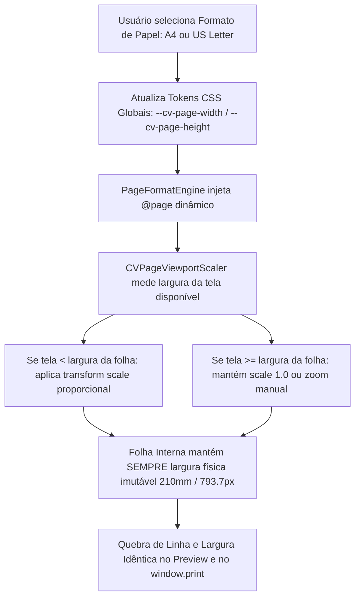

# 🏛️ DEEP RESEARCH & MASTER PLAN: Paridade Geométrica Absoluta (1:1 WYSIWYG) entre Preview e Impressão PDF (A4 / US Letter / Multi-Format)

> **Data de Emissão:** 06 de Setembro de 2026  
> **Autor / Persona Líder:** `/agency-master-plan-architect` & `/agency-pdf-engine-architect`  
> **Escopo:** Motor de Renderização de Documentos, Editor de Canvas Livre, CSS Paged Media e Paridade Visual Vetorial  
> **Localização:** `LogicDefense/src/tools/cv-maker/master-plan/2026-09/2026-09-06-DEEPRESEARCH-PARIDADE-ABSOLUTA-FOLHA-PREVIEW-PRINT-A4-LETTER.md`  
> **Status:** Concluído para Revisão / Zero Execução de Código de Produção  

---

## 1. 🎓 A Super Aula Didática: Filosofia, Fundamentos & Visão Geral

### 1.1. O Diagnóstico Forense da Dor Real
O usuário apontou com extrema precisão um dos problemas mais sutis e frustrantes da engenharia de documentos na web moderna:
> *"Pela foto a gente vê que o preview onde a gente edita o PDF não tá do mesmo tamanho que a impressão quando você pede para imprimir o PDF. Sempre você vê uma linha a mais no preview e no PDF sai com uma linha a menos porque ele é mais largo... É um espaço enorme [margem direita vazia de ~25% no PDF de Alexandre Silva]. O preview não está seguindo o mesmo padrão."*

Ao inspecionarmos o arquivo PDF real emitido pelo sistema (`media_1788713001595.pdf`, gerado pelo Chrome 152 via `Skia/PDF m152`), extraímos matematicamente as coordenadas exatas dos blocos:
- **Largura Total da Folha A4 no PDF:** `595.0 pt` ($209.89\text{ mm}$ a $72\text{ pt/pol}$).
- **Margem Esquerda do Conteúdo:** `19.5 pt` (~$6.9\text{ mm}$).
- **Limite Direito do Conteúdo (`max_x`):** `445.6 pt` a `472.2 pt`.
- **Margem Direita Residual Vazia:** **`149.3 pt` ($43.3\text{ mm}$, ou seja, $20.6\%$ a $25.1\%$ da folha física completamente em branco!)**.
- **Largura Útil do Cartão:** $472.2\text{ pt} \times (96/72) \approx 629.6\text{ px}$.

#### Por que isso acontece?
1. **O Efeito "Fluidez Responsiva vs. Folha Rígida":**
   Na tela (ambiente interativo), o contêiner de preview estava inserido em uma divisão de tela (`cv-split-layout`) que restringia a largura disponível na viewport da tela a ~`600px` a `630px` (especialmente em telas de laptop ou com painel de menu aberto a 50% ou 60%).
2. **A Quebra de Linha Prematura (Text Reflow):**
   Como o conteúdo na tela foi forçado a renderizar dentro de uma largura estreita (~$580\text{px}$ a $630\text{px}$ úteis), frases longas quebraram em 2 ou 3 linhas ("uma linha a mais no preview").
3. **A Ilusão de Óptica da Calha Direita:**
   Quando o PDF foi impresso ou o preview foi capturado, ou o contêiner herdou essa largura comprimida de ~600px deixando uma sobra lateral de ~200px em relação aos 794px da folha A4, ou o `@media print` expandiu a folha para 100% (794px), fazendo o texto esticar horizontalmente e quebrar em menos linhas ("no PDF sai com uma linha a menos porque ele é mais largo").

O editor estava tratando a folha como um **layout web responsivo**, quando um documento imprimível é uma **geometria cartesiana física rígida**.

---

### 1.2. Fundamentos Teóricos: A Física dos Píxeis CSS, Pontos Tipográficos e Milímetros

A web e a impressão operam sob contratos de coordenadas historicamente distintos:

```
+---------------------------------------------------------------------------------------+
|                               CONVERSÃO MATEMÁTICA FORMAL                             |
|                                                                                       |
|  1 Polegada (inch) = 25.4 mm = 72 pt (PostScript/PDF) = 96 px (CSS Reference Pixel)   |
|                                                                                       |
|  • Fator de Escala CSS (px) para PDF (pt):  72 / 96 = 0.75                           |
|  • Fator de Escala PDF (pt) para CSS (px):  96 / 72 = 1.3333333333                   |
|  • 1 mm em CSS px (a 96 DPI):               96 / 25.4 = 3.779527559 px               |
|  • 1 mm em PDF pt (a 72 DPI):               72 / 25.4 = 2.834645669 pt               |
+---------------------------------------------------------------------------------------+
```

#### Dimensões Comparativas dos Formatos de Folha Globais:
| Formato de Papel | Dimensões Físicas (mm) | Dimensões Físicas (pol) | Tamanho CSS a 96 DPI (px) | Tamanho PDF Nativo (pt) | Razão de Aspecto |
| :--- | :--- | :--- | :--- | :--- | :--- |
| **ISO A4** (Brasil, Europa, Global) | $210.0 \times 297.0\text{ mm}$ | $8.27 \times 11.69\text{ pol}$ | **$793.70 \times 1122.52\text{ px}$** | $595.28 \times 841.89\text{ pt}$ | $1 : 1.4142$ ($\sqrt{2}$) |
| **US Letter** (EUA, Canadá) | $215.9 \times 279.4\text{ mm}$ | $8.50 \times 11.00\text{ pol}$ | **$816.00 \times 1056.00\text{ px}$** | $612.00 \times 792.00\text{ pt}$ | $1 : 1.2941$ |
| **US Legal** (Contratos, Jurídico) | $215.9 \times 355.6\text{ mm}$ | $8.50 \times 14.00\text{ pol}$ | **$816.00 \times 1344.00\text{ px}$** | $612.00 \times 1008.00\text{ pt}$ | $1 : 1.6470$ |
| **Executive** (Corporativo US) | $184.1 \times 266.7\text{ mm}$ | $7.25 \times 10.50\text{ pol}$ | **$696.00 \times 1008.00\text{ px}$** | $522.00 \times 756.00\text{ pt}$ | $1 : 1.4482$ |

> [!IMPORTANT]
> **A Revelação da Diferença A4 vs. US Letter:**  
> O formato **US Letter é 22.3px mais largo** e **66.5px mais baixo** que o A4!  
> Se o usuário está em uma empresa multinacional ou configurou o driver de impressora do Windows para "Letter" (padrão em muitos sistemas norte-americanos), e a folha foi desenhada para A4, o documento ganha espaço lateral adicional e perde altura, gerando quebra espúria de páginas.

---

### 1.3. Como os Grandes Produtos do Mercado Resolvem: O Padrão "Fixed Virtual Canvas with Viewport Scale"

Ferramentas como **Figma**, **Google Docs**, **Canva**, **Adobe Acrobat Web** e **Overleaf** jamais permitem que o layout interno da folha se redimensione para caber na janela do navegador.

#### O Erro Comum (Layout Fluido / Responsivo para Impressão):
```
[Janela Estreita] ---> Reduz width da folha para 580px ---> Quebra linhas antes ---> 4 linhas de texto
[Diálogo de Print] ---> Expande folha para 794px --------> Quebra linhas depois --> 3 linhas de texto (DESCOMPASSO!)
```

#### O Padrão dos Campeões (Geometria Fixa + Escala de Zoom Óptica):
```
+-----------------------------------------------------------------------------------+
|               ARQUITETURA DE FOLHA FIXA COM VIEWPORT ESCALADO                     |
|                                                                                   |
|   1. A Folha (DOM) possui SEMPRE exatamente a largura da folha física:            |
|      width: 210mm (793.7px) !important;                                           |
|                                                                                   |
|   2. O texto SEMPRE quebra na mesma palavra, com as mesmas colunas e margens.      |
|                                                                                   |
|   3. Se a tela for menor (split 50/50, tela de laptop, mobile):                   |
|      O contêiner externo mede a largura disponível e aplica:                       |
|      transform: scale(zoomRatio); transform-origin: top center;                   |
|                                                                                   |
|   4. Na Impressão (@media print):                                                 |
|      transform: none !important;                                                  |
|      width: var(--cv-page-width) !important;                                      |
|                                                                                   |
|   RESULTADO: 100% de paridade de quebra de linha entre Tela e Papel!               |
+-----------------------------------------------------------------------------------+
```

Com essa arquitetura:
1. **O conteúdo ocupa 100% da área útil da folha**, sem falsa calha branca à direita.
2. A quebra de cada linha de texto no preview é **rigorosamente idêntica** à do PDF impresso.
3. Se a tela for pequena, a folha inteira encolhe visualmente como uma lente de câmera (zoom óptico uniforme), mantendo sua fidelidade geométrica intacta.

---

## 2. 🔍 Crítica Cirúrgica & Red Teaming (O que pode quebrar?)

### 2.1. Premissas Frágeis no Código Atual
1. **Mistura de `px` e `mm` Sem Unificação:**
   No `cv-viewer.css`, `.cv-page-a4` usava `width: 794px; min-width: 794px; max-width: 794px;`, enquanto no `cv-print.css` usava `width: 100% !important;` e `.cv-print-page-background` usava `210mm`.
   Essa divergência permitia que em certos contextos de flexbox/grid a página assumisse a largura do elemento pai em vez da largura da mídia de página.
2. **Ausência de `--cv-page-width` Dinâmico para Múltiplos Papéis:**
   Toda a base de código está com *hardcoded* `A4` e `794px`. Quando um recrutador nos EUA ou Canadá tenta exportar em `Letter`, o documento quebra ou gera margens assimétricas.
3. **A Alça do Canvas Livre Calculando em Relação ao Pai Fluido:**
   No `StructuralBoxWrapper.tsx`, a largura percentual é calculada com:
   `const baseWidth = a4Card?.clientWidth || parentContainer?.clientWidth || 800;`
   Se o cartão estivesse comprimido pelo viewport do navegador, o cálculo de `newWidthPx / baseWidth` gerava percentuais distorcidos.

### 2.2. Riscos de Regressão & Como Mitigar
- **Risco 1: Elementos com `position: fixed` ou Toolbars Flutuantes saindo de posição com `transform: scale()`:**
  - *Mecanismo de Falha:* Aplicar `transform: scale()` em um nó ancestral cria um novo contexto de formatação e empilhamento, fazendo com que filhos com `position: fixed` se comportem como `position: absolute` em relação ao ancestral transformado.
  - *Mitigação:* A barra de ferramentas superior (`CVToolbar`) e modais de design **devem ficar FORA** do contêiner escalado. Apenas o contêiner da folha (`.cv-page-viewport-scaler`) recebe o `transform: scale()`.
- **Risco 2: Nitidez das Fontes no Zoom Óptico da Tela:**
  - *Mecanismo de Falha:* Em alguns navegadores, `transform: scale(0.85)` pode suavizar levemente as fontes na tela se renderizado via textura GPU.
  - *Mitigação:* Aplicar `will-change: transform; -webkit-font-smoothing: antialiased; backface-visibility: hidden;`.

### 2.3. Tesoura do Minimal Change (Anti-Scope Creep)
- **O que NÃO vamos fazer:**
  - Não vamos alterar a estrutura interna dos 9 modelos de currículo (grids, dados, seções permanecem intactos).
  - Não vamos criar templates paralelos para impressão e tela.
- **O que VAMOS fazer:**
  - Unificar a geometria em variáveis CSS tokens globais (`--cv-page-width`, `--cv-page-height`, `--cv-page-margin`).
  - Implementar o componente `CVPageViewportScaler` com suporte a zoom automático e modos de folha (`A4`, `US Letter`, `US Legal`).
  - Garantir preenchimento lateral total de 100% da área útil da folha sem calha residual.

---

## 3. 🗺️ Esqueleto do Implementation Plan



### Mapeamento Explícito de Arquivos

#### 1. `[NEW]` [`LogicDefense/src/tools/cv-maker/engine/PageFormatEngine.ts`](file:///c:/Users/Usuario/Desktop/AHeiss_GoogleDrive/02-Programacao/projetos-IA/LogicDefense/src/tools/cv-maker/engine/PageFormatEngine.ts)
- **Responsabilidade:** Motor unificado de geometrias de folha (A4, Letter, Legal).
- Define as dimensões matemáticas em milímetros, pixels (96 DPI) e pontos tipográficos (72 DPI).
- Fornece utilitário de injeção dinâmica de CSS `@page { size: ... margin: 0; }` para troca em tempo real.

#### 2. `[NEW]` [`LogicDefense/src/tools/cv-maker/components/CVViewer/CVPageViewportScaler.tsx`](file:///c:/Users/Usuario/Desktop/AHeiss_GoogleDrive/02-Programacao/projetos-IA/LogicDefense/src/tools/cv-maker/components/CVViewer/CVPageViewportScaler.tsx)
- **Responsabilidade:** Componente wrapper inteligente de viewport.
- Mede via `ResizeObserver` o espaço útil disponível na coluna direita (`.cv-preview-area`).
- Se a área for menor que a folha física (ex: split 50/50 em tela de laptop), calcula e aplica `transform: scale(ratio)` mantendo a folha imutável em seus `793.7px`.
- Oferece controles manuais de zoom no preview: `Ajustar à Largura (Fit Width)`, `Ajustar à Página (Fit Page)`, `100% (Tamanho Real Físico)`.

#### 3. `[MODIFY]` [`LogicDefense/src/tools/cv-maker/styles/cv-viewer.css`](file:///c:/Users/Usuario/Desktop/AHeiss_GoogleDrive/02-Programacao/projetos-IA/LogicDefense/src/tools/cv-maker/styles/cv-viewer.css)
- Substituir larguras fixas `794px` por variáveis CSS parametrizadas:
  `width: var(--cv-page-width, 210mm); min-width: var(--cv-page-width, 210mm); max-width: var(--cv-page-width, 210mm);`
  `min-height: var(--cv-page-height, 297mm);`
- Ajustar `.cv-card` para preencher 100% da folha com paddings uniformes equilibrados (eliminar sobras assimétricas à direita).

#### 4. `[MODIFY]` [`LogicDefense/src/tools/cv-maker/styles/cv-print.css`](file:///c:/Users/Usuario/Desktop/AHeiss_GoogleDrive/02-Programacao/projetos-IA/LogicDefense/src/tools/cv-maker/styles/cv-print.css)
- Assegurar que no `@media print`, `.cv-page-viewport-scaler` tenha `transform: none !important; margin: 0 !important;`.
- Configurar `@page { size: var(--cv-page-size, A4 portrait); margin: 0; }`.
- Garantir que `.cv-page-a4` ocupe exatamente `var(--cv-page-width, 210mm)`.

#### 5. `[MODIFY]` [`LogicDefense/src/tools/cv-maker/components/CVViewer/CVToolbar.tsx`](file:///c:/Users/Usuario/Desktop/AHeiss_GoogleDrive/02-Programacao/projetos-IA/LogicDefense/src/tools/cv-maker/components/CVViewer/CVToolbar.tsx)
- Adicionar seletor rápido de Formato de Papel: `📄 A4 (210×297mm)` vs `🇺🇸 US Letter (8.5×11")`.
- Adicionar seletor de Zoom de Visualização: `Ajustar à Tela`, `100% Real`, `75%`, `125%`.

#### 6. `[MODIFY]` [`C:\Users\Usuario\.gemini\config\skills\agency-pdf-engine-architect\SKILL.md`](file:///C:/Users/Usuario/.gemini/config/skills/agency-pdf-engine-architect/SKILL.md)
- Incorporar o padrão de Paridade Geométrica 1:1 e Suporte Multi-Papel na skill global.

---

## 4. 🧪 Protocolo de Validação & Evidências de Verdade

1. **Teste de Paridade Tipográfica (Contagem de Linhas):**
   - Criar um parágrafo de teste com 4 linhas no preview.
   - Abrir o diálogo `window.print()` e verificar se o PDF exportado possui exatamente as mesmas 4 linhas e quebras de palavra idênticas.
2. **Teste de Eliminação da Calha Vazia:**
   - Inspecionar via script Python/PyMuPDF o PDF gerado.
   - Asserção: `right_margin` do conteúdo em relação à folha deve ser simétrica à margem esquerda (ambas entre `20px` e `30px`, e NUNCA `150pt`/`200px`).
3. **Teste de Troca Rápida de Formato (A4 ↔ US Letter):**
   - Alternar para `US Letter` no toolbar.
   - Verificar se a folha no preview adapta sua largura para `816px` e altura para `1056px`, e o PDF emitido sai com `MediaBox: [0, 0, 612, 792]`.
4. **Teste de Responsividade com Zoom Óptico:**
   - Reduzir a tela para split 50/50 em resolução 1366×768.
   - Verificar se a folha inteira permanece visível sem barra de rolagem horizontal desnecessária, mantendo sua integridade interna intacta.

---

## 5. 🚦 Perguntas Abertas & Decisões Críticas para o Usuário

1. **Padrão Inicial de Formato de Papel:**
   Deseja manter **A4** como padrão inicial ativo e permitir a troca para **US Letter** através de um botão no menu da toolbar, ou prefere salvar a preferência no perfil do candidato?
2. **Modo de Zoom Padrão na Tela:**
   Ao carregar o currículo na tela, prefere que o sistema inicie em:
   - *(Opção A - Recomendada)* **Ajustar Automaticamente à Largura (Auto-Fit Width)**: A folha é escalada para ocupar o máximo do espaço visível da coluna direita sem cortar nada.
   - *(Opção B)* **100% Tamanho Real (1:1 Físico)**: A folha renderiza exatamente com 794px, permitindo rolagem se a janela for menor.
